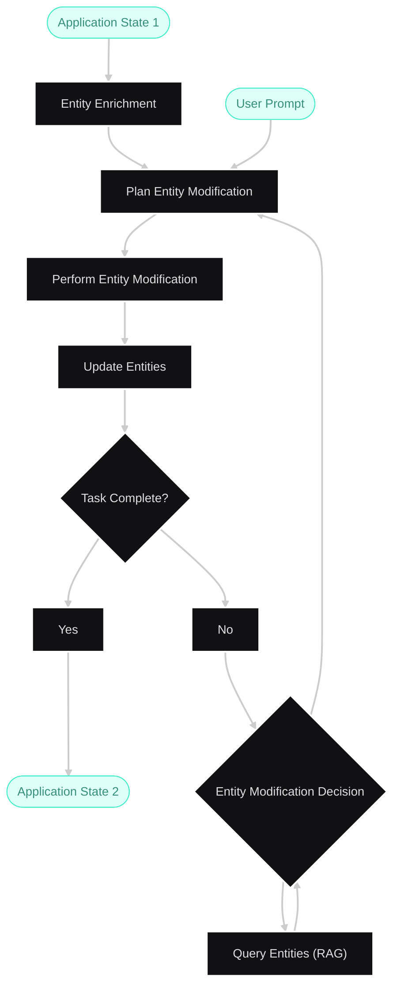
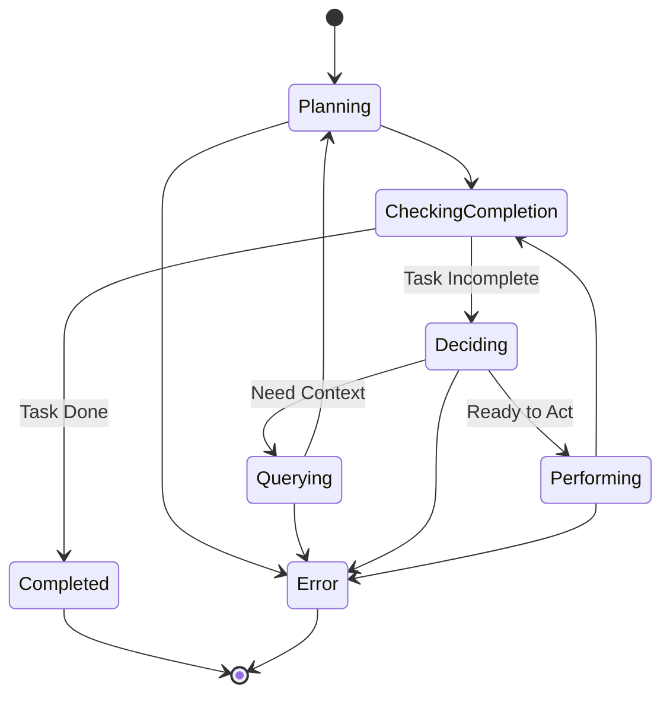

# Nanna Coder Agent System

This document describes the agent implementation in Nanna Coder, detailing how the AI-powered control loop manages development workflows through entity-based decision making.

## Table of Contents

- [Overview](#overview)
- [Agent Architecture](#agent-architecture)
- [Control Flow](#control-flow)
- [State Machine](#state-machine)
- [Components](#components)
- [Entity Integration](#entity-integration)
- [Usage Examples](#usage-examples)

## Overview

The Nanna agent is an autonomous AI system that:
- Interprets user prompts and translates them into development actions
- Queries entity stores using RAG for context-aware decision making
- Modifies development artifacts through structured entity operations
- Maintains conversation history and project context
- Operates within containerized environments for safety and isolation

The agent follows a control loop architecture that continuously evaluates task completion and decides on next actions based on entity state.

## Agent Architecture

For the complete architectural context, see [ARCHITECTURE.md](ARCHITECTURE.md).

### Core Architecture Diagram

The agent follows the control flow defined in the architecture:



See [ARCHITECTURE.md - Harness Control Flow](ARCHITECTURE.md#harness-control-flow) for detailed explanation of each component.

## Control Flow

### Agent Loop Phases

1. **Entity Enrichment**
   - Automatically gather relevant context from entity store
   - Enrich application state with current environment info
   - Prepare context for planning phase

2. **Planning (User Prompt → Plan Entity Modification)**
   - Receive user prompt
   - Analyze current entity state
   - Create modification plan
   - Determine which entities need to change

3. **Task Completion Check**
   - Evaluate if user requirements are satisfied
   - Check entity state against success criteria
   - Decide if more work is needed

4. **Decision Making** (if task incomplete)
   - Determine if more information is needed
   - Choose between querying entities or performing modifications
   - Strategic routing based on current context

5. **Entity Querying (RAG)**
   - Retrieve relevant entities using semantic search
   - Traverse entity relationships
   - Build comprehensive context for next decision

6. **Entity Modification**
   - Apply planned changes to entities
   - Validate modifications
   - Create microcommit for tracking

7. **Entity Updates**
   - Persist changes to entity store
   - Update relationships
   - Refresh context for next iteration

### Implementation Location

The control flow is implemented in `harness/src/agent/`:

```rust
harness/src/agent/
├── mod.rs         # Main agent loop and state machine
├── decision.rs    # Entity modification decision logic
└── rag.rs         # RAG-based entity querying
```

## State Machine

The agent operates as a state machine with the following states:

### States

```rust
pub enum AgentState {
    /// Planning next actions based on user prompt
    Planning,

    /// Querying entities using RAG for context
    Querying,

    /// Deciding what modification to perform
    Deciding,

    /// Performing entity modification
    Performing,

    /// Checking if task is complete
    CheckingCompletion,

    /// Task completed successfully
    Completed,

    /// Error state with message
    Error(String),
}
```

### State Transitions



### State Descriptions

- **Planning**: Analyzing user prompt and current state to create modification plan
- **Querying**: Using RAG to retrieve relevant entities and build context
- **Deciding**: Determining whether to query more entities or perform modifications
- **Performing**: Applying planned changes to entities
- **CheckingCompletion**: Evaluating if user requirements are satisfied
- **Completed**: Successfully finished task
- **Error**: Handling errors with detailed messages

## Components

### AgentLoop

Main control loop that manages state transitions and coordinates components.

```rust
pub struct AgentLoop {
    state: AgentState,
    config: AgentConfig,
    iterations: usize,
}
```

**Key Methods**:
- `run(context: AgentContext)` - Execute agent loop until completion
- `state()` - Get current state
- `transition_to(state)` - Move to new state

See `harness/src/agent/mod.rs` for implementation.

### AgentConfig

Configuration for agent behavior:

```rust
pub struct AgentConfig {
    /// Maximum iterations before stopping
    pub max_iterations: usize,

    /// Enable verbose logging
    pub verbose: bool,
}
```

### AgentContext

Execution context passed through the agent loop:

```rust
pub struct AgentContext {
    /// User's prompt/request
    pub user_prompt: String,

    /// Conversation history
    pub conversation_history: Vec<String>,

    /// Application state identifier
    pub app_state_id: String,
}
```

### AgentComponent Trait

Interface for pluggable agent components:

```rust
#[async_trait]
pub trait AgentComponent: Send + Sync {
    async fn initialize(&mut self) -> AgentResult<()>;
    async fn process(&mut self, state: &AgentState) -> AgentResult<()>;
    async fn cleanup(&mut self) -> AgentResult<()>;
}
```

## Entity Integration

The agent integrates tightly with the entity management system (see [ARCHITECTURE.md - Entity Management](ARCHITECTURE.md#entity-management-system)).

### Entity Operations in Agent Loop

1. **Query** (RAG Phase):
   ```rust
   // Retrieve relevant entities based on query
   let entities = entity_store.query(user_prompt).await?;
   ```

2. **Plan** (Planning Phase):
   ```rust
   // Determine which entities need modification
   let plan = create_modification_plan(entities, user_prompt)?;
   ```

3. **Modify** (Performing Phase):
   ```rust
   // Apply changes to entities
   for modification in plan {
       entity_store.modify(modification).await?;
       create_microcommit(modification)?;
   }
   ```

4. **Validate** (Checking Completion):
   ```rust
   // Check if modifications satisfy requirements
   let complete = validate_entities(entities, requirements)?;
   ```

### Entity Types Used by Agent

The agent interacts with all entity types:

- **Version Control**: Track changes via microcommits
- **AST/Filesystem**: Modify code structure
- **Testing/Analysis**: Validate modifications
- **Environment**: Manage deployment state
- **Project Context**: Maintain conversation and progress
- **Telemetry**: Monitor execution (future)

See [ARCHITECTURE.md - Entity Types](ARCHITECTURE.md#entity-types) for details.

## Usage Examples

### Basic Agent Execution

```rust
use harness::agent::{AgentLoop, AgentConfig, AgentContext};

#[tokio::main]
async fn main() -> Result<(), Box<dyn std::error::Error>> {
    // Configure agent
    let config = AgentConfig {
        max_iterations: 50,
        verbose: true,
    };

    // Create context
    let context = AgentContext {
        user_prompt: "Add authentication to the API".to_string(),
        conversation_history: vec![],
        app_state_id: "dev-1".to_string(),
    };

    // Run agent
    let mut agent = AgentLoop::new(config);
    let result = agent.run(context).await?;

    println!("Task completed in {} iterations", result.iterations);
    Ok(())
}
```

### Custom Agent Component

```rust
use harness::agent::{AgentComponent, AgentState, AgentResult};
use async_trait::async_trait;

struct CustomValidator {
    checks: Vec<String>,
}

#[async_trait]
impl AgentComponent for CustomValidator {
    async fn initialize(&mut self) -> AgentResult<()> {
        println!("Initializing validator");
        Ok(())
    }

    async fn process(&mut self, state: &AgentState) -> AgentResult<()> {
        if let AgentState::CheckingCompletion = state {
            // Run custom validation checks
            for check in &self.checks {
                println!("Running check: {}", check);
            }
        }
        Ok(())
    }

    async fn cleanup(&mut self) -> AgentResult<()> {
        println!("Cleaning up validator");
        Ok(())
    }
}
```

### Integration with Entity System

```rust
use harness::agent::{AgentLoop, AgentConfig, AgentContext};
// Entity system imports (future implementation)

async fn run_with_entities() -> Result<(), Box<dyn std::error::Error>> {
    // Initialize entity store
    let entity_store = EntityStore::new()?;

    // Enrich context with entities
    let entities = entity_store.query("authentication related code").await?;

    let context = AgentContext {
        user_prompt: "Add JWT authentication".to_string(),
        conversation_history: entities.to_history(),
        app_state_id: "dev-1".to_string(),
    };

    // Run agent with entity context
    let config = AgentConfig::default();
    let mut agent = AgentLoop::new(config);
    let result = agent.run(context).await?;

    // Commit changes
    entity_store.commit_changes().await?;

    Ok(())
}
```

## Testing

The agent system includes comprehensive tests:

### Unit Tests
- State machine transitions
- Configuration handling
- Context management
- Error handling

### Integration Tests
- RAG entity querying
- Entity modification workflows
- Multi-iteration scenarios
- Timeout and resource limits

Run tests:
```bash
cargo test --package harness --lib agent
```

## Error Handling

The agent defines specific error types:

```rust
pub enum AgentError {
    StateError(String),
    TaskCheckFailed(String),
    MaxIterationsExceeded,
}
```

All agent operations return `AgentResult<T>` for consistent error handling.

## Performance Considerations

- **Max Iterations**: Prevents infinite loops (configurable)
- **Async Execution**: Non-blocking I/O throughout
- **State Tracking**: Minimal memory overhead
- **Entity Caching**: RAG queries leverage cached entities

## Future Enhancements

- **Parallel Planning**: Multi-threaded modification planning
- **Adaptive Iteration Limits**: Dynamic based on task complexity
- **Advanced RAG**: Vector embeddings for entity retrieval
- **Multi-Agent Coordination**: Distributed agent systems
- **Learning from History**: Improve decisions based on past outcomes

## Related Documentation

- [ARCHITECTURE.md](ARCHITECTURE.md) - Complete system architecture
- [README.md](README.md) - Project overview
- [TESTING.md](TESTING.md) - Testing strategy
- [docs/poc-system-overview.md](docs/poc-system-overview.md) - System overview

## References

- Implementation: `harness/src/agent/`
- Tests: `harness/src/agent/mod.rs` (tests module)
- Entity System: `harness/src/entities/` (in progress)
- Container Integration: `harness/src/container.rs`
