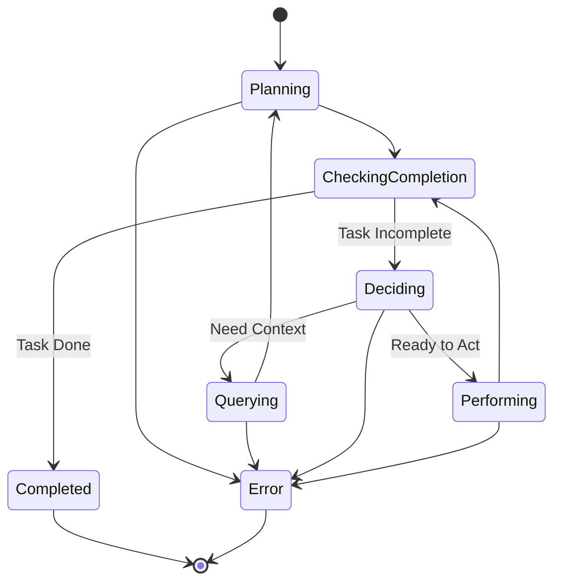

# Agent Control Flow

See [ARCHITECTURE.md](ARCHITECTURE.md) for the harness control flow diagram.

# Agent State Machine

```mermaid
stateDiagram-v2
    [*] --> Planning
    Planning --> CheckingCompletion
    CheckingCompletion --> Completed: Task Done
    CheckingCompletion --> Deciding: Task Incomplete
    Deciding --> Querying: Need Context
    Deciding --> Performing: Ready to Act
    Querying --> Planning
    Performing --> CheckingCompletion
    Completed --> [*]
    Planning --> Error
    Querying --> Error
    Deciding --> Error
    Performing --> Error
    Error --> [*]
```
