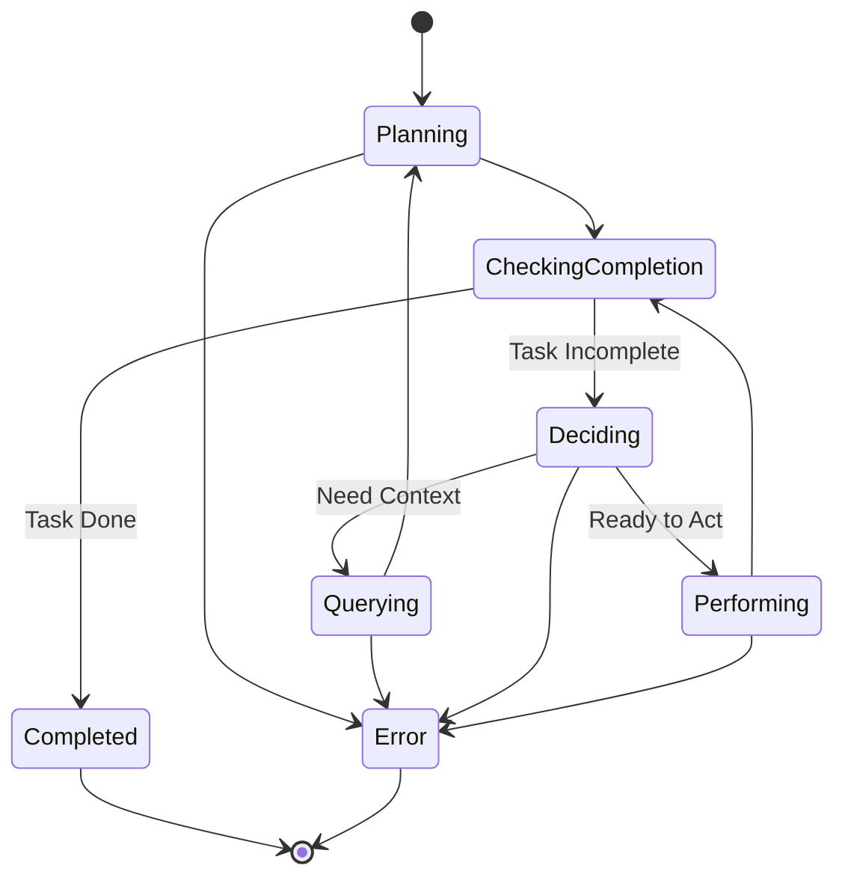

# Agent Control Flow

See [ARCHITECTURE.md](ARCHITECTURE.md) for the harness control flow diagram.

## What an agent should NOT do

- Lower the `target:` value in `codecov.yml`. The guard rejects decreases; admin bypass is the only path.
- Add entries to `ignore:` in `codecov.yml`. The guard counts entries (block- and flow-style) and rejects growth.
- Replace a numeric `target:` with `auto` or remove it. The guard rejects loss of a numeric floor.
- Edit, rename, or delete `.github/workflows/codecov-guard.yml`, `.github/workflows/coverage-bypass-guard.yml`, `.github/CODEOWNERS`, or other files in `.github/workflows/**` to circumvent the guard.
- Add `#[cfg(not(tarpaulin))]`, `#[cfg(not(tarpaulin_include))]`, `#[cfg_attr(coverage_nightly, coverage(off))]`, or `#[cfg_attr(coverage, coverage(off))]` to *.rs source. The `coverage-bypass-guard` workflow counts these annotations on the base and head trees and rejects any net increase.
- Add `#[ignore]` to a `#[test]`, `#[tokio::test]`, or `#[rstest]`-annotated test function. The guard detects `#[ignore]` within ~3 lines of a test attribute and rejects net additions.
- Grow `[config].exclude-files` or `[config].exclude` in `tarpaulin.toml`. The guard parses the TOML on both sides and rejects list growth.

## When 100% patch coverage is genuinely unhittable

1. If you are blocked because of disabled tests, enable them.
2. If you are blocked because your architectural decisions yield untestable code, re-architect. 
3. If the CI environment is broken in a way that you cannot fix and which is preventing your tests from being run, escalate by creating a github issue describing the exact misisng test problem.
4. If, after the steps above, you still have a genuinely-untestable code path, a repository admin can apply the `coverage-exception-approved` label to the PR. The `coverage-bypass-guard` workflow will skip its net-delta check on the next `synchronize`/`labeled` event. This is the only escape hatch and is intentionally manual + admin-only.

## Coverage-bypass guard (the bypass-bypass guard)

`codecov.yml` and the `codecov-guard` workflow keep the patch-coverage *floor* honest. The `coverage-bypass-guard` workflow (`.github/workflows/coverage-bypass-guard.yml`) closes the second-order hole: an agent can't dodge the 100% floor by annotating new code with `#[cfg(not(tarpaulin))]`, hiding tests behind `#[ignore]`, or adding files to `tarpaulin.toml`'s `exclude-files`.

How it works:

- Runs on `pull_request` (`opened, synchronize, reopened, labeled, unlabeled`).
- For each fixed-string bypass pattern, counts occurrences in `*.rs` files at the PR base SHA and at the PR head SHA via `git ls-tree` + `git show | grep -F -c`. Fails if `head_count - base_count > 0` for any pattern.
- For `#[ignore]`, an awk pass requires a test attribute (`#[test]`, `#[tokio::test]`, `#[rstest]`) within 3 lines to count it - avoiding doc-string false positives. This is a heuristic, not a Rust parser; the admin label is the safety valve.
- For `tarpaulin.toml`, parses both sides with `yq -p toml` and fails if `[config].exclude-files` or `[config].exclude` grew.
- All logic is inlined in the YAML - no `scripts/*.sh` indirection - so the trust anchor and the policy are the same path-protected file (same pattern as `codecov-guard`).
- Only escape: a repository admin applies the `coverage-exception-approved` label. No commit trailer, env var, or script flag can bypass.

## Owner one-time UI follow-ups

After `coverage-bypass-guard` lands, the repository owner needs to:

1. **Required status check.** Settings -> Rules -> Default branch protection: add `coverage-bypass-guard / guard` to required status checks alongside `codecov-guard / guard`, `codecov/patch`, and `All Checks Passed`.
2. **Repository Ruleset path-restriction.** Settings -> Rules -> Rulesets -> existing branch ruleset for `main` -> *Restrict file paths*: add
   - `tarpaulin.toml`
   - `.github/workflows/coverage-bypass-guard.yml`

   to the existing list (alongside `codecov.yml`, `.github/workflows/**`, `.github/CODEOWNERS`, `.github/rulesets/**`). Bypass list: repository admin (you).
3. **Label.** Create the `coverage-exception-approved` label on the repo (any color). Reserve it for admin use; document in repo settings that contributors should not self-apply.

Agents cannot perform any of these UI steps via the API - these are owner actions.

# Agent State Machine

```mermaid
stateDiagram-v2
    [*] --> Planning
    Planning --> CheckingCompletion
    CheckingCompletion --> Completed: Task Done
    CheckingCompletion --> Deciding: Task Incomplete
    Deciding --> Querying: Need Context
    Deciding --> Performing: Ready to Act
    Querying --> Planning
    Performing --> CheckingCompletion
    Completed --> [*]
    Planning --> Error
    Querying --> Error
    Deciding --> Error
    Performing --> Error
    Error --> [*]
```
