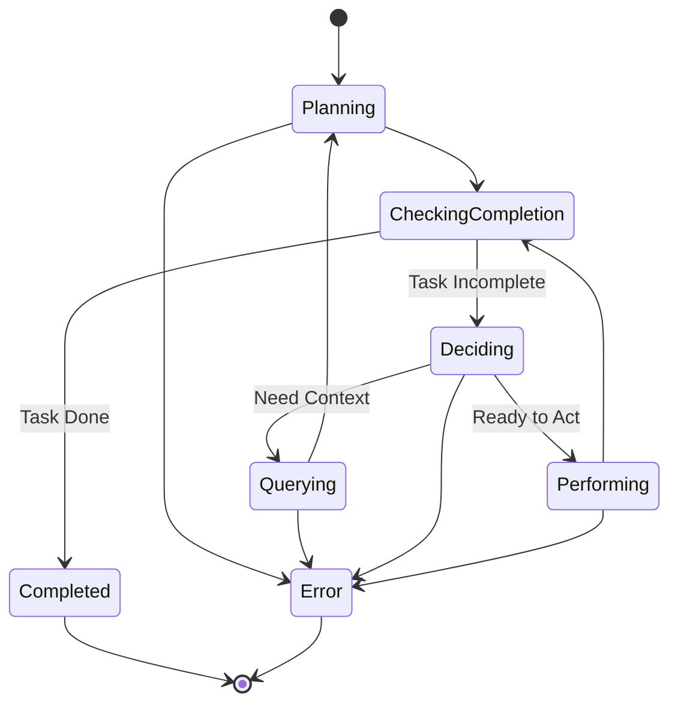

# Agent Control Flow

See [ARCHITECTURE.md](ARCHITECTURE.md) for the harness control flow diagram.

## What an agent should NOT do

- Lower the `target:` value in `codecov.yml`. The guard rejects decreases; admin bypass is the only path.
- Add entries to `ignore:` in `codecov.yml`. The guard counts entries (block- and flow-style) and rejects growth.
- Replace a numeric `target:` with `auto` or remove it. The guard rejects loss of a numeric floor.
- Edit, rename, or delete `.github/workflows/codecov-guard.yml`, `.github/CODEOWNERS`, or other files in `.github/workflows/**` to circumvent the guard.
- Write to a **protected path**. Nanna cannot modify its own configuration. The set (`harness::protected::PROTECTED_PATTERNS`, as of this read) is `.nanna/**` and any nested `.nanna/` directory (agent identities, `deploy.toml`, availability windows), `.git/**` (the repository's own git metadata — even though this is only `Workspace`-class, it is protected because the PR/issue tools resolve which repository to act on from the worktree's live `origin` remote; an unaudited write to `.git/config` could silently redirect that remote before any audited tool call runs), `.github/workflows/**`, `.github/CODEOWNERS`, `codecov.yml`, and `windows.toml`, plus Nanna's own configuration directory (`$NANNA_CONFIG_DIR`, else `$XDG_CONFIG_HOME/nanna`, else `~/.config/nanna`) when it happens to sit inside the repository. No identity scope widens it: `write_file` refuses these paths, the dev container mounts them read-only and never mounts the configuration directory, and `extract_changes` / `format_patch` refuse to produce a patch that touches them (the task fails with `error_type = "ProtectedPathViolation"` and the auditor is notified). Treat `harness::protected::PROTECTED_PATTERNS` as the source of truth if this list and the code ever disagree.
- **Never merge a pull request or close an issue.** This mirrors the standing human-operator policy for this project (plan or review approval is not merge or close authorization) applied to autonomous agents specifically. No *dedicated* tool in the catalog merges a pull request, closes an issue, or enables auto-merge: `harness::pr_tools` exposes `github_pr_open` (always opens a draft), `github_pr_promote` (marks an identity's own draft ready for review — not a merge), `github_pr_close` (closes a pull request the identity itself owns, e.g. to abandon its own superseded draft, and requires the closing comment to reference the originating issue), `github_pr_comments` (fetches review/issue comments, filtered to an author allow-list), `github_issue_read` and `github_issue_comment`. `github_pr_status` (a separate, read-only tool in `harness::tools`, not `pr_tools`) reports whether GitHub's auto-merge is enabled on a PR but has no tool to change it. There is no `github_pr_merge`, no tool that closes an issue, and no tool that toggles auto-merge. `git_push_branch` also refuses to push to the repository's actual default branch, closing off a push-to-main as a way to merge by other means. This is a *policy* guarantee, not a structural one, wherever an identity is instead granted the general-purpose `run_command` tool (e.g. the `deployer` fixture): `run_command` runs an arbitrary shell command in the dev container, is fixed at `EffectClass::Workspace` regardless of what it actually does, and so is always allowed by the action-gate without review (see [ARCHITECTURE.md](ARCHITECTURE.md#two-auditor-gates)) — nothing stops its shell command from being `gh pr merge` if the container both has network access (true once the identity's ceiling is `Repository` or above) and holds GitHub write credentials. As of this read, nothing in `harness::container` injects `GITHUB_TOKEN` or any other GitHub credential into a dev container by default, so an identity would need that wired in deliberately for this path to matter in practice — but an identity author granting `run_command` alongside real GitHub credentials should not rely on this section as an RBAC guarantee. A human merges pull requests and closes issues.
- Strip or forge the identity marker. Agent commits end with the `Nanna-Identity: <name>` trailer and agent PR bodies carry `<!-- Nanna-Identity: <name> -->` (`harness::marker`); the CI guard uses it to tell agent PRs from human PRs.
- Circumvent the protected-paths guard. Its workflow is maintained at [`docs/ci/protected-paths-guard.yml`](docs/ci/protected-paths-guard.yml) and must be installed into `.github/workflows/` by a maintainer, because agents cannot write there; it fails any PR carrying an identity marker that touches a protected path.

## When 100% patch coverage is genuinely unhittable

1. If you are blocked because of disabled tests, enable them.
2. If you are blocked because your architectural decisions yield untestable code, re-architect.
3. If a CI-environment failure you cannot fix is blocking your tests, escalate by opening a GitHub issue describing the exact missing-test problem.

# Agent State Machine

```mermaid
stateDiagram-v2
    [*] --> Planning
    Planning --> CheckingCompletion
    CheckingCompletion --> Completed: Task Done
    CheckingCompletion --> Deciding: Task Incomplete
    Deciding --> Querying: Need Context
    Deciding --> Performing: Ready to Act
    Querying --> Planning
    Performing --> CheckingCompletion
    Completed --> [*]
    Planning --> Error
    Querying --> Error
    Deciding --> Error
    Performing --> Error
    Error --> [*]
```
