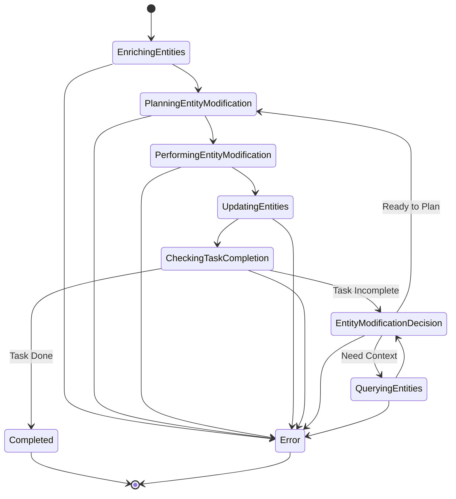

# Agent Control Flow

See [ARCHITECTURE.md](./ARCHITECTURE.md#harness-control-flow) for the harness
control flow diagram. The state names below match the `AgentState` enum in
[`harness/src/agent/mod.rs`](./harness/src/agent/mod.rs) verbatim.

# Agent State Machine

```mermaid
stateDiagram-v2
    [*] --> EnrichingEntities
    EnrichingEntities --> PlanningEntityModification
    PlanningEntityModification --> PerformingEntityModification
    PerformingEntityModification --> UpdatingEntities
    UpdatingEntities --> CheckingTaskCompletion
    CheckingTaskCompletion --> Completed: Task Done
    CheckingTaskCompletion --> EntityModificationDecision: Task Incomplete
    EntityModificationDecision --> QueryingEntities: Need Context
    EntityModificationDecision --> PlanningEntityModification: Ready to Plan
    QueryingEntities --> EntityModificationDecision
    Completed --> [*]
    EnrichingEntities --> Error
    PlanningEntityModification --> Error
    PerformingEntityModification --> Error
    UpdatingEntities --> Error
    CheckingTaskCompletion --> Error
    EntityModificationDecision --> Error
    QueryingEntities --> Error
    Error --> [*]
```
