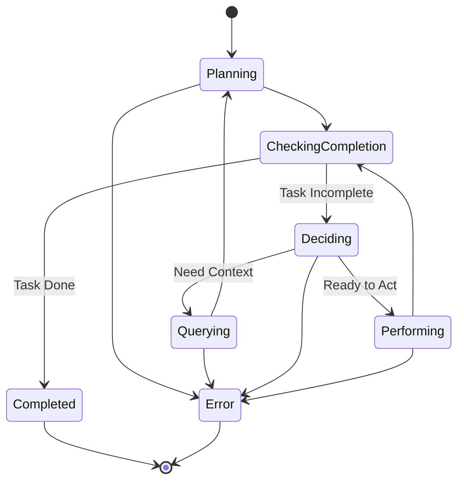

# Agent Control Flow

See [ARCHITECTURE.md](ARCHITECTURE.md) for the harness control flow diagram.

## What an agent should NOT do

- Lower the `target:` value in `codecov.yml`. The guard rejects decreases; admin bypass is the only path.
- Add entries to `ignore:` in `codecov.yml`. The guard counts entries (block- and flow-style) and rejects growth.
- Replace a numeric `target:` with `auto` or remove it. The guard rejects loss of a numeric floor.
- Edit, rename, or delete `.github/workflows/codecov-guard.yml`, `.github/CODEOWNERS`, or other files in `.github/workflows/**` to circumvent the guard.
- Write to a **protected path**. Nanna cannot modify its own configuration. The set (`harness::protected::PROTECTED_PATTERNS`) is `.nanna/**` (agent identities, `deploy.toml`, availability windows), any nested `.nanna/` directory, `.github/workflows/**`, `.github/CODEOWNERS`, `codecov.yml`, `windows.toml`, plus Nanna's own configuration directory (`$NANNA_CONFIG_DIR`, else `$XDG_CONFIG_HOME/nanna`, else `~/.config/nanna`). No identity scope widens it: `write_file` refuses these paths, the dev container mounts them read-only and never mounts the configuration directory, and `extract_changes` / `format_patch` refuse to produce a patch that touches them (the task fails with `error_type = "ProtectedPathViolation"` and the auditor is notified).
- Strip or forge the identity marker. Agent commits end with the `Nanna-Identity: <name>` trailer and agent PR bodies carry `<!-- Nanna-Identity: <name> -->` (`harness::marker`); the CI guard uses it to tell agent PRs from human PRs.
- Circumvent the protected-paths guard. Its workflow is maintained at [`docs/ci/protected-paths-guard.yml`](docs/ci/protected-paths-guard.yml) and must be installed into `.github/workflows/` by a maintainer, because agents cannot write there; it fails any PR carrying an identity marker that touches a protected path.

## When 100% patch coverage is genuinely unhittable

1. If you are blocked because of disabled tests, enable them.
2. If you are blocked because your architectural decisions yield untestable code, re-architect.
3. If a CI-environment failure you cannot fix is blocking your tests, escalate by opening a GitHub issue describing the exact missing-test problem.

# Agent State Machine

```mermaid
stateDiagram-v2
    [*] --> Planning
    Planning --> CheckingCompletion
    CheckingCompletion --> Completed: Task Done
    CheckingCompletion --> Deciding: Task Incomplete
    Deciding --> Querying: Need Context
    Deciding --> Performing: Ready to Act
    Querying --> Planning
    Performing --> CheckingCompletion
    Completed --> [*]
    Planning --> Error
    Querying --> Error
    Deciding --> Error
    Performing --> Error
    Error --> [*]
```
