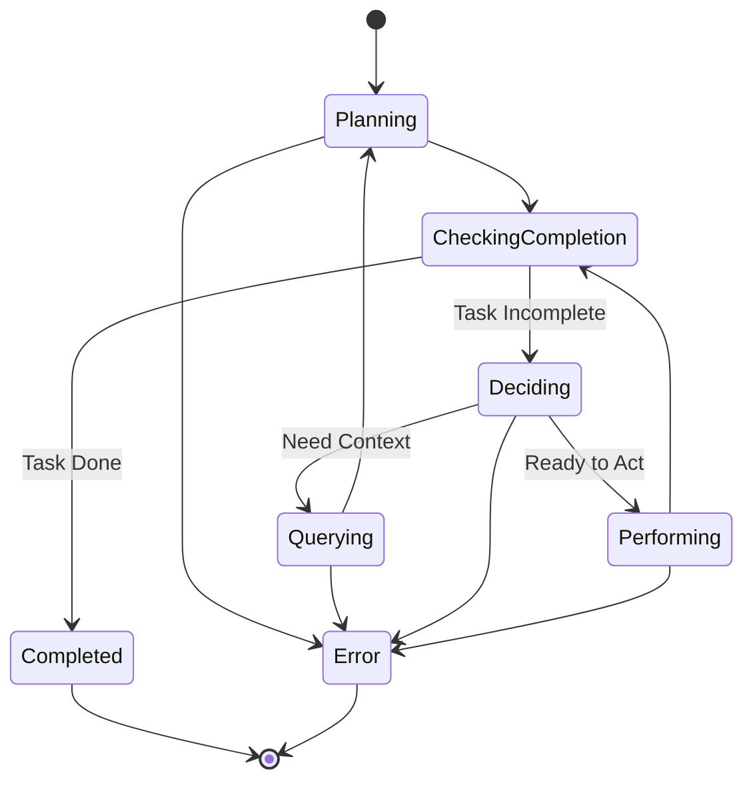

# Agent Control Flow

See [ARCHITECTURE.md](ARCHITECTURE.md) for the harness control flow diagram.

## What an agent should NOT do

- Lower the `target:` value in `codecov.yml`. The guard rejects decreases; admin bypass is the only path.
- Add entries to `ignore:` in `codecov.yml`. The guard counts entries (block- and flow-style) and rejects growth.
- Replace a numeric `target:` with `auto` or remove it. The guard rejects loss of a numeric floor.
- Edit, rename, or delete the `codecov-guard` job in `.github/workflows/ci.yml`, `.github/CODEOWNERS`, or other files in `.github/workflows/**` to circumvent the guard.

## When 100% patch coverage is genuinely unhittable

1. If you are blocked because of disabled tests, enable them.
2. If you are blocked because your architectural decisions yield untestable code, re-architect. 
3. If the CI environment is broken in a way that you cannot fix and which is preventing your tests from being run, escalate by creating a github issue describing the exact misisng test problem.

# Agent State Machine

```mermaid
stateDiagram-v2
    [*] --> Planning
    Planning --> CheckingCompletion
    CheckingCompletion --> Completed: Task Done
    CheckingCompletion --> Deciding: Task Incomplete
    Deciding --> Querying: Need Context
    Deciding --> Performing: Ready to Act
    Querying --> Planning
    Performing --> CheckingCompletion
    Completed --> [*]
    Planning --> Error
    Querying --> Error
    Deciding --> Error
    Performing --> Error
    Error --> [*]
```
