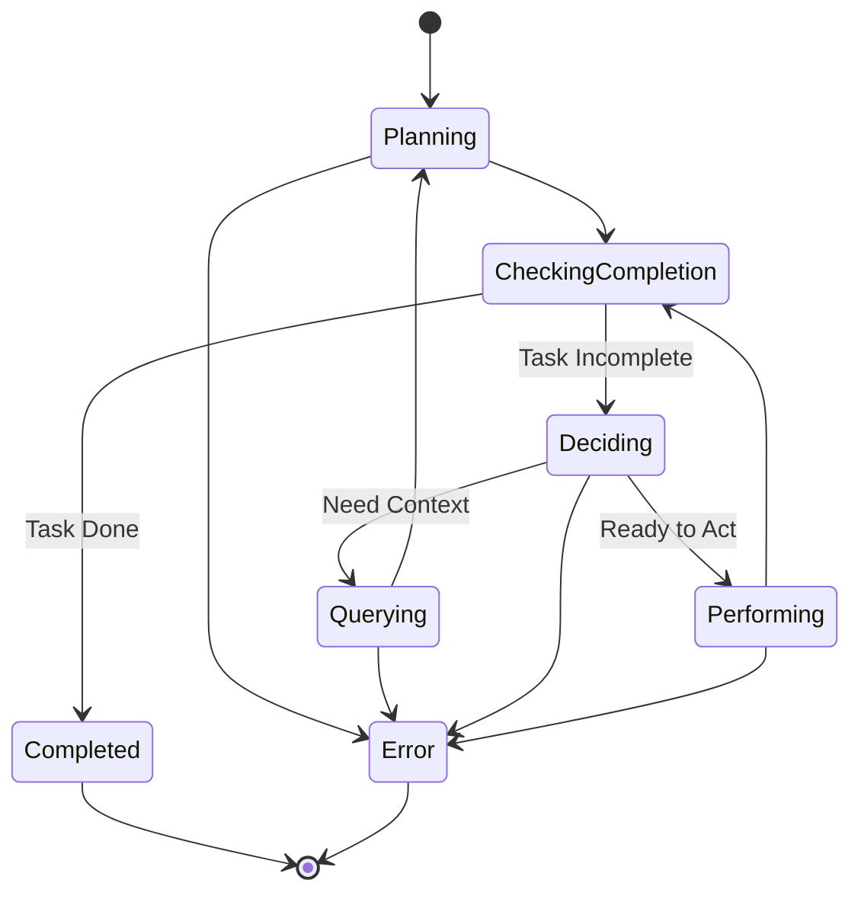

# Agent Control Flow

See [ARCHITECTURE.md](ARCHITECTURE.md) for the harness control flow diagram.

## What an agent should NOT do

- Lower the `target:` value in `codecov.yml`. The guard rejects decreases; admin bypass is the only path.
- Add entries to `ignore:` in `codecov.yml`. The guard counts entries (block- and flow-style) and rejects growth.
- Replace a numeric `target:` with `auto` or remove it. The guard rejects loss of a numeric floor.
- Edit, rename, or delete `.github/workflows/codecov-guard.yml`, `.github/CODEOWNERS`, or other files in `.github/workflows/**` to circumvent the guard.

## When 100% patch coverage is genuinely unhittable

1. If you are blocked because of disabled tests, enable them.
2. If you are blocked because your architectural decisions yield untestable code, re-architect. 
3. If the CI environment is broken in a way that you cannot fix and which is preventing your tests from being run, escalate by creating a github issue describing the exact misisng test problem.

## Adding a new CI job

Every job in every `.github/workflows/*.{yml,yaml}` file is checked by the
`all-checks` gate in `ci.yml`. To avoid breaking the gate, wire each new job
into exactly one of these slots:

- **Default-required job (lives in `ci.yml`)**: add the job under
  `jobs:` in `.github/workflows/ci.yml` AND add its job-id to
  `jobs.all-checks.needs` in the same file.
- **Cross-workflow required job (lives in another workflow file)**: add an
  entry of the form `<workflow-file-basename-without-extension>/<job-id>`
  to `.github/required-status-checks.txt` under the "Required" section AND
  configure it as a required status check in branch protection for `main`.
  NOTE: the string in branch protection is NOT the same as the allowlist
  entry. Branch protection identifies a check by `<workflow `name:`> /
  <job `name:` or job-id>` (with spaces around the slash) — e.g.
  `codecov-guard / guard` — whereas the allowlist uses
  `<workflow-filename-without-extension>/<job-id>` (no spaces) —
  e.g. `codecov-guard/guard`. Configure each side independently. The
  allowlist is documentation/enumeration only; actual merge enforcement
  lives in branch-protection settings, which an agent cannot self-verify
  in this sandbox.
- **Optional / dispatch-only / scheduled job**: add an entry of the same
  form to `.github/required-status-checks.txt` under the "Optional" section.
  The gate will still account for it; branch protection will not require it.

If `all-checks` fails with "jobs are not covered", read the error message:
it lists exactly which `<workflow>/<job>` entries need to be wired in. Do
not silence the gate by deleting jobs from the enumeration.

# Agent State Machine

```mermaid
stateDiagram-v2
    [*] --> Planning
    Planning --> CheckingCompletion
    CheckingCompletion --> Completed: Task Done
    CheckingCompletion --> Deciding: Task Incomplete
    Deciding --> Querying: Need Context
    Deciding --> Performing: Ready to Act
    Querying --> Planning
    Performing --> CheckingCompletion
    Completed --> [*]
    Planning --> Error
    Querying --> Error
    Deciding --> Error
    Performing --> Error
    Error --> [*]
```
