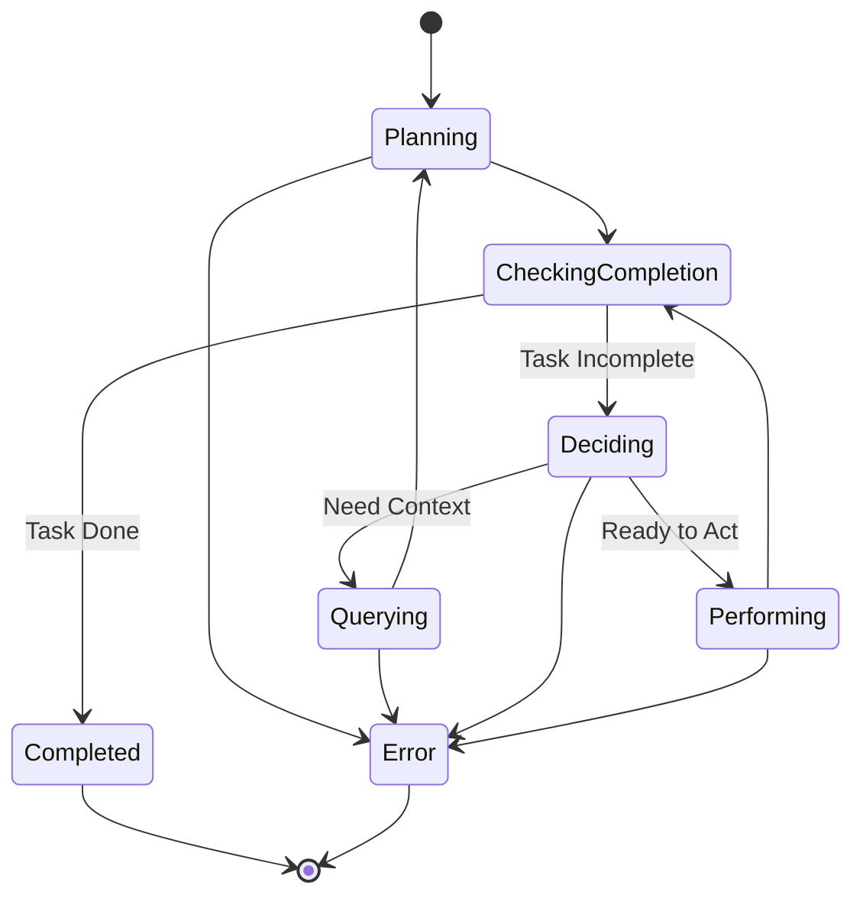

# Agent Control Flow

See [ARCHITECTURE.md](ARCHITECTURE.md) for the harness control flow diagram.

## What an agent should NOT do

- Lower the `target:` value in `codecov.yml`. The guard rejects decreases; admin bypass is the only path.
- Add entries to `ignore:` in `codecov.yml`. The guard counts entries (block- and flow-style) and rejects growth.
- Replace a numeric `target:` with `auto` or remove it. The guard rejects loss of a numeric floor.
- Edit, rename, or delete `.github/workflows/codecov-guard.yml`, `.github/CODEOWNERS`, or other files in `.github/workflows/**` to circumvent the guard.

## When 100% patch coverage is genuinely unhittable

If a PR introduces a branch that cannot be exercised by tests in CI (e.g., requires a real container runtime not available on the runner), the PR's author is responsible for either:

1. Adding a unit test that uses a mock/stub at the same dispatch point (preferred — see `create_with_container_using` in `harness/src/workspace.rs` for the pattern).
2. Refactoring so the uncoverable surface is minimal (e.g., a single delegating wrapper).
3. As a last resort, requesting admin bypass from the owner with a clear justification.

Bypassing coverage by adding `#[cfg(not(tarpaulin))]` or `#[ignore]` to source files to hide lines from the patch metric is **not acceptable** and is tracked as a separate guard initiative.

## Owner one-time setup (UI)

After this guardrail's first PR lands:

1. **Required status check.** Settings → Rules → Default branch protection: add `codecov-guard / guard` to the required status checks alongside `codecov/patch` and `All Checks Passed`.
2. **Repository Ruleset.** Settings → Rules → Rulesets → New branch ruleset. Target `main`. Enable *Restrict file paths* with patterns:
   - `codecov.yml`
   - `tarpaulin.toml`
   - `.github/workflows/**`
   - `.github/CODEOWNERS`
   - `.github/rulesets/**`

   Bypass list: repository admin (you). Apply on PR and push events.
3. Optional: enable *Require pull request before merging* on the same ruleset; CODEOWNERS will surface `@DominicBurkart` as a reviewer on relevant paths but does not block solo merges (admin bypass remains available).

# Agent State Machine

```mermaid
stateDiagram-v2
    [*] --> Planning
    Planning --> CheckingCompletion
    CheckingCompletion --> Completed: Task Done
    CheckingCompletion --> Deciding: Task Incomplete
    Deciding --> Querying: Need Context
    Deciding --> Performing: Ready to Act
    Querying --> Planning
    Performing --> CheckingCompletion
    Completed --> [*]
    Planning --> Error
    Querying --> Error
    Deciding --> Error
    Performing --> Error
    Error --> [*]
```
