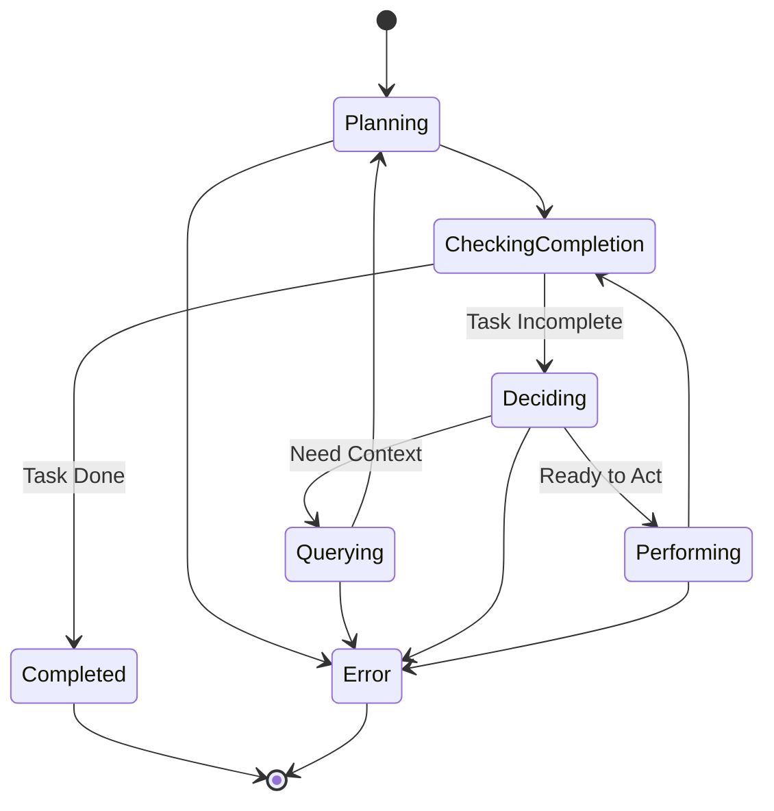

# Agent Control Flow

See [ARCHITECTURE.md](ARCHITECTURE.md) for the harness control flow diagram.

## What an agent should NOT do

- Lower the `target:` value in `codecov.yml`. The guard rejects decreases; admin bypass is the only path.
- Add entries to `ignore:` in `codecov.yml`. The guard counts entries (block- and flow-style) and rejects growth.
- Replace a numeric `target:` with `auto` or remove it. The guard rejects loss of a numeric floor.
- Edit, rename, or delete `.github/workflows/codecov-guard.yml`, `.github/CODEOWNERS`, or other files in `.github/workflows/**` to circumvent the guard.
- Write to a **protected path**. Nanna does not modify the configuration of the repository it works in or its own configuration directory. The fixed set that ships with the executable (`harness::protected::PROTECTED_PATTERNS`, matched case-insensitively) is `.nanna/**` (agent identities, `deploy.toml`, availability windows, and the repository's own `.nanna/protected.toml`), `**/.nanna/**` (any nested `.nanna/` directory), `.git/**`, `.github/workflows/**`, `.github/CODEOWNERS`, `CODEOWNERS`, `docs/CODEOWNERS`, `codecov.yml`, `windows.toml`, `tarpaulin.toml`, `deny.toml`, `flake.nix`, `flake.lock`, `.github/rulesets/**`, `.githooks/**`, `.cargo/**`, `.devcontainer/**`, `AGENTS.md`, `.gitattributes`, `.gitmodules`, `.github/**` (every file under `.github`, including actions and `dependabot.yml`), `.cargo-husky/**`, `.envrc`, `.config/**`, `.claude/**`, `nix/**` and `CLAUDE.md`, plus Nanna's own configuration directory (`$NANNA_CONFIG_DIR`, else `$XDG_CONFIG_HOME/nanna`, else `~/.config/nanna`). A repository may protect more by declaring extra patterns in `.nanna/protected.toml` (`extra = ["path", "dir/**"]`; each entry is a normalised relative literal path, optionally ending in `/**`). The declaration only adds: it cannot remove a shipped pattern or the configuration-directory rule, unknown keys are rejected, and a malformed, unreadable or non-regular file makes the task refuse to start (a missing file declares nothing, so a checkout without it has only the shipped set); the file may be at most 65536 bytes and declare at most 256 patterns, and a declared directory protects its whole tree only when written with a trailing `/**` (a bare directory path protects just that one path). It is read from the base checkout on the host before the task's worktree is created and the resulting set is handed to every enforcement point: `write_file`, the dev container's read-only mounts and placeholders, `extract_changes` / `format_patch`, and `git_commit` and `git_push_branch`. The host-side command pre-filter for `run_command` (`action_auditor/commands.rs`) has no repository context and checks only the shipped set; a shell write to a declared path is refused by the container's read-only mounts. A read-only mount protects the declared file or directory itself but not its parent, so a shell in the container can still `mv` a declared file's parent and recreate it (`moving_the_parent_of_a_declared_file_and_recreating_it_never_changes_a_declared_path_unseen`); git then reports the declared path as changed and patch extraction, `git_commit` and `git_push_branch` refuse it. Only path strings are compared, so a tracked symlink or a hardlink to a declared file is a known gap alongside #917. Making the pre-filter aware of the declared set is tracked in #1020. Nanna's own repository declares the 44 patterns that used to ship for every repository (its protected-set code, gate and auditor code, isolation, effect, budget and lease code, rollout, PR, CI and sandbox tools, scripts, security suites, the four structural tests, `evals/cases/**`, the auditor fixtures, `docs/ci/protected-paths-guard.yml` and `harness/dev-container.toml`) in its own `.nanna/protected.toml`; a test pins that file to exactly those 44 and a second test fails if any of them is protected by default again. No identity scope widens the set: `write_file` refuses these paths, the dev container mounts them read-only and never mounts the configuration directory, and `extract_changes` / `format_patch` refuse to produce a patch that touches them (the task fails with `error_type = "ProtectedPathViolation"` and the auditor is notified).
- Rely on the protected set for more than it does. It is a blocklist of paths, not a review: anything outside the shipped set and the repository's declaration is editable by a task and is protected only by ordinary human review of the PR it produces. In Nanna's own repository that includes the `Cargo.toml` / `Cargo.lock` files (agents must be able to add dependencies; the only control is human PR review, because CODEOWNERS does not list them, `deny.toml` sets `unknown-git` and `unknown-registry` to `warn`, and CI skips `cargo audit` and `cargo deny` on Linux: #925), `harness/src/task.rs`, `harness/src/rollout/**` other than the declared files, `harness/src/harness_adapter/{mod,pi,pi_extension}.rs`, `harness/src/mcp/**`, `harness/src/escalation/**`, `nanna-effects/**` and the rest of `harness/tests/**`; whether to declare any of them is a decision for this repository's `.nanna/protected.toml`, not a product default. Protected files that are absent from a repository are created as empty read-only placeholders in the container worktree (invisible to git, but a tool that auto-detects `flake.nix`, `flake.lock`, `.envrc` or `deny.toml` sees an empty file). Matching compares Unicode NFC forms on every platform (#919), for the shipped patterns and the patterns declared in `.nanna/protected.toml` alike: each rule and each candidate path are normalised to NFC before the case-insensitive glob match, and the configuration directory is located under the repository root by NFC form, so an NFD spelling of a name (macOS HFS+ and APFS treat the two as one file) matches its rule, as does a compatibility singleton such as the Kelvin sign for `k`; reported rules, mount roots and violation paths keep the spelling they were given. Only canonical equivalence is folded, not the code points HFS+ ignores, and the fold also protects the NFC/NFD twin of a protected name on Linux, where the two are distinct files; the CI guard needs no change because every fixed pattern is ASCII. Matching also folds the Windows spellings of a name on every platform, for the shipped patterns and the patterns declared in `.nanna/protected.toml` alike, so a protected file cannot be reached under another name (#918): trailing dots and spaces and an `:stream` suffix are stripped from each path component, and a component shaped like an 8.3 short name (`CODECO~1.YML`, or the hashed `CO3F9A~1.YML`) is also tried as every protected literal name it could abbreviate (the literal names of declared patterns included), with a path of too many such components refused outright. The fold is conservative: it also protects `codecov.yml.` and `CODECO~1.YML` on Linux, and a short name is judged by its shape, never resolved against the file system (no `GetFinalPathNameByHandle`), so it cannot be tested against a real NTFS volume here; the CI guard (`docs/ci/protected-paths-guard.yml` and its installed copy) matches path strings only and folds none of these spellings, so a PR touching a protected file under an alias is not caught there. A declared pattern whose component ends in a dot or a space or contains a colon is rejected when `.nanna/protected.toml` is read, because those are Windows spellings of another name. An 8.3 expansion also treats the characters Windows replaces with `_` (`+ , ; = [ ]`) as `_`. The shell pre-filter's ancestor-removal check is case-sensitive (`rm -rf DOCS` is not caught there) and the matcher never folds backslash separators anywhere (on Linux a backslash is a legal file name character). On a file system that resolves the aliases itself (ntfs-3g, WSL drvfs) an alias spelling can bypass a Linux-path bind mount, and is caught only at patch extraction, commit and push. The two folds compose: a path is normalised to NFC first and the Windows spellings are then expanded, so an NFD spelling of a declared name with a trailing dot or an 8.3 alias is refused too. Known gaps, tracked under #639: a hardlink to a protected file writes through to it because only path strings are compared (#917); a nested `**/.nanna/**` directory has no mount root, so a shell write there is caught only at patch extraction (#810); declared non-ASCII mount roots are mounted read-only under their declared spelling only, and on APFS the NFC and NFD spellings name the same file, so a container shell writing the other spelling may bypass the read-only mount and is caught only at patch extraction, commit and push, which refuse by fold (same class as #810); the production `AuditHook` raises an escalation for a violation, and every production path (the MCP server, `delegate`, `backlog-sync` and the restored queue) now builds one shared sink set from the environment: the escalation is always appended, redacted, to `escalation_records.jsonl` next to the escalation log (rotated to a `.1` sibling at 8 MiB, so at most 16 MiB; when a remote sink is configured a failing local record is logged and never fails the delivery; with no remote sink it stays strict and the escalation errors and is retried), and it also becomes a labelled GitHub issue in the repository named by `NANNA_ESCALATION_REPO` (with a token in `NANNA_ESCALATION_GITHUB_TOKEN` or `GITHUB_TOKEN`) and a JSON POST to `NANNA_ESCALATION_WEBHOOK_URL` when those are set, at most 10 remote deliveries per severity per hour per process; with none of them set a human is NOT notified, only the local record exists and a startup warning says so, so the owner must configure a sink; a malformed value stops the process at start; the rollout executor's escalator is still not constructed in production (#866, #778, #864, #656); the guard workflow is installed at `.github/workflows/protected-paths-guard.yml` but is not a required check (main requires `codecov/patch` and `All Checks Passed`) and the repository variable `PROTECTED_PATTERNS_HUMAN_AUTHORS` is set to `DominicBurkart`, so it fails a PR that carries an identity marker or comes from an unlisted author when the PR touches a path in its inline list (the former 71 patterns, a superset of the shipped set and of this repository's declaration) and passes an unmarked PR from the listed author (#862); the guard template identifies agent PRs only by the agent-controlled `Nanna-Identity` marker and `PR_AUTHOR`, never by the branch or an identity registry, which is what #755 asks for. `.git/**` is not a gap: it is in the protected set, refused by `write_file` (`every_write_capable_tool_refuses_every_protected_pattern_unscoped`), and blocked from the shell by the container join (`protected_roots_absent_at_container_start_cannot_be_created_from_the_shell`, which skips without a container runtime; #802 is closed). `git_commit` stamps the identity trailer (#740 is delivered).
- Expect protected files to need a human. In Nanna's own repository agents cannot edit the shipped set (`nix/**`, `.github/**`, `.claude/**` and the rest) or the files in its `.nanna/protected.toml` (`tools.rs`, `workspace.rs`, `identity/**`, `action_auditor/**`, `container.rs`, `effects.rs`, `leases/**`, `rollout/executor.rs`, `scripts/**` and the rest); those changes need a human-authored PR. The guard is installed (#862) and not required; with `PROTECTED_PATTERNS_HUMAN_AUTHORS` set to `DominicBurkart` it fails an agent-marked PR that touches one of its listed paths, and the variable must list every login allowed to change them, including any Dependabot bot login, or the guard fails Dependabot PRs that touch `.github`.
- Strip or forge the identity marker. Agent commits end with the `Nanna-Identity: <name>` trailer and agent PR bodies carry `<!-- Nanna-Identity: <name> -->` (`harness::marker`); the CI guard uses it to tell agent PRs from human PRs.
- Circumvent the protected-paths guard. Its workflow is installed at `.github/workflows/protected-paths-guard.yml` and maintained as [`docs/ci/protected-paths-guard.yml`](docs/ci/protected-paths-guard.yml); the installed copy is the template without its leading comment header (`harness/tests/protected_guard_install.rs` keeps them identical), agents cannot write either file, and it runs on `pull_request` with a read-only token, no secrets and no PR code executed. It fails any PR that touches a path in its inline list unless its author is listed in the repository variable `PROTECTED_PATTERNS_HUMAN_AUTHORS` and the PR carries no identity marker (a PR with a marker fails even when its author is listed).

## Auditor false-allow eval: what is enforced where

`nanna auditor eval` measures the spawn auditor's model-only false-allow count on the held-out cases and exits non-zero above the threshold (default 0) or when the run cannot be trusted. It is manual today. CI checks only its logic against mocks; no required check measures a real model. A `workflow_dispatch`-only job (`.github/workflows/auditor-eval.yml`) is not a required check and is dispatch-only until the gate can complete on the runner (see #1000); the first measurement is pending, and no held-out false-allow number exists yet. Full description: [docs/agent-evaluation-patterns.md](docs/agent-evaluation-patterns.md#auditor-false-allow-eval-what-is-enforced-where).

## Action audit telemetry: what is exported and what blocks

Every decision of `ActionGate::run_gate` (allow, block, escalate, including the block an auditor error or a log-write failure becomes) is handed to the gate's `ActionAuditSink` exactly once, as an `ActionAuditEvent` that carries only the verdict, reason-code names, identity, tool, task id, effect class and auditor name (names reduced to plain characters and 64 characters; never the tool arguments or reason text). `nanna mcp-serve` and `nanna delegate` attach a `TelemetrySink`, so decisions reach the telemetry system as a counter and an event; `mcp-serve` flushes every 30 seconds and once more on shutdown (stdin closing, SIGINT or SIGTERM) to `telemetry.jsonl` beside the queue, and `delegate` flushes once when its task ends, whether it succeeded or failed, to `telemetry-delegate.jsonl` (the two commands use different files; two `mcp-serve` processes or two `delegate` runs on one queue directory still share a file, where lines are never torn but a rotation can overshoot the cap or drop the other process's `.1`); the file is opened without following symlinks and without blocking, must be a regular file (a symlink or FIFO is refused and logged), is created with mode 0600 and tightened to 0600 if it already existed, and is rotated at 8 MiB to a `.1` sibling, checked per line. The final flush runs on a blocking thread with a 5 second limit, and the process then leaves the runtime within 2 seconds (`Runtime::shutdown_timeout`) even if a blocking task is stuck, such as a hung export or the blocking stdin read of `mcp-serve`, so a signal ends `mcp-serve` while stdin stays open; a hard-hung syscall can still delay exit by up to that 2 seconds. tokio keeps its signal handler installed, so a second SIGINT or SIGTERM during the flush is swallowed rather than killing the process. A panic in the work skips the final flush, and `delegate` has no signal handler, so an interrupted `delegate` loses its telemetry. The exported verdict is the decision `run_gate` returned, not the final registry outcome: `apply_denial_policy` can still turn a task's third denial into an escalation after the gate, and the fail-closed block a registry returns when no auditor is configured never reaches the gate, so neither is exported. Emission is infallible and never blocks or downgrades an action: the durable `ActionAuditLog` remains the fail-closed record (a write failure still turns an Allow into a Block), and telemetry is a derived view. A gate with no sink attached emits nothing; gates built by `nanna agent` and `nanna chat` do not exist (those registries are ungated) and the `TaskManager` default gate used in tests has no sink. `harness/tests/action_audit_structural.rs` pins that `run_gate` is `decide`, `emit`, return the emitted value, and that both CLI gates get the sink from the manager they run (the manager is bound once and handed to the server, the flushed work is the serving or delegate future, the file constant is the command's own). The pin is syntactic: it reads `harness/src` only and matches the adjacent tokens `ActionGate` `new` (so `<ActionGate as Default>::default()` or `ActionGate::from` would not be flagged; `ActionGate` has neither today). The telemetry buffers are bounded (10,000 metrics and 10,000 events; the oldest tenth is dropped and counted in `nanna_telemetry_dropped_total`). Not exported: a prompt hash (the action verdict does not carry one).

## The pull request a task deploys: where the binding comes from

A dispatched task has no pull request until it opens one. The only writer of the binding is `github_pr_open`: after the host created the draft pull request it records the origin-resolved repository, the number from the host's response, the branch and the `git rev-parse HEAD` the harness ran (`harness/src/pr_binding.rs`; first binding wins, nothing can replace it, and its `bind` is crate-private, so no tool argument, queue field or MCP argument can set it). The registry owns the cell; `review_action` offers the bound number to the lease context only when the bound repository equals the subject's repository after normalisation (ASCII `owner/name`, case-insensitive; a non-ASCII lookalike, a trailing dot or extra path parts never match), and `sandbox_deploy` refuses unless the same check holds against the repository it resolves from `origin`, so the lease key and the deployed repository cannot disagree. An empty or mismatching binding fails closed at the gate and at the tool. The result of `sandbox_deploy` reports `pr_number` and `head_sha`; the head sha is recorded and reported, not enforced against `image_tag`. A closed or merged bound pull request does not block a deploy (#1035). A host-supplied binding for a task dispatched against an existing pull request is not part of this design (#1037). `harness/tests/pr_binding_structural.rs` pins the single writer, the single reader, and that `QueuedTask`, `ActionSubject`, `SandboxContext` and the `assign_task` / `plan_task` arguments gain no pull request or window input.

## When 100% patch coverage is genuinely unhittable

1. If you are blocked because of disabled tests, enable them.
2. If you are blocked because your architectural decisions yield untestable code, re-architect.
3. If a CI-environment failure you cannot fix is blocking your tests, escalate by opening a GitHub issue describing the exact missing-test problem.

# Agent State Machine

```mermaid
stateDiagram-v2
    [*] --> Planning
    Planning --> CheckingCompletion
    CheckingCompletion --> Completed: Task Done
    CheckingCompletion --> Deciding: Task Incomplete
    Deciding --> Querying: Need Context
    Deciding --> Performing: Ready to Act
    Querying --> Planning
    Performing --> CheckingCompletion
    Completed --> [*]
    Planning --> Error
    Querying --> Error
    Deciding --> Error
    Performing --> Error
    Error --> [*]
```
