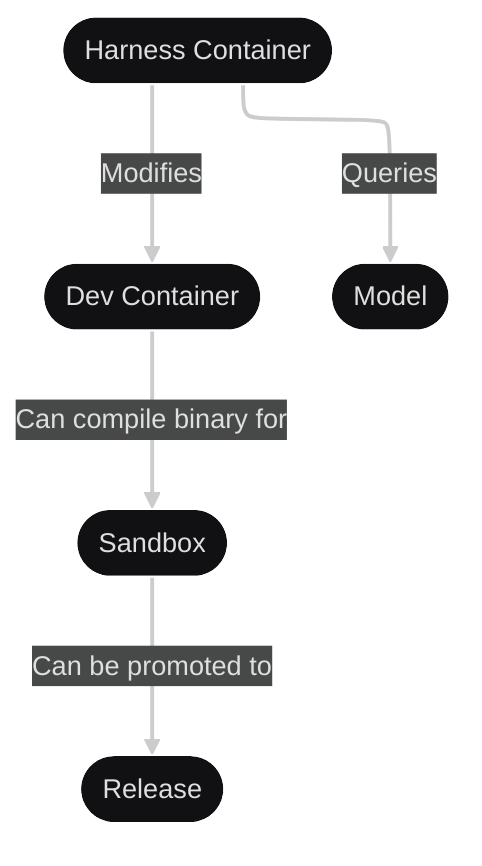

# Nanna Coder Architecture

This document describes the architectural design of Nanna Coder, focusing on the entity management system that forms the core domain complexity of the project.

## Table of Contents

- [Overview](#overview)
- [Harness Control Flow](#harness-control-flow)
- [Container Topology](#container-topology)
- [Entity Management System](#entity-management-system)
- [Entity Types](#entity-types)
- [Query & Modification Patterns](#query--modification-patterns)

## Overview

Nanna Coder is an AI-powered coding assistant that manages development environments through a sophisticated entity system. The architecture is built around:

1. **Harness**: The control loop that manages the AI agent's decision-making process
2. **Entity Management**: Structured representation of all development artifacts and their relationships
3. **Container Orchestration**: Isolated environments for development, testing, and deployment
4. **RAG (Retrieval-Augmented Generation)**: Context-aware querying of entities to inform AI decisions

The system follows a microcommit strategy where every modification to the dev environment corresponds to a new git commit, facilitating granular entity management within the inner development loop.

## Harness Control Flow

The harness implements the main agent control loop, managing the AI's interaction with the development environment:


### Control Flow States

1. **Application State 1**: Initial state with enriched entities
2. **Entity Enrichment**: Automatic enrichment of context before planning
3. **User Prompt**: Trigger from user request
4. **Plan Entity Modification**: Strategic planning of what entities need to change
5. **Task Complete?**: Decision point checking if user requirements are satisfied
6. **Entity Modification Decision**: Determine if more information is needed
7. **Query Entities (RAG)**: Retrieve relevant context from entity store
8. **Perform Entity Modification**: Execute planned changes
9. **Update Entities**: Persist changes to entity system
10. **Application State 2**: Final state after task completion

### Implementation

The control flow is implemented in `harness/src/agent/`:
- `mod.rs`: Main agent loop state machine
- `decision.rs`: Entity modification decision logic
- `rag.rs`: RAG-based entity querying

## Container Topology

Nanna uses a multi-container architecture to provide isolation and controlled progression through development stages:



### Container Responsibilities

1. **Harness Container**:
   - Runs the AI agent control loop
   - Manages entity state
   - Queries AI models for decisions
   - Orchestrates development workflow

2. **Dev Container**:
   - Isolated development environment
   - Modifiable by harness
   - Contains source code and build tools
   - Tracked via git with microcommits

3. **Model**:
   - AI model inference
   - Provides intelligent suggestions
   - Validates code quality
   - Implements ModelJudge framework

4. **Sandbox**:
   - Testing and validation environment
   - Receives compiled binaries from dev container
   - Telemetry and observability
   - Safe execution environment

5. **Release**:
   - Production deployment target
   - Promoted from validated sandbox builds
   - Principle of least privilege
   - Human-in-the-loop for deployment

### Implementation

Container infrastructure is in `harness/src/container.rs`:
- Multi-runtime support (Podman, Docker, Mock)
- Health checking and lifecycle management
- Image fallback strategies
- Automatic cleanup

## Entity Management System

The entity management system is the core domain complexity of Nanna. It defines:
- **What** context is collected and surfaced to the AI model
- **How** the structure helps the model understand relationships between information
- **When** entities are queried (RAG) and modified

### Design Principles

1. **Queryable**: Limited-parameter models can meaningfully navigate entities with minimal domain-specific prompting
2. **Modular**: Entity types are independent, extensible units
3. **Concurrent**: Entity operations support parallel execution
4. **Versioned**: All entity modifications are tracked via git microcommits
5. **Relational**: Entities maintain graph relationships for context

### Entity Storage

Entities are stored with:
- **Content-addressed storage**: Deduplicated and immutable
- **Graph relationships**: Bidirectional links between related entities
- **Version tracking**: Every change corresponds to a git commit
- **Metadata**: Timestamps, authorship, and lineage

### Entity Operations

1. **Create**: Add new entity with metadata
2. **Query**: RAG-based retrieval using free text search and graph traversal
3. **Update**: Modify entity with automatic versioning
4. **Relate**: Establish relationships between entities
5. **Enrich**: Automatic enhancement of entity context

## Entity Types

Nanna manages the following classes of entities:

### 1. Version Control Entities

**Purpose**: Track git repository state and changes

**Entities**:
- Repository metadata
- Branch information (feature branches for new prompts)
- Staged/unstaged files
- Commit history and lineage
- .gitignore scope (what's tracked vs. ignored)
- Bundle environment information

**Relationships**:
- Commits → Changed files
- Branches → Commits
- Files → Ignore rules

**Implementation**: `harness/src/entities/git/`

### 2. AST & Filesystem Entities

**Purpose**: Complete, queryable, and modifiable abstract syntax trees and filesystem representation

**Supported ASTs**:
- Rust, Python, JavaScript/TypeScript, Java
- YAML, TOML, JSON, CSV
- Dockerfile, Nix expressions
- Makefiles, CMake
- Shell scripts (POSIX, Bash, Zsh)

**Fallback Strategies**:
- **Text files**: By-line representation with metadata (line/character counts)
- **Binary files**: Base64 encoding with file metadata

**Query Capabilities**:
- Free text search across all entities
- Graph relationships: files ↔ specific line segments
- Structural navigation (e.g., "find all functions calling X")

**Implementation**: `harness/src/entities/ast/`

### 3. Testing & Analysis Entities

**Purpose**: Static analysis and test results correlated with git state

**Entities**:
- Test results (unit, integration, E2E)
- Lint results (clippy, rustfmt, etc.)
- Static analysis output
- Code coverage metrics
- Security audit results
- Dependency license compliance

**Relationships**:
- Git commit → Test results
- Code location → Lint warnings
- Dependencies → Security vulnerabilities

**Implementation**: `harness/src/entities/test/`

### 4. Environment & Deployment Entities

**Purpose**: Model container relationships and deployment configuration

**Entities**:
- Container configurations
- Build specifications
- Deployment manifests
- Environment variables
- Resource constraints
- Security policies

**Principles**:
- **Least Privilege**: Minimal permissions for builds
- **Effects Visibility**: Clear view of what changes when deploying
- **Human-in-the-Loop**: Manual approval for production deployments

**Relationships**:
- Dev container → Sandbox
- Sandbox → Release candidate
- Build config → Container image

**Implementation**: `harness/src/entities/env/`

### 5. Project Context Entities

**Purpose**: Track user intent, scope, and progress

**Entities**:
- User prompts and requests
- Conversation history
- Project scope definition
- Task completion status
- Progress tracking (from git commit messages)
- Agent decisions and rationale

**Relationships**:
- User prompt → Generated commits
- Conversation → Entity modifications
- Task → Required entities

**Implementation**: `harness/src/entities/context/`

### 6. Sandbox Telemetry Entities (TODO)

**Purpose**: Runtime observability and metrics from sandbox execution

**Note**: This has the largest scope and requires per-project configuration. Detailed design is deferred.

**Planned Entities**:
- Runtime metrics
- Performance traces
- Resource utilization
- Error logs
- System events

**Implementation**: Future - requires project-specific configuration

## Query & Modification Patterns

### RAG-Based Querying

When the agent needs context, it queries entities using RAG:

```rust
// Pseudo-code for entity querying
async fn query_entities(query: &str) -> Vec<Entity> {
    // 1. Free text search across entity content
    let text_matches = entity_store.search(query);

    // 2. Graph traversal for related entities
    let related = entity_store.find_related(text_matches);

    // 3. Rank by relevance
    let ranked = rank_entities(text_matches, related, query);

    // 4. Return top-k most relevant
    ranked.take(TOP_K)
}
```

**Query Types**:
- **Semantic**: "What functions handle authentication?"
- **Structural**: "Show all tests for module X"
- **Temporal**: "What changed in the last 3 commits?"
- **Relational**: "What depends on this function?"

### Entity Modification

All modifications follow a structured pattern:

1. **Plan**: Determine which entities need to change
2. **Validate**: Check modification is safe and sensible
3. **Apply**: Perform the modification
4. **Commit**: Create git microcommit
5. **Update**: Refresh entity relationships

```rust
// Pseudo-code for entity modification
async fn modify_entity(
    entity_id: EntityId,
    modification: Modification
) -> Result<(), Error> {
    // 1. Plan modification
    let plan = plan_modification(entity_id, modification)?;

    // 2. Validate safety
    validate_modification(&plan)?;

    // 3. Apply changes
    let updated = apply_modification(plan)?;

    // 4. Create microcommit
    create_microcommit(&updated)?;

    // 5. Update relationships
    update_relationships(&updated)?;

    Ok(())
}
```

### Microcommit Strategy

Every entity modification creates a focused git commit:

- **Granular**: One logical change per commit
- **Traceable**: Commit message links to user prompt
- **Reversible**: Easy to undo specific changes
- **Queryable**: Commits themselves are entities

This enables:
- Fine-grained history tracking
- Precise rollback capabilities
- Better understanding of entity evolution
- Improved RAG context (changes over time)

## Implementation Status

### Completed
- ✅ Harness control flow (agent loop)
- ✅ Container topology and orchestration
- ✅ Model integration and validation
- ✅ Observability and monitoring

### In Progress
- 🚧 Entity management system architecture
- 🚧 Core entity traits and abstractions
- 🚧 Entity type implementations

### Planned
- 📋 Version Control Entities
- 📋 AST & Filesystem Entities
- 📋 Testing & Analysis Entities
- 📋 Environment & Deployment Entities
- 📋 Project Context Entities
- 📋 Sandbox Telemetry Entities

## Related Documentation

- [README.md](README.md) - Project overview and quick start
- [AGENTS.md](AGENTS.md) - Agent implementation details
- [TESTING.md](TESTING.md) - Testing strategy and guidelines
- [docs/poc-system-overview.md](docs/poc-system-overview.md) - Complete system overview

## References

- [Issue #20: Entity Management](https://github.com/DominicBurkart/nanna-coder/issues/20) - Original requirements
- `harness/src/agent/` - Agent control loop implementation
- `harness/src/container.rs` - Container orchestration
- `harness/src/entities/` - Entity system implementation (in progress)
