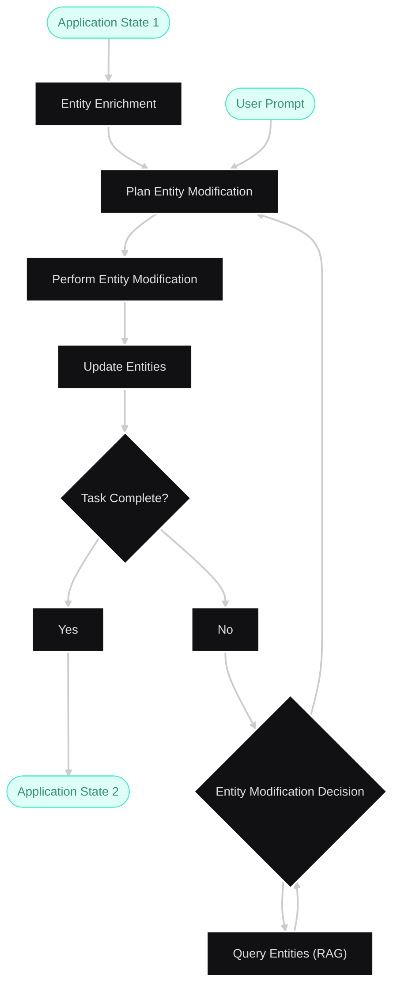

# Harness Control Flow

```mermaid
---
config:
  theme: redux-dark
  layout: dagre
---
flowchart TD
    A(["Application State 1"]) --> n6["Entity Enrichment"]
    n10(["User Prompt"]) --> n4["Plan Entity Modification"]
    B{"Task Complete?"} --> C["Yes"] & D["No"]
    D --> n1["Entity Modification Decision"]
    n1 --> n3["Query Entities (RAG)"] & n4
    n4 --> n7["Perform Entity Modification"]
    C --> n9(["Application State 2"])
    n3 --> n1
    n7 --> n11["Update Entities"]
    n11 --> B
    n6 --> n4
    n6@{ shape: rect}
    n4@{ shape: rect}
    n1@{ shape: diam}
    n3@{ shape: rect}
    n7@{ shape: rect}
    n11@{ shape: rect}
     A:::Rose
     A:::Aqua
     n10:::Aqua
     n9:::Aqua
    classDef Rose stroke-width:1px, stroke-dasharray:none, stroke:#FF5978, fill:#FFDFE5, color:#8E2236
    classDef Aqua stroke-width:1px, stroke-dasharray:none, stroke:#46EDC8, fill:#DEFFF8, color:#378E7A
```

# Container Topology

```mermaid
---
config:
  theme: redux-dark
  layout: elk
---
flowchart TD
    B(["Harness Container"]) -- Modifies --> C(["Dev Container"])
    B -- Queries --> n1(["Model"])
    C -- Can compile binary for --> n2(["Sandbox"])
    n2 -- Can be promoted to --> n3(["Release"])
```
