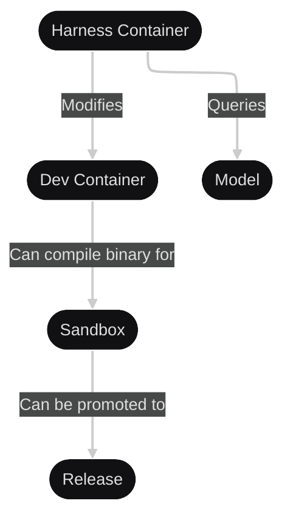

# Harness Control Flow

See [AGENTS.md](AGENTS.md) for the agent control flow and state machine diagrams.

# Container Topology

```mermaid
---
config:
  theme: redux-dark
  layout: elk
---
flowchart TD
    B(["Harness Container"]) -- Modifies --> C(["Dev Container"])
    B -- Queries --> n1(["Model"])
    C -- Can compile binary for --> n2(["Sandbox"])
    n2 -- Can be promoted to --> n3(["Release"])
```
