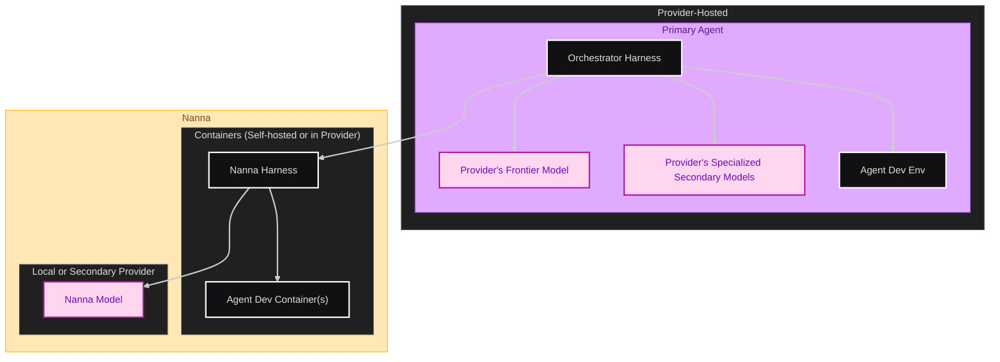
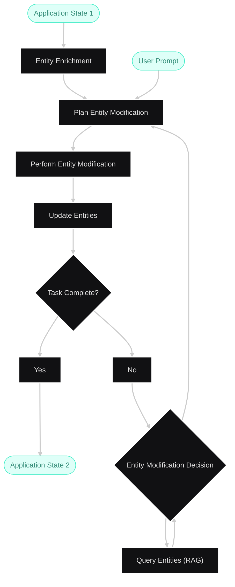

# Nanna: A Delegation Tool for Coding Agents

Nanna is a tool for advanced agents to delegate simple coding tasks to smaller models. It is designed to be integrated into orchestrator agent configurations, allowing frontier models to offload well-scoped work to cheaper, faster, local or secondary-provider models.

## System Architecture

```mermaid
---
config:
  theme: redux-dark
  layout: dagre
---
flowchart TD
    %% Provider side
    subgraph ProviderHosted["Provider-Hosted"]
        subgraph ProviderAgent["Primary Agent"]
            OrchestratorHarness["Orchestrator Harness"]
            OrchestratorModel["Provider's Frontier Model"]
            OrchestratorSecondaryModel["Provider's Specialized Secondary Models"]
            OrchestratorHarness --> OrchestratorModel
            OrchestratorHarness --> OrchestratorSecondaryModel
            ProviderDevEnv["Agent Dev Env"]
        end
        OrchestratorHarness --> ProviderDevEnv
    end

    %% Nanna side (Self-hosted or in Provider)
    subgraph Nanna["Nanna"]
        subgraph NannaDev["Containers (Self-hosted or in Provider)"]
            NannaHarness["Nanna Harness"]
            NannaDevEnv["Agent Dev Container(s)"]
            NannaHarness --> NannaDevEnv
        end
        subgraph GatewayHosted["Local or Secondary Provider"]
            NannaModel["Nanna Model"]
        end
    end

    %% Optional external model provider for Nanna
    NannaHarness --> NannaModel

    %% Connections between orchestration layers
    OrchestratorHarness --> NannaHarness

    %% Classes
    classDef area fill:#202020,stroke:#555,stroke-width:1px,color:#DDD
    classDef orchestrator stroke:#9D4EDD,fill:#E0AAFF,color:#5A189A
    classDef subagent stroke:#46EDC8,fill:#DEFFF8,color:#378E7A
    classDef nanna stroke:#FFB703,fill:#FFE8B6,color:#8B4513
    classDef model stroke:#B5179E,fill:#FFD6F0,color:#7209B7

    class ProviderHosted,NannaDev,GatewayHosted area
    class ProviderAgent orchestrator
    class Nanna nanna
    class NannaModel,OrchestratorModel,OrchestratorSecondaryModel model
```

# Harness Control Flow

```mermaid
---
config:
  theme: redux-dark
  layout: dagre
---
flowchart TD
    A(["Application State 1"]) --> n6["Entity Enrichment"]
    n10(["User Prompt"]) --> n4["Plan Entity Modification"]
    B{"Task Complete?"} --> C["Yes"] & D["No"]
    D --> n1["Entity Modification Decision"]
    n1 --> n3["Query Entities (RAG)"] & n4
    n4 --> n7["Perform Entity Modification"]
    C --> n9(["Application State 2"])
    n3 --> n1
    n7 --> n11["Update Entities"]
    n11 --> B
    n6 --> n4
    n6@{ shape: rect}
    n4@{ shape: rect}
    n1@{ shape: diam}
    n3@{ shape: rect}
    n7@{ shape: rect}
    n11@{ shape: rect}
     A:::Rose
     A:::Aqua
     n10:::Aqua
     n9:::Aqua
    classDef Rose stroke-width:1px, stroke-dasharray:none, stroke:#FF5978, fill:#FFDFE5, color:#8E2236
    classDef Aqua stroke-width:1px, stroke-dasharray:none, stroke:#46EDC8, fill:#DEFFF8, color:#378E7A
```

# Container Topology

```mermaid
---
config:
  theme: redux-dark
  layout: elk
---
flowchart TD
    B(["Harness Container"]) -- Modifies --> C(["Dev Container"])
    B -- Queries --> n1(["Model"])
    C -- Can compile binary for --> n2(["Sandbox"])
    n2 -- Can be promoted to --> n3(["Release"])
```
