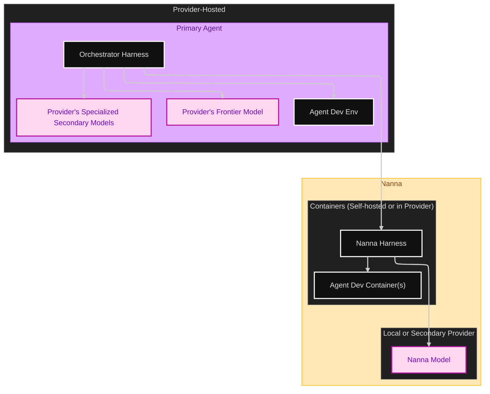
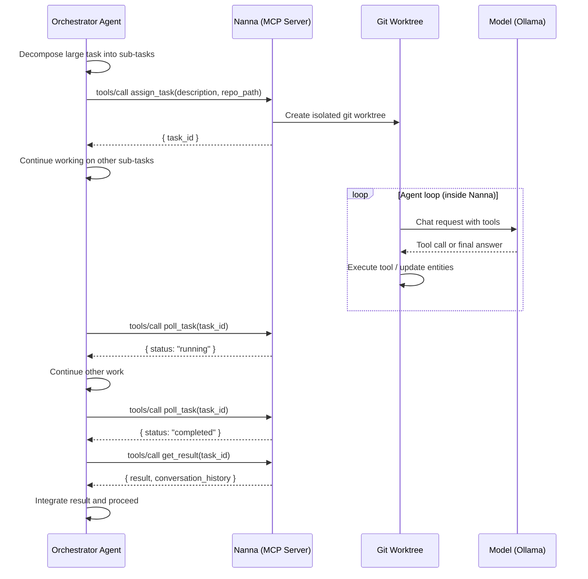

# Primary Use-Case (Background Agents Delegate Tasks to Nanna)


```mermaid
---
config:
  theme: redux-dark
  layout: elk
---
flowchart TD
    %% Provider side
    subgraph ProviderHosted["Provider-Hosted"]
        subgraph ProviderAgent["Primary Agent"]
            OrchestratorHarness["Orchestrator Harness"]
            OrchestratorModel["Provider's Frontier Model"]
            OrchestratorSecondaryModel["Provider's Specialized Secondary Models"]
            OrchestratorHarness --> OrchestratorModel
            OrchestratorHarness --> OrchestratorSecondaryModel
            ProviderDevEnv["Agent Dev Env"]
        end
        OrchestratorHarness --> ProviderDevEnv
    end

    %% Nanna side (Self-hosted or in Provider)
    subgraph Nanna["Nanna"]
        subgraph NannaDev["Containers (Self-hosted or in Provider)"]
            NannaHarness["Nanna Harness"]
            NannaDevEnv["Agent Dev Container(s)"]
            NannaHarness --> NannaDevEnv
        end
        subgraph GatewayHosted["Local or Secondary Provider"]
            NannaModel["Nanna Model"]
        end
    end

    %% Connections between orchestration layers
    OrchestratorHarness --> NannaHarness

    %% Optional external model provider for Nanna
    NannaHarness --> NannaModel

    %% Classes
    classDef area fill:#202020,stroke:#555,stroke-width:1px,color:#DDD
    classDef orchestrator stroke:#9D4EDD,fill:#E0AAFF,color:#5A189A
    classDef subagent stroke:#46EDC8,fill:#DEFFF8,color:#378E7A
    classDef nanna stroke:#FFB703,fill:#FFE8B6,color:#8B4513
    classDef model stroke:#B5179E,fill:#FFD6F0,color:#7209B7

    class ProviderHosted,NannaDev,GatewayHosted area
    class ProviderAgent orchestrator
    class Nanna nanna
    class NannaModel,OrchestratorModel,OrchestratorSecondaryModel model
```

# Harness Control Flow


```mermaid
---
config:
  theme: redux-dark
  layout: dagre
---
flowchart TD
    A(["Application State 1"]) --> n6["Entity Enrichment"]
    n10(["User Prompt"]) --> n4["Plan Entity Modification"]
    B{"Task Complete?"} --> C["Yes"] & D["No"]
    D --> n1["Entity Modification Decision"]
    n1 --> n3["Query Entities (RAG)"] & n4
    n4 --> n7["Perform Entity Modification"]
    C --> n9(["Application State 2"])
    n3 --> n1
    n7 --> n11["Update Entities"]
    n11 --> B
    n6 --> n4
    n6@{ shape: rect}
    n4@{ shape: rect}
    n1@{ shape: diam}
    n3@{ shape: rect}
    n7@{ shape: rect}
    n11@{ shape: rect}
     A:::Rose
     A:::Aqua
     n10:::Aqua
     n9:::Aqua
    classDef Rose stroke-width:1px, stroke-dasharray:none, stroke:#FF5978, fill:#FFDFE5, color:#8E2236
    classDef Aqua stroke-width:1px, stroke-dasharray:none, stroke:#46EDC8, fill:#DEFFF8, color:#378E7A
```

# API

Nanna exposes two interfaces: a CLI for direct use and an MCP server for integration with other agents.

## CLI

The `harness` binary is the primary interface:

```
harness chat [--model <model>] [--prompt <text>] [--tools] [--temperature <f>]
harness agent --prompt <text> [--model <model>] [--max-iterations <n>] [--tools] [--verbose]
harness mcp-serve [--model <model>] [--max-iterations <n>]
harness models
harness tools
harness health
```

- **chat** – single-turn or interactive conversation with a model, optionally using tools.
- **agent** – autonomous agentic loop: the model iterates with tool use until the task is complete or the iteration limit is reached.
- **mcp-serve** – start an MCP server over stdio so other agents can delegate tasks to nanna (see below).
- **models / tools / health** – introspection and diagnostics.

## MCP Server

Running `harness mcp-serve` exposes nanna as an MCP tool server (JSON-RPC 2.0 over stdio). This is the preferred interface when a background orchestrator needs to offload coding tasks asynchronously.

| Tool | Description |
|------|-------------|
| `assign_task` | Submit a coding task to run asynchronously in an isolated git worktree. Returns a `task_id`. |
| `poll_task` | Check the current status of a submitted task. |
| `get_result` | Retrieve the final result of a completed or failed task. |
| `list_tasks` | List all submitted tasks and their statuses. |
| `cancel_task` | Cancel a pending or running task. |
| `onboard_repo` | Generate a `flake.nix` for a pure Cargo/Rust project that does not have one. |

# Happy-Path Sequence: Orchestrator Delegating to Nanna

The following diagram shows how a background orchestrator agent that is managing many parallel tasks delegates coding sub-tasks to nanna via MCP.


```mermaid
sequenceDiagram
    participant O as Orchestrator Agent
    participant N as Nanna (MCP Server)
    participant W as Git Worktree
    participant M as Model (Ollama)

    O->>O: Decompose large task into sub-tasks
    O->>N: tools/call assign_task(description, repo_path)
    N->>W: Create isolated git worktree
    N-->>O: { task_id }
    O->>O: Continue working on other sub-tasks

    loop Agent loop (inside Nanna)
        W->>M: Chat request with tools
        M-->>W: Tool call or final answer
        W->>W: Execute tool / update entities
    end

    O->>N: tools/call poll_task(task_id)
    N-->>O: { status: "running" }
    O->>O: Continue other work

    O->>N: tools/call poll_task(task_id)
    N-->>O: { status: "completed" }
    O->>N: tools/call get_result(task_id)
    N-->>O: { result, conversation_history }
    O->>O: Integrate result and proceed
```

# Container Topology


```mermaid
---
config:
  theme: redux-dark
  layout: elk
---
flowchart TD
    B(["Harness Container"]) -- Modifies --> C(["Dev Container"])
    B -- Queries --> n1(["Model"])
    C -- Can compile binary for --> n2(["Sandbox"])
    n2 -- Can be promoted to --> n3(["Release"])
```
