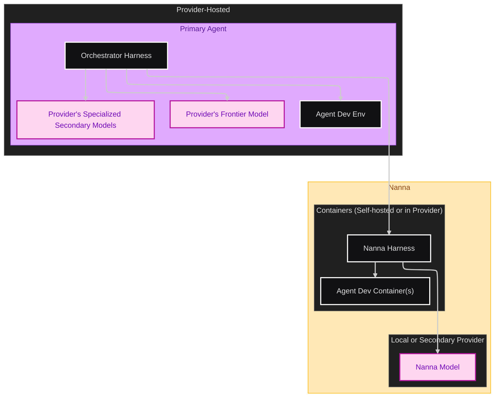
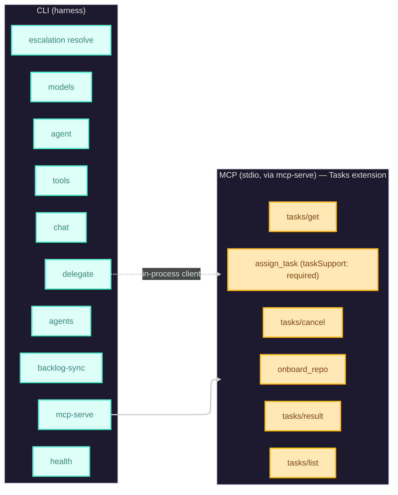
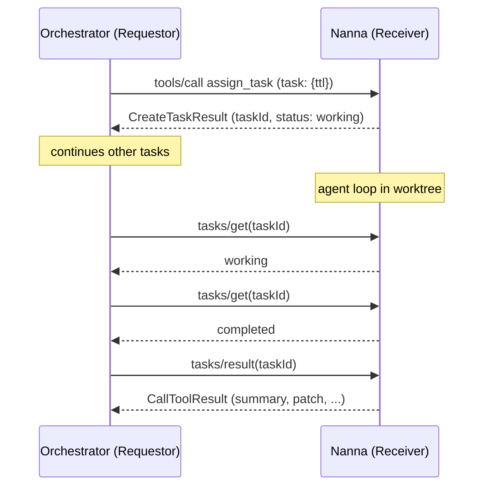
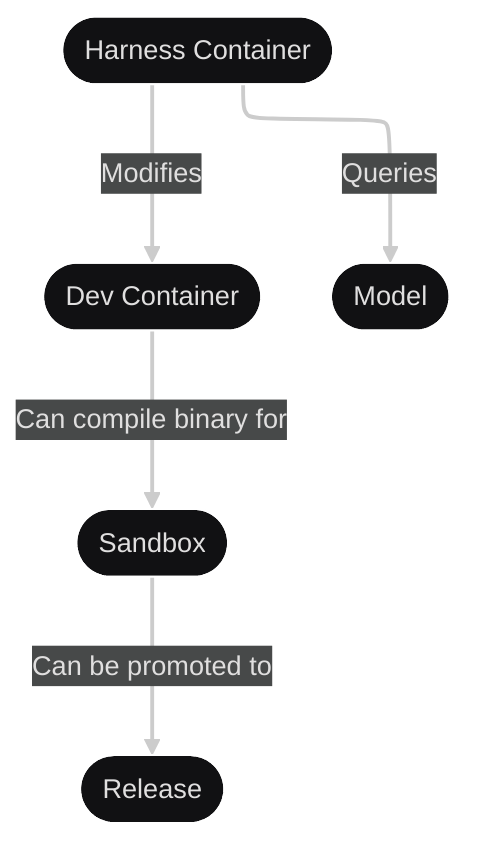
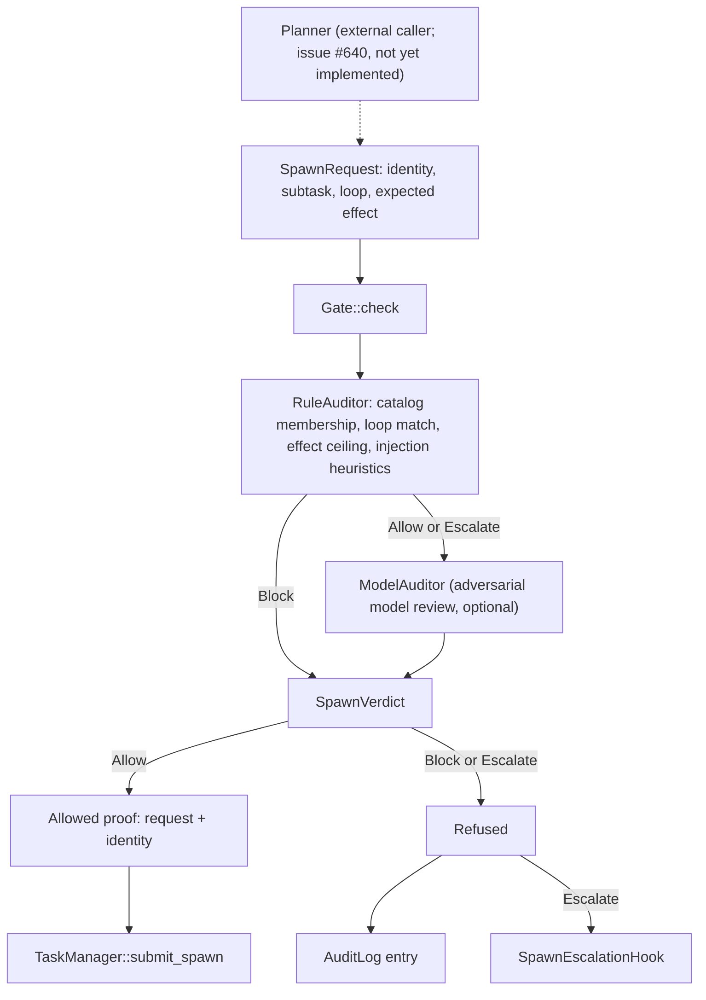
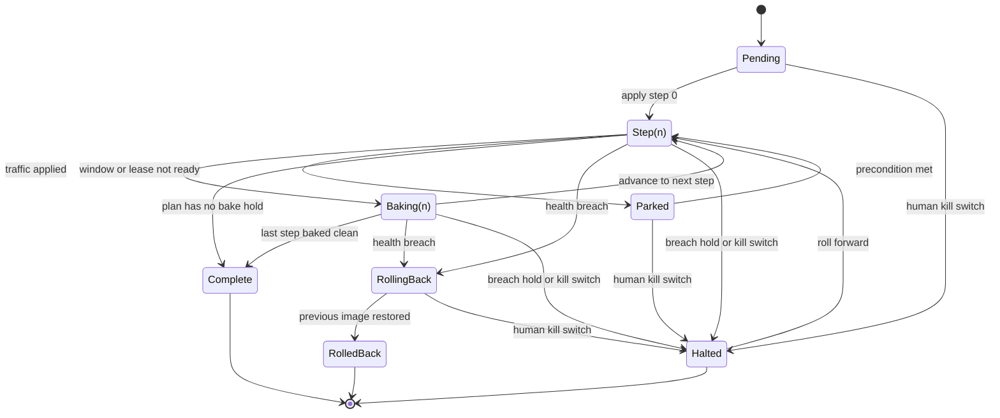
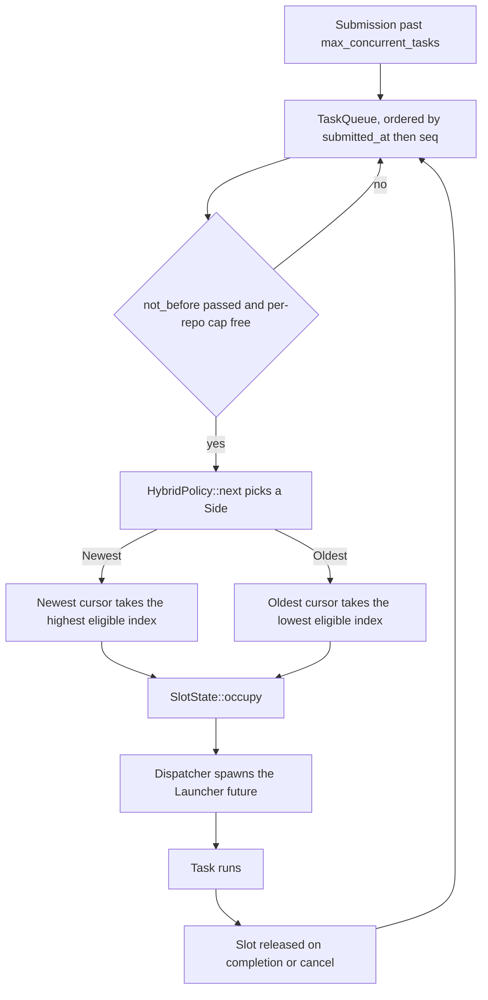

# Primary Use-Case (Background Agents Delegate Tasks to Nanna)


```mermaid
---
config:
  theme: redux-dark
  layout: elk
---
flowchart TD
    %% Provider side
    subgraph ProviderHosted["Provider-Hosted"]
        subgraph ProviderAgent["Primary Agent"]
            OrchestratorHarness["Orchestrator Harness"]
            OrchestratorModel["Provider's Frontier Model"]
            OrchestratorSecondaryModel["Provider's Specialized Secondary Models"]
            OrchestratorHarness --> OrchestratorModel
            OrchestratorHarness --> OrchestratorSecondaryModel
            ProviderDevEnv["Agent Dev Env"]
        end
        OrchestratorHarness --> ProviderDevEnv
    end

    %% Nanna side (Self-hosted or in Provider)
    subgraph Nanna["Nanna"]
        subgraph NannaDev["Containers (Self-hosted or in Provider)"]
            NannaHarness["Nanna Harness"]
            NannaDevEnv["Agent Dev Container(s)"]
            NannaHarness --> NannaDevEnv
        end
        subgraph GatewayHosted["Local or Secondary Provider"]
            NannaModel["Nanna Model"]
        end
    end

    %% Connections between orchestration layers
    OrchestratorHarness --> NannaHarness

    %% Optional external model provider for Nanna
    NannaHarness --> NannaModel

    %% Classes
    classDef area fill:#202020,stroke:#555,stroke-width:1px,color:#DDD
    classDef orchestrator stroke:#9D4EDD,fill:#E0AAFF,color:#5A189A
    classDef subagent stroke:#46EDC8,fill:#DEFFF8,color:#378E7A
    classDef nanna stroke:#FFB703,fill:#FFE8B6,color:#8B4513
    classDef model stroke:#B5179E,fill:#FFD6F0,color:#7209B7

    class ProviderHosted,NannaDev,GatewayHosted area
    class ProviderAgent orchestrator
    class Nanna nanna
    class NannaModel,OrchestratorModel,OrchestratorSecondaryModel model
```

# API

The `mcp-serve` subcommand starts a JSON-RPC 2.0 server over stdio that implements the Model Context Protocol (protocol revision `2025-11-25`), including the [MCP Tasks extension](https://modelcontextprotocol.io/specification/2025-11-25/basic/utilities/tasks) for long-running operations. External orchestrators connect to Nanna exclusively through this MCP interface. The `delegate` CLI subcommand is a first-party client of the same interface (it drives an in-process server over an in-memory channel), so the CLI and external orchestrators exercise identical wire semantics.

Nanna exposes its coding capability as a **task-augmented tool** rather than a bespoke poll/result tool surface. `tools/list` advertises:

- **`assign_task`** — declared with `execution.taskSupport: "required"`. Submit a coding task (natural-language description plus target repo); Nanna spawns an agent loop in an isolated worktree. Because task support is *required*, clients MUST augment the `tools/call` with a `task` field (per the Tasks extension); a non-augmented call returns `-32601`. The response is a `CreateTaskResult` carrying a `taskId` and initial `working` status.
- **`onboard_repo`** — an ordinary synchronous tool (no task augmentation) that generates a `flake.nix` for a pure-Cargo Rust repository that lacks one.

The task lifecycle uses the standard Tasks methods instead of custom tools:

- **`tasks/get`** — poll a task's status by `taskId` (`working`, `completed`, `failed`, or `cancelled`) with `createdAt`/`lastUpdatedAt`/`ttl`/`pollInterval` metadata. Non-blocking.
- **`tasks/result`** — retrieve the terminal `CallToolResult` (result summary, patch, tool calls, model). Blocks until the task reaches a terminal state; carries the `io.modelcontextprotocol/related-task` metadata.
- **`tasks/list`** — enumerate all tasks Nanna is tracking with their statuses. The result's `_meta.queue` carries the scheduler's backlog metrics (depth, parked, running, age of the oldest entry, per-side dispatch counts); `_meta.leases` the coordination lease snapshot; `_meta.escalations` the escalation snapshot (tracked keys, live incident holds, repositories whose production work is held).
- **`tasks/cancel`** — request cancellation by `taskId`; the task transitions to `cancelled`. Cancelling an already-terminal task returns `-32602`.

The server advertises `capabilities.tasks: { list, cancel, requests: { tools: { call } } }` at `initialize`. Task IDs are UUIDv4 with no authorization-context binding — appropriate for a single-user local stdio server (see the Tasks spec's security considerations). `input_required`/elicitation is out of scope for this revision.

Submissions beyond the concurrency limit are queued, not rejected. `harness::scheduler` orders the backlog by submission time and dispatches it with a hybrid FIFO/LIFO policy (half the slots chase the newest work, half serve the oldest, with an optional per-repository cap); queued entries are persisted to a JSON Lines log (`NANNA_QUEUE_PATH`, default `~/.local/state/nanna/queue.jsonl`) and restored when `mcp-serve` starts. Entries may be parked until a human-availability window opens (`harness::windows`). The `backlog-sync` subcommand pulls open GitHub issues into that log as tasks, skipping issues already queued or already claimed by an open pull request carrying a `Nanna-Identity:` marker.

When a producer (auditor verdict, rollout halt, budget exhaustion, repeated scope denials, incident postmortem) cannot proceed, it hands off through `harness::escalation`: a deterministic-title GitHub issue labelled `nanna-escalation` (repeats comment on the open issue) and/or a JSON webhook, every body redacted. Occurrences are logged to `escalations.jsonl` beside the queue log (`NANNA_ESCALATION_PATH`) and identical escalations inside a window collapse into a counter. An `incident` escalation records a hold that parks production-class work for the repository until a human runs `nanna escalation resolve <id>`; no agent tool can clear it.


```mermaid
---
config:
  theme: redux-dark
  layout: elk
---
flowchart LR
    subgraph CLI["CLI (harness)"]
        chat
        agent
        delegate
        mcpserve["mcp-serve"]
        models
        tools
        agents
        health
        backlogsync["backlog-sync"]
        escalation["escalation resolve"]
    end
    subgraph MCP["MCP (stdio, via mcp-serve) — Tasks extension"]
        assign_task["assign_task (taskSupport: required)"]
        onboard_repo
        tget["tasks/get"]
        tresult["tasks/result"]
        tlist["tasks/list"]
        tcancel["tasks/cancel"]
    end
    mcpserve --> MCP
    delegate -.->|in-process client| MCP
    classDef cli stroke:#46EDC8,fill:#DEFFF8,color:#378E7A
    classDef mcp stroke:#FFB703,fill:#FFE8B6,color:#8B4513
    class chat,agent,delegate,mcpserve,models,tools,agents,health,backlogsync,escalation cli
    class assign_task,onboard_repo,tget,tresult,tlist,tcancel mcp
```

# Delegation Sequence


```mermaid
sequenceDiagram
    participant O as Orchestrator (Requestor)
    participant N as Nanna (Receiver)
    O->>N: tools/call assign_task (task: {ttl})
    N-->>O: CreateTaskResult (taskId, status: working)
    Note over O: continues other tasks
    Note over N: agent loop in worktree
    O->>N: tasks/get(taskId)
    N-->>O: working
    O->>N: tasks/get(taskId)
    N-->>O: completed
    O->>N: tasks/result(taskId)
    N-->>O: CallToolResult (summary, patch, ...)
```

# Harness Control Flow


```mermaid
---
config:
  theme: redux-dark
  layout: dagre
---
flowchart TD
    A(["Application State 1"]) --> n6["Entity Enrichment"]
    n10(["User Prompt"]) --> n4["Plan Entity Modification"]
    B{"Task Complete?"} --> C["Yes"] & D["No"]
    D --> n1["Entity Modification Decision"]
    n1 --> n3["Query Entities (RAG)"] & n4
    n4 --> n7["Perform Entity Modification"]
    C --> n9(["Application State 2"])
    n3 --> n1
    n7 --> n11["Update Entities"]
    n11 --> B
    n6 --> n4
    n6@{ shape: rect}
    n4@{ shape: rect}
    n1@{ shape: diam}
    n3@{ shape: rect}
    n7@{ shape: rect}
    n11@{ shape: rect}
     A:::Rose
     A:::Aqua
     n10:::Aqua
     n9:::Aqua
    classDef Rose stroke-width:1px, stroke-dasharray:none, stroke:#FF5978, fill:#FFDFE5, color:#8E2236
    classDef Aqua stroke-width:1px, stroke-dasharray:none, stroke:#46EDC8, fill:#DEFFF8, color:#378E7A
```

# Container Topology

See [TESTING.md](TESTING.md) for the test topology and how each layer is exercised.


```mermaid
---
config:
  theme: redux-dark
  layout: elk
---
flowchart TD
    B(["Harness Container"]) -- Modifies --> C(["Dev Container"])
    B -- Queries --> n1(["Model"])
    C -- Can compile binary for --> n2(["Sandbox"])
    n2 -- Can be promoted to --> n3(["Release"])
```

# The Three Development Loops

Nanna spawns agents into one of three SDLC stages, `harness::identity::DevLoop`:

| Loop | `DevLoop` variant | When | Typical activity | Example identity |
|---|---|---|---|---|
| Inner | `Inner` | Before a pull request is opened | Code research, generation, local compile/test, container-isolated QA | `rust-implementer` (`max_effect = "repository"`), `auditor` (`max_effect = "none"`, the spawn-gate reviewer itself) |
| Middle | `Middle` | While a pull request is open | CI, review response, sandbox QA | `pr-shepherd` (`max_effect = "ci"`) |
| Outer | `Outer` | After merge | Deployment, monitoring, incident response | `deployer` (`max_effect = "sandbox"`), `incident-responder` (`max_effect = "production"`) |

`DevLoop` derives `Ord` (`Inner < Middle < Outer`), matching the cost of a regression caught at that stage. The identities above are read from this repository's own test fixtures (`harness/tests/fixtures/identities/global/*.toml`); they are the fixture catalog the identity/RBAC and auditor test suites exercise, not a shipped default catalog — a real deployment authors its own cards under `$NANNA_CONFIG_DIR/agents` (see [Identity Catalog and RBAC](#identity-catalog-and-rbac)).

A card's `loop` is enforced, not advisory: the spawn auditor (`harness::auditor::RuleAuditor`) rejects a `SpawnRequest` whose `dev_loop` does not match the identity's own `identity.loop`, so a subtask cannot be routed to a card acting in the wrong stage. Within the inner loop, effects are also contained by construction: `harness::container::NetworkPolicy::for_ceiling` disables the dev container's network entirely for `EffectClass::None`/`Workspace` identities, so inner-loop isolation does not depend solely on RBAC.

The middle and outer loops' `Ci` and `Sandbox` effect classes exist in the taxonomy and are already load-bearing in RBAC, leases and the action auditor, but the concrete tools that actually trigger CI or a sandbox deploy (`ci_trigger`, `sandbox_deploy` in the fixtures above) are still stand-ins used by tests; the real tools are issue #648, in progress separately from this change.

# Effect Classes

`harness::effects::EffectClass` (`None < Workspace < Repository < Ci < Sandbox < Production`) is the blast-radius taxonomy every tool call is classified by. The order is total, so policy layers express a permission as a single ceiling: a call is allowed when its class is at most the ceiling in force.

| Class | Meaning |
|---|---|
| `None` | Pure read, no observable side effect |
| `Workspace` | Writes confined to the task worktree or its dev container |
| `Repository` | Writes to the shared repository host: push, branch, PR or issue writes |
| `Ci` | Triggers CI or another expensive shared test job |
| `Sandbox` | Deploys to a non-production environment |
| `Production` | Touches live traffic or production configuration |

`EffectClass` drives, independently:

- **RBAC.** An identity's `scope.max_effect` is the highest class any of its tools may declare; `harness::scope::PathScope` and the tool registry refuse to register a tool above that ceiling.
- **Container networking.** `harness::container::NetworkPolicy::for_ceiling` maps `None`/`Workspace` to a network-disabled container (`--network=none`) and `Repository` and above to a networked one.
- **The action-gate.** See [Two Auditor Gates](#two-auditor-gates) below.

Note a naming mismatch worth knowing about while reading the leases code: `harness::leases::Effect` (`Local < Repository < Sandbox < Production`) is a *separate, smaller* enum used only to decide which coordination lease an action needs (`required_leases`); it has no `Ci` variant and its `Local` is not the same cut point as `EffectClass::Workspace`. The two are related by name (`FromStr` on matching strings) but are not the same type, and a `Ci`-class action maps onto none of `Effect`'s variants — today only `Repository`, `Sandbox` and `Production` actions acquire a lease this way.

# Identity Catalog and RBAC

An identity is a human-authored TOML card (`harness::identity::AgentIdentity`) with three tables:

- **`[identity]`** — `name`, `description`, `loop` (`DevLoop`), `model`, `system_prompt` (inline text or a path relative to the identity file).
- **`[scope]`** — `repos` the identity may run against, `paths` it may write (worktree-relative globs), `read_paths` (`None` leaves reads unrestricted), `max_effect` (`EffectClass` ceiling), and `tools` (a list of `ToolPattern`s, e.g. `cargo_*`).
- **`[limits]`** — `max_iterations`, `max_wall_clock_secs`, `max_concurrent`.

`harness::identity::IdentityCatalog::load` reads every `*.toml` directly under a directory (the global catalog, resolved from `$NANNA_CONFIG_DIR/agents`, else `$XDG_CONFIG_HOME/nanna/agents`, else `~/.config/nanna/agents`). `IdentityCatalog::with_repo_overrides` then layers a repository's own `.nanna/agents/*.toml` on top; each override must name an identity already in the global catalog and may only *narrow* it — `scope.max_effect` at or below the base, `repos`/`paths`/`tools` string-subsets of the base lists, `read_paths` a subset when the base restricts it, and every `[limits]` value at or below the base. `identity.description`, `loop`, `model` and `system_prompt` may differ freely, since they change what the agent is told, not what it can reach. A repo-local card that widens any of these is rejected at load time (`IdentityError::WidensScope`).

At runtime, `harness::scope::PathScope` enforces an identity's `paths`/`read_paths` globs against every file tool call, recording a `ScopeDenial` (with a `DenialReason`: `ToolNotInScope`, `PathOutsideScope`, or `ProtectedPath`) for anything refused. Above every identity's scope sits `harness::protected::ProtectedPaths` (see [AGENTS.md](AGENTS.md)): no identity's scope can widen past it, regardless of `paths`.

# Two Auditor Gates

Nanna gates agents at two different chokepoints, both structural rather than advisory — each is the *only* code path to the capability it certifies:

| | `harness::auditor` (spawn-gate) | `harness::action_auditor` (action-gate) |
|---|---|---|
| Reviews | Whether an agent gets spawned at all | Every effectful action a spawned agent's agent loop then attempts |
| Timing | Once, before the agent starts | Per tool call, inside `ToolRegistry::execute` |
| Input | A `SpawnRequest` (identity + subtask + loop + expected effect) | An `ActionReview` (identity, tool, `EffectClass`, target) |
| Output | `SpawnVerdict`: `Allow` / `Block` / `Escalate` | `ActionVerdict`, surfaced to the caller as `ActionDenied::Block` / `ActionDenied::Escalate` on anything but an allow |
| Sole entry point | `auditor::Gate::check`, the only way to construct an `Allowed` proof (no public constructor, no public fields) | `action_auditor::ActionGate::run_gate`, the only place a verdict is produced and logged |
| Consumed by | `TaskManager::submit_spawn`, which requires an `Allowed` | `ToolRegistry::execute`, in the shared dispatch path so every tool implementation is covered once |

**Spawn-gate.** Two auditors implement `Auditor`: `RuleAuditor` is deterministic — it checks the identity exists in the catalog, that the request's `dev_loop` matches the card's, that the requested effect is within `scope.max_effect`, and scans the subtask text for prompt-injection patterns (role overrides, "ignore previous instructions", embedded tool-call JSON, chat-template markers, and text that tries to talk the auditor itself into an allow). `ModelAuditor` wraps it: it always runs the rules first, so a rule `Block` can never be argued away by the model, and only asks the model to weigh in when the rules do not already decide. The auditor's own identity must itself be inert (`max_effect = "none"`, no tools) or `AuditContext::new` refuses to construct — an auditor can never be spawned as an agent that acts. Every verdict is appended to an `AuditLog`; a `Block` or `Escalate` becomes `Refused`, and an `Escalate` is additionally handed to a `SpawnEscalationHook`. Note that the node upstream of this gate — a planner that decomposes a task into a DAG of `SpawnRequest`s (issue #640) — is not implemented on this base; today a `SpawnRequest` is built and passed to `Gate::check` directly by its caller (tests and the CLI).

**Action-gate.** `RuleActionAuditor` always allows `None`/`Workspace` calls without consulting anything further (the inner loop is container-isolated by network policy and needs no gate). `Repository`/`Ci` calls are checked against the identity's effect ceiling. `Sandbox`/`Production` calls additionally require the action's target availability window to be open and its coordination lease to be acquired *before* any model is consulted; a bare `RuleActionAuditor` can never itself allow a `Sandbox`/`Production` action — once window and lease checks pass it defers (`RuleOutcome::NeedsModel`), and only `ModelActionAuditor`, backed by the strongest configured model, may turn that into an `Allow`. Denials accumulate per task: the third denial escalates (`ActionDenied::Escalate`) rather than merely blocking, halting the task for human review. A log write failure downgrades even an `Allow` to a `Block`, so an effectful action can never run unlogged.


```mermaid
flowchart TD
    Planner["Planner (external caller; issue #640, not yet implemented)"]
    Planner -.-> Request["SpawnRequest: identity, subtask, loop, expected effect"]
    Request --> GateCheck["Gate::check"]
    GateCheck --> RuleAuditor["RuleAuditor: catalog membership, loop match, effect ceiling, injection heuristics"]
    RuleAuditor -- Block --> Verdict["SpawnVerdict"]
    RuleAuditor -- Allow or Escalate --> ModelAuditor["ModelAuditor (adversarial model review, optional)"]
    ModelAuditor --> Verdict
    Verdict -- Allow --> Allowed["Allowed proof: request + identity"]
    Verdict -- Block or Escalate --> Refused["Refused"]
    Allowed --> Submit["TaskManager::submit_spawn"]
    Refused --> Log["AuditLog entry"]
    Refused -- Escalate --> Hook["SpawnEscalationHook"]
```

# Availability Windows

`harness::windows::WindowSet` (loaded from `windows.toml`, a protected path — see [AGENTS.md](AGENTS.md)) is a set of named, recurring spans of local wall-clock time in an IANA timezone during which humans are available to supervise gated effects, e.g.:

```toml
[[window]]
name = "business-hours"
timezone = "Europe/Paris"
days = ["mon", "tue", "wed", "thu", "fri"]
start = "09:30"
end = "17:00"
applies_to = ["production"]
holidays = ["2026-12-25"]
```

Every query (`is_open`, `next_open`) takes an explicit `now`, so callers and tests own the clock rather than reading the wall clock themselves. Windows are evaluated on the local wall clock of their timezone, which is what keeps them correct across daylight-saving transitions. `harness::windows::WindowGating` decides *which* effect levels need a window at all — its default is `production: true, sandbox: false`, i.e. production effects are gated by default and sandbox effects are not unless configured otherwise.

`harness::action_auditor::RuleActionAuditor` consults `WindowSet` directly for every `Sandbox`/`Production` action review, so window enforcement on effectful *actions* is live end-to-end. Separately, `harness::scheduler::parked_until` computes the instant a *queued task* should resume once a named window opens, for use with `QueuedTask::with_not_before`; the queue and dispatcher already honor an entry's `not_before` (an ineligible entry is skipped without charging a slot). As of this read, no call site in the harness invokes `parked_until` outside its own tests, so window-based parking of freshly-submitted tasks is a ready building block rather than something wired into `TaskManager::submit` today — worth confirming before this doc section is taken as describing live behavior end to end.

# Coordination Leases

`harness::leases` hands out named, TTL-bearing leases so that concurrent agents' effects never collide: two rollouts to one environment, two pushes to one branch, two sandbox deploys for one pull request, or two tasks editing the same path set. A `LeaseName` is `<kind>:<repo>:<scope>`; `LeaseKind` (`Deploy < Branch < Sandbox < Paths`) fixes a single global acquisition order, so `leases::acquire_all` always takes several leases for one holder in that order (then lexically by repository and scope) and two holders can never deadlock waiting on each other in a cycle.

`required_leases(effect, ctx)` (see the `Effect`/`EffectClass` note above) maps `Repository` to a branch lease, `Sandbox` to a sandbox lease (keyed by PR), and `Production` to a deploy lease (keyed by environment); a non-empty `paths` context additionally requires a paths lease at or above `Repository`. `LeaseStore` is implemented in memory (`InMemoryLeaseStore`, for tests) and as an append-only JSON Lines log (`JsonlLeaseStore`, `NANNA_LEASE_PATH`) for the live harness. `wait_for` retries acquisition with a `Backoff` against a `Clock` trait, so contention tests run on `SimulatedClock` without real sleeps (see [TESTING.md](TESTING.md)).

# Rollout State Machine

`harness::rollout::RolloutExecutor` drives a `DeployPlan` step by step, holding no state of its own: every call reloads the current `RolloutRecord` from an append-only `RolloutLog` and appends the next transition before applying its effect, so two executors over the same log agree and a crashed harness resumes at the last recorded step. Per step it takes the plan's deploy lease, waits for the plan's availability window, lets an `AuditHook` review the step, applies the step's traffic split through a `TargetAdapter`, bakes while polling a `HealthSource`, and then advances or applies the deploy template's `[rollback].on_breach`. A human can halt any rollout from the CLI (`nanna deploy halt <id>`); no agent tool exposes that kill switch.

`RolloutState` (`harness::rollout::state`) is: `Pending` (created, nothing applied) → `Step(n)` (about to apply step `n`) → `Baking { step, since }` (step applied, health polling until the bake/hold ends) → ... → `Complete`, with detours to `RollingBack` → `RolledBack` on a health breach whose `on_breach` is `rollback`, to `Halted` on a breach that holds the split or the human kill switch, and to `Parked { until, resume_state }` while a precondition (window, lease) is not yet met. Every transition is checked by `RolloutState::allows`, which — among other rules — permits `Halted` to be reached from any non-terminal state, and a roll-forward back out of `Halted` to resume at `Step(0)`.


```mermaid
stateDiagram-v2
    state "Step(n)" as Step
    state "Baking(n)" as Baking
    [*] --> Pending
    Pending --> Step : apply step 0
    Step --> Baking : traffic applied
    Step --> Parked : window or lease not ready
    Parked --> Step : precondition met
    Baking --> Step : advance to next step
    Baking --> Complete : last step baked clean
    Step --> Complete : plan has no bake hold
    Step --> RollingBack : health breach
    Baking --> RollingBack : health breach
    RollingBack --> RolledBack : previous image restored
    Pending --> Halted : human kill switch
    Step --> Halted : breach hold or kill switch
    Baking --> Halted : breach hold or kill switch
    Parked --> Halted : human kill switch
    RollingBack --> Halted : human kill switch
    Halted --> Step : roll forward
    Complete --> [*]
    RolledBack --> [*]
    Halted --> [*]
```

The executor is provider-agnostic: real target adapters live behind the `serverless-adapter` cargo feature, and the fixture target (`FakeAdapter`) is what the harness CLI's own `deploy` subcommand runs against today when driving a plan end to end (see `fake_rollout_executor` in `harness/src/main.rs`) absent a compiled-in real adapter. Outer-loop remediation of a halted rollout is scoped to the `incident-responder` identity (`max_effect = "production"`, tools limited to `rollout_rollback`, `rollout_roll_forward_pr` and `read_logs`), which can never run an arbitrary production command.

# Escalation

`harness::escalation` is where an agent, the auditor, the rollout executor or the scheduler hands off to a human when it cannot manage something itself. An `Escalation` names its `EscalationSource` (`Auditor`, `Rollout`, `Budget`, `ScopeDenials`, `Incident`, or `Manual`), a `Severity` (`Info` < `NeedsCard` < `Blocked` < `Incident`), a summary, evidence, and a suggested action; `NeedsCard` escalations carry a proposed identity skeleton. Titles and dedupe keys are deterministic, so repeated occurrences of the same problem land on the same GitHub issue (`GithubIssueSink` comments rather than filing a duplicate) instead of paging a human once per repeat; a `WebhookSink` posts the JSON form, and a `FanoutSink` delivers to several sinks at once. The `Escalator` is the single entry point: it records every occurrence in an `EscalationLog` (JSON Lines beside the queue and lease logs), collapses repeats inside a window into a counter, and for `Incident` severity sets an `IncidentHold` that parks production-class work for the repository until a human runs `nanna escalation resolve <id>` — no agent tool can clear it. Everything leaving the process passes through `redact` first.

# Scheduler Dispatch

`harness::scheduler::TaskQueue` holds queued work ordered by `(submitted_at, seq)`. `HybridPolicy` (the default `SchedulingPolicy`) splits the concurrency slots between a newest-first cursor and an oldest-first cursor (`caps(N)` from a configurable `newest_share`); when a slot frees, the policy refills it from whichever side has more room relative to its cap (ties favor the oldest cursor, so the long tail is never starved), skipping entries whose `not_before` has not yet passed or whose repository is already at its optional per-repository concurrency cap. `Dispatcher` occupies the chosen `SlotState` entry and hands the `QueuedTask` to a `Launcher`, which returns the future that runs it; the slot is released when that future resolves or is aborted (`Dispatcher::cancel`).


```mermaid
flowchart TD
    Submit["Submission past max_concurrent_tasks"] --> Queue["TaskQueue, ordered by submitted_at then seq"]
    Queue --> Eligible{"not_before passed and per-repo cap free"}
    Eligible -- no --> Queue
    Eligible -- yes --> Policy["HybridPolicy::next picks a Side"]
    Policy -- Newest --> PickNewest["Newest cursor takes the highest eligible index"]
    Policy -- Oldest --> PickOldest["Oldest cursor takes the lowest eligible index"]
    PickNewest --> Occupy["SlotState::occupy"]
    PickOldest --> Occupy
    Occupy --> Dispatch["Dispatcher spawns the Launcher future"]
    Dispatch --> Running["Task runs"]
    Running --> Release["Slot released on completion or cancel"]
    Release --> Queue
```
