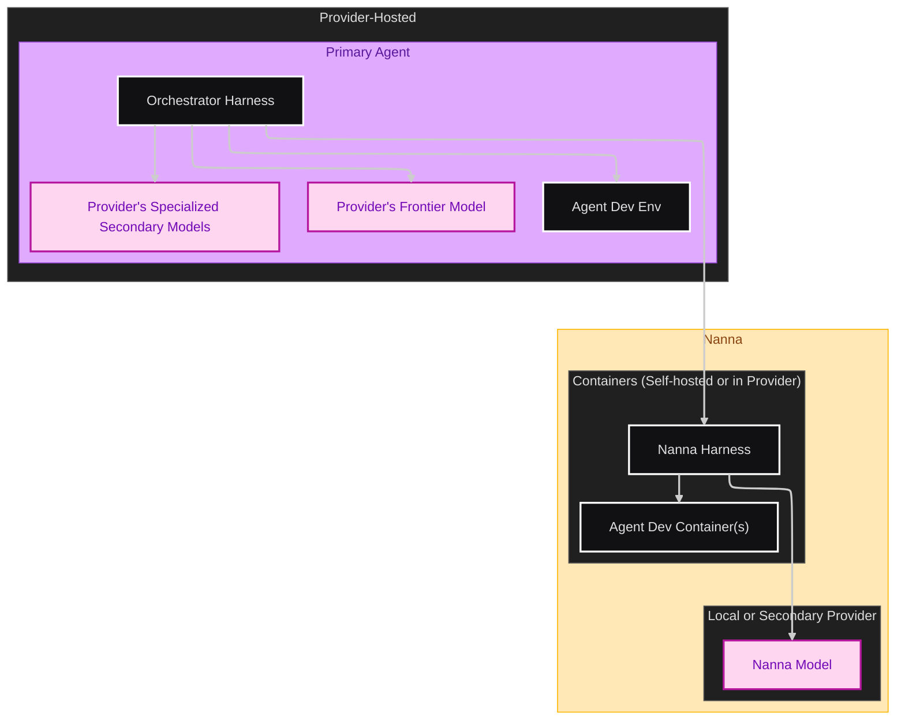
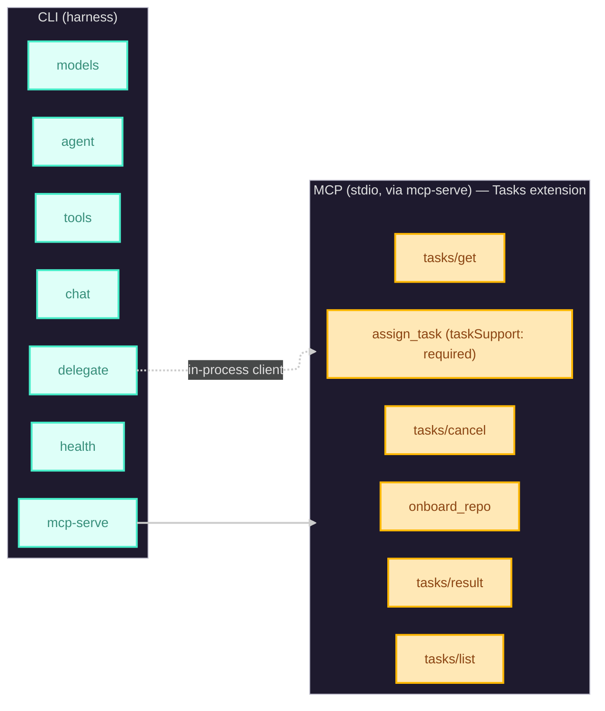
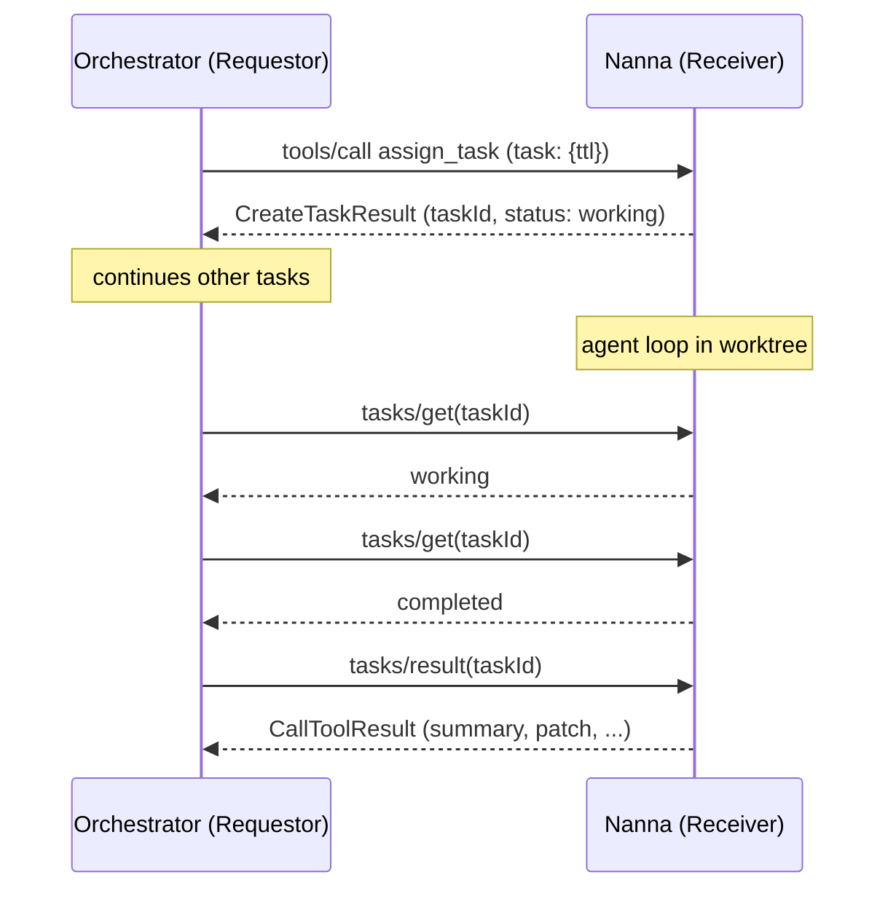

# Primary Use-Case (Background Agents Delegate Tasks to Nanna)

```mermaid
---
config:
  theme: redux-dark
  layout: elk
---
flowchart TD
    %% Provider side
    subgraph ProviderHosted["Provider-Hosted"]
        subgraph ProviderAgent["Primary Agent"]
            OrchestratorHarness["Orchestrator Harness"]
            OrchestratorModel["Provider's Frontier Model"]
            OrchestratorSecondaryModel["Provider's Specialized Secondary Models"]
            OrchestratorHarness --> OrchestratorModel
            OrchestratorHarness --> OrchestratorSecondaryModel
            ProviderDevEnv["Agent Dev Env"]
        end
        OrchestratorHarness --> ProviderDevEnv
    end

    %% Nanna side (Self-hosted or in Provider)
    subgraph Nanna["Nanna"]
        subgraph NannaDev["Containers (Self-hosted or in Provider)"]
            NannaHarness["Nanna Harness"]
            NannaDevEnv["Agent Dev Container(s)"]
            NannaHarness --> NannaDevEnv
        end
        subgraph GatewayHosted["Local or Secondary Provider"]
            NannaModel["Nanna Model"]
        end
    end

    %% Connections between orchestration layers
    OrchestratorHarness --> NannaHarness

    %% Optional external model provider for Nanna
    NannaHarness --> NannaModel

    %% Classes
    classDef area fill:#202020,stroke:#555,stroke-width:1px,color:#DDD
    classDef orchestrator stroke:#9D4EDD,fill:#E0AAFF,color:#5A189A
    classDef subagent stroke:#46EDC8,fill:#DEFFF8,color:#378E7A
    classDef nanna stroke:#FFB703,fill:#FFE8B6,color:#8B4513
    classDef model stroke:#B5179E,fill:#FFD6F0,color:#7209B7

    class ProviderHosted,NannaDev,GatewayHosted area
    class ProviderAgent orchestrator
    class Nanna nanna
    class NannaModel,OrchestratorModel,OrchestratorSecondaryModel model
```

# API

The `mcp-serve` subcommand starts a JSON-RPC 2.0 server over stdio that implements the Model Context Protocol (protocol revision `2025-11-25`), including the [MCP Tasks extension](https://modelcontextprotocol.io/specification/2025-11-25/basic/utilities/tasks) for long-running operations. External orchestrators connect to Nanna exclusively through this MCP interface. The `delegate` CLI subcommand is a first-party client of the same interface (it drives an in-process server over an in-memory channel), so the CLI and external orchestrators exercise identical wire semantics.

Nanna exposes its coding capability as a **task-augmented tool** rather than a bespoke poll/result tool surface. `tools/list` advertises:

- **`assign_task`** — declared with `execution.taskSupport: "required"`. Submit a coding task (natural-language description plus target repo); Nanna spawns an agent loop in an isolated worktree. Because task support is *required*, clients MUST augment the `tools/call` with a `task` field (per the Tasks extension); a non-augmented call returns `-32601`. The response is a `CreateTaskResult` carrying a `taskId` and initial `working` status.
- **`onboard_repo`** — an ordinary synchronous tool (no task augmentation) that generates a `flake.nix` for a pure-Cargo Rust repository that lacks one.

The task lifecycle uses the standard Tasks methods instead of custom tools:

- **`tasks/get`** — poll a task's status by `taskId` (`working`, `completed`, `failed`, or `cancelled`) with `createdAt`/`lastUpdatedAt`/`ttl`/`pollInterval` metadata. Non-blocking.
- **`tasks/result`** — retrieve the terminal `CallToolResult` (result summary, patch, tool calls, model). Blocks until the task reaches a terminal state; carries the `io.modelcontextprotocol/related-task` metadata.
- **`tasks/list`** — enumerate all tasks Nanna is tracking with their statuses.
- **`tasks/cancel`** — request cancellation by `taskId`; the task transitions to `cancelled`. Cancelling an already-terminal task returns `-32602`.

The server advertises `capabilities.tasks: { list, cancel, requests: { tools: { call } } }` at `initialize`. Task IDs are UUIDv4 with no authorization-context binding — appropriate for a single-user local stdio server (see the Tasks spec's security considerations). `input_required`/elicitation and durable cross-restart task storage are out of scope for this revision.

```mermaid
---
config:
  theme: redux-dark
  layout: elk
---
flowchart LR
    subgraph CLI["CLI (harness)"]
        chat
        agent
        delegate
        mcpserve["mcp-serve"]
        models
        tools
        health
    end
    subgraph MCP["MCP (stdio, via mcp-serve) — Tasks extension"]
        assign_task["assign_task (taskSupport: required)"]
        onboard_repo
        tget["tasks/get"]
        tresult["tasks/result"]
        tlist["tasks/list"]
        tcancel["tasks/cancel"]
    end
    mcpserve --> MCP
    delegate -.->|in-process client| MCP
    classDef cli stroke:#46EDC8,fill:#DEFFF8,color:#378E7A
    classDef mcp stroke:#FFB703,fill:#FFE8B6,color:#8B4513
    class chat,agent,delegate,mcpserve,models,tools,health cli
    class assign_task,onboard_repo,tget,tresult,tlist,tcancel mcp
```

# Delegation Sequence

```mermaid
sequenceDiagram
    participant O as Orchestrator (Requestor)
    participant N as Nanna (Receiver)
    O->>N: tools/call assign_task (task: {ttl})
    N-->>O: CreateTaskResult (taskId, status: working)
    Note over O: continues other tasks
    Note over N: agent loop in worktree
    O->>N: tasks/get(taskId)
    N-->>O: working
    O->>N: tasks/get(taskId)
    N-->>O: completed
    O->>N: tasks/result(taskId)
    N-->>O: CallToolResult (summary, patch, ...)
```

# Harness Control Flow

```mermaid
---
config:
  theme: redux-dark
  layout: dagre
---
flowchart TD
    A(["Application State 1"]) --> n6["Entity Enrichment"]
    n10(["User Prompt"]) --> n4["Plan Entity Modification"]
    B{"Task Complete?"} --> C["Yes"] & D["No"]
    D --> n1["Entity Modification Decision"]
    n1 --> n3["Query Entities (RAG)"] & n4
    n4 --> n7["Perform Entity Modification"]
    C --> n9(["Application State 2"])
    n3 --> n1
    n7 --> n11["Update Entities"]
    n11 --> B
    n6 --> n4
    n6@{ shape: rect}
    n4@{ shape: rect}
    n1@{ shape: diam}
    n3@{ shape: rect}
    n7@{ shape: rect}
    n11@{ shape: rect}
     A:::Rose
     A:::Aqua
     n10:::Aqua
     n9:::Aqua
    classDef Rose stroke-width:1px, stroke-dasharray:none, stroke:#FF5978, fill:#FFDFE5, color:#8E2236
    classDef Aqua stroke-width:1px, stroke-dasharray:none, stroke:#46EDC8, fill:#DEFFF8, color:#378E7A
```

# Container Topology

See [TESTING.md](TESTING.md) for the test topology and how each layer is exercised.

```mermaid
---
config:
  theme: redux-dark
  layout: elk
---
flowchart TD
    B(["Harness Container"]) -- Modifies --> C(["Dev Container"])
    B -- Queries --> n1(["Model"])
    C -- Can compile binary for --> n2(["Sandbox"])
    n2 -- Can be promoted to --> n3(["Release"])
```
