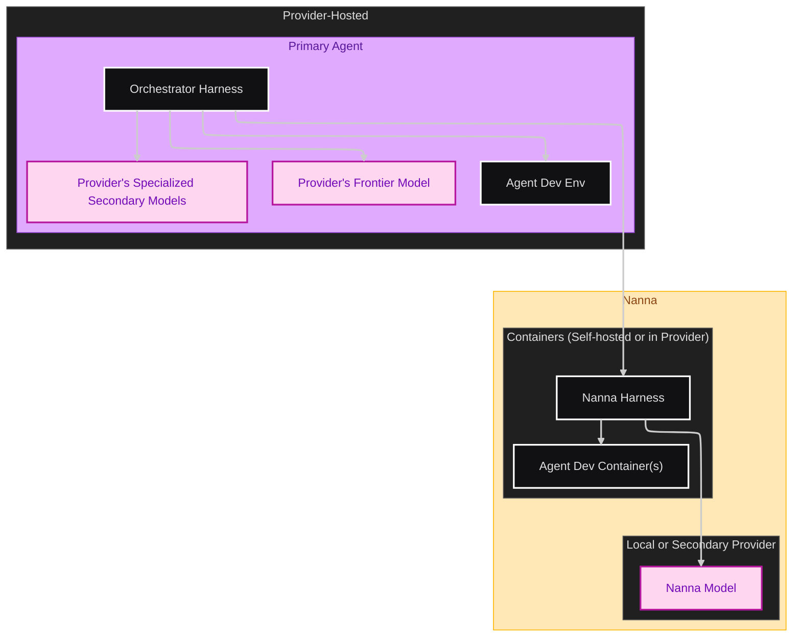
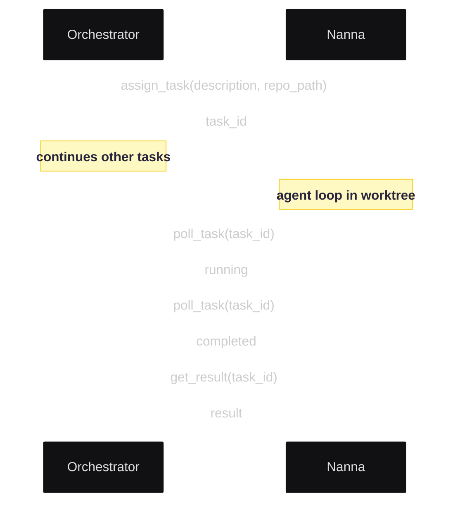
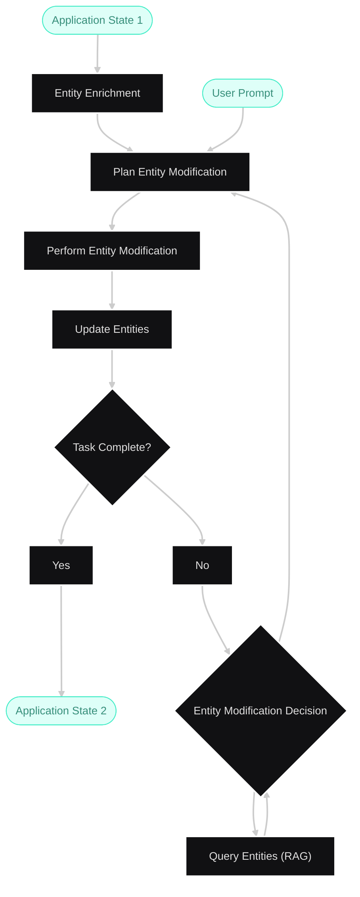
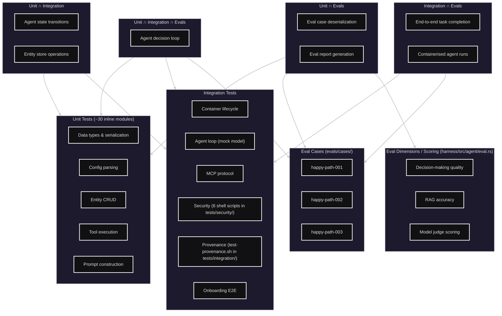

# Primary Use-Case (Background Agents Delegate Tasks to Nanna)

```mermaid
---
config:
  theme: redux-dark
  layout: elk
---
flowchart TD
    %% Provider side
    subgraph ProviderHosted["Provider-Hosted"]
        subgraph ProviderAgent["Primary Agent"]
            OrchestratorHarness["Orchestrator Harness"]
            OrchestratorModel["Provider's Frontier Model"]
            OrchestratorSecondaryModel["Provider's Specialized Secondary Models"]
            OrchestratorHarness --> OrchestratorModel
            OrchestratorHarness --> OrchestratorSecondaryModel
            ProviderDevEnv["Agent Dev Env"]
        end
        OrchestratorHarness --> ProviderDevEnv
    end

    %% Nanna side (Self-hosted or in Provider)
    subgraph Nanna["Nanna"]
        subgraph NannaDev["Containers (Self-hosted or in Provider)"]
            NannaHarness["Nanna Harness"]
            NannaDevEnv["Agent Dev Container(s)"]
            NannaHarness --> NannaDevEnv
        end
        subgraph GatewayHosted["Local or Secondary Provider"]
            NannaModel["Nanna Model"]
        end
    end

    %% Connections between orchestration layers
    OrchestratorHarness --> NannaHarness

    %% Optional external model provider for Nanna
    NannaHarness --> NannaModel

    %% Classes
    classDef area fill:#202020,stroke:#555,stroke-width:1px,color:#DDD
    classDef orchestrator stroke:#9D4EDD,fill:#E0AAFF,color:#5A189A
    classDef subagent stroke:#46EDC8,fill:#DEFFF8,color:#378E7A
    classDef nanna stroke:#FFB703,fill:#FFE8B6,color:#8B4513
    classDef model stroke:#B5179E,fill:#FFD6F0,color:#7209B7

    class ProviderHosted,NannaDev,GatewayHosted area
    class ProviderAgent orchestrator
    class Nanna nanna
    class NannaModel,OrchestratorModel,OrchestratorSecondaryModel model
```

# Delegation Sequence

```mermaid
---
config:
  theme: redux-dark
  layout: dagre
---
sequenceDiagram
    participant O as Orchestrator
    participant N as Nanna
    O->>N: assign_task(description, repo_path)
    N-->>O: task_id
    Note over O: continues other tasks
    Note over N: agent loop in worktree
    O->>N: poll_task(task_id)
    N-->>O: running
    O->>N: poll_task(task_id)
    N-->>O: completed
    O->>N: get_result(task_id)
    N-->>O: result
```

# Harness Control Flow

```mermaid
---
config:
  theme: redux-dark
  layout: dagre
---
flowchart TD
    A(["Application State 1"]) --> n6["Entity Enrichment"]
    n10(["User Prompt"]) --> n4["Plan Entity Modification"]
    B{"Task Complete?"} --> C["Yes"] & D["No"]
    D --> n1["Entity Modification Decision"]
    n1 --> n3["Query Entities (RAG)"] & n4
    n4 --> n7["Perform Entity Modification"]
    C --> n9(["Application State 2"])
    n3 --> n1
    n7 --> n11["Update Entities"]
    n11 --> B
    n6 --> n4
    n6@{ shape: rect}
    n4@{ shape: rect}
    n1@{ shape: diam}
    n3@{ shape: rect}
    n7@{ shape: rect}
    n11@{ shape: rect}
     A:::Rose
     A:::Aqua
     n10:::Aqua
     n9:::Aqua
    classDef Rose stroke-width:1px, stroke-dasharray:none, stroke:#FF5978, fill:#FFDFE5, color:#8E2236
    classDef Aqua stroke-width:1px, stroke-dasharray:none, stroke:#46EDC8, fill:#DEFFF8, color:#378E7A
```

# Container Topology

```mermaid
---
config:
  theme: redux-dark
  layout: elk
---
flowchart TD
    B(["Harness Container"]) -- Modifies --> C(["Dev Container"])
    B -- Queries --> n1(["Model"])
    C -- Can compile binary for --> n2(["Sandbox"])
    n2 -- Can be promoted to --> n3(["Release"])
```

# Tests and Evals

```mermaid
---
config:
  theme: redux-dark
  layout: dagre
---
flowchart TD
    subgraph UT["Unit Tests (~30 inline modules)"]
        u1["Data types & serialization"]
        u2["Config parsing"]
        u3["Entity CRUD"]
        u4["Tool execution"]
        u5["Prompt construction"]
    end

    subgraph IT["Integration Tests"]
        i1["Container lifecycle"]
        i2["Agent loop (mock model)"]
        i3["MCP protocol"]
        i4["Security (6 shell scripts in tests/security/)"]
        i5["Provenance (test-provenance.sh in tests/integration/)"]
        i6["Onboarding E2E"]
    end

    subgraph EC["Eval Cases (evals/cases/)"]
        ec1["happy-path-001"]
        ec2["happy-path-002"]
        ec3["happy-path-003"]
    end

    subgraph ED["Eval Dimensions / Scoring (harness/src/agent/eval.rs)"]
        ed1["Decision-making quality"]
        ed2["RAG accuracy"]
        ed3["Model judge scoring"]
    end

    subgraph UT_IT["Unit ∩ Integration"]
        ui1["Agent state transitions"]
        ui2["Entity store operations"]
    end

    subgraph UT_EV["Unit ∩ Evals"]
        ue1["Eval case deserialization"]
        ue2["Eval report generation"]
    end

    subgraph IT_EV["Integration ∩ Evals"]
        ie1["End-to-end task completion"]
        ie2["Containerised agent runs"]
    end

    subgraph ALL["Unit ∩ Integration ∩ Evals"]
        a1["Agent decision loop"]
    end

    UT_IT --> UT
    UT_IT --> IT
    UT_EV --> UT
    UT_EV --> EC
    UT_EV --> ED
    IT_EV --> IT
    IT_EV --> EC
    ALL --> UT
    ALL --> IT
    ALL --> EC
```
