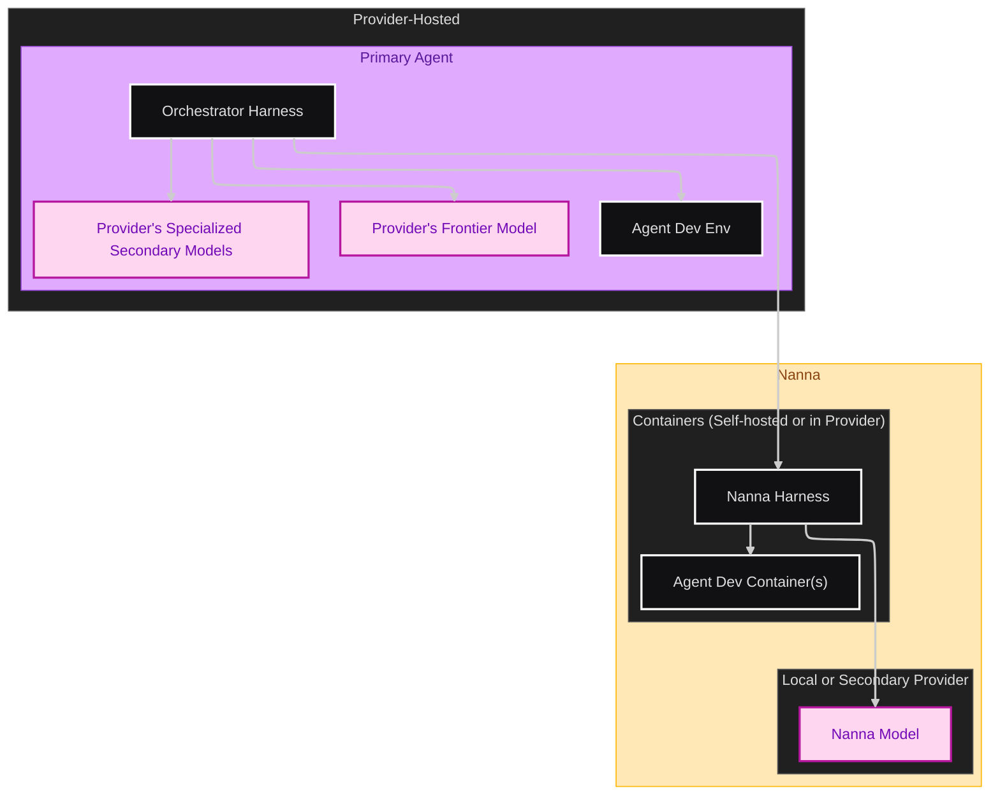
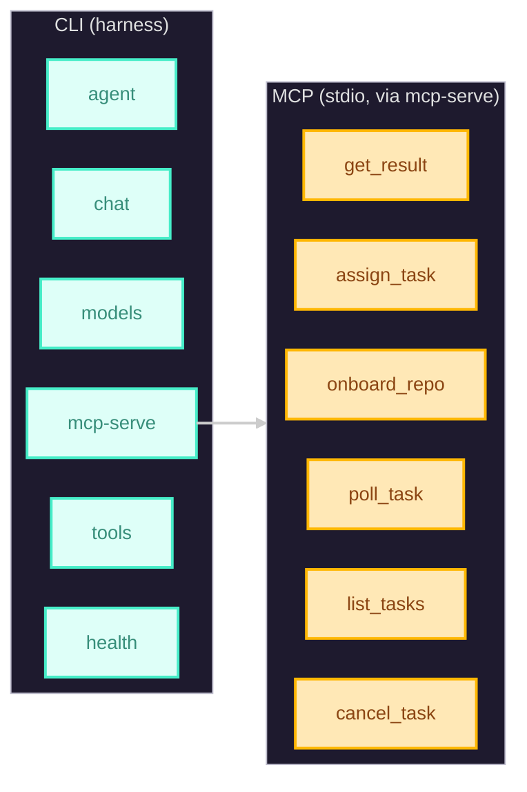
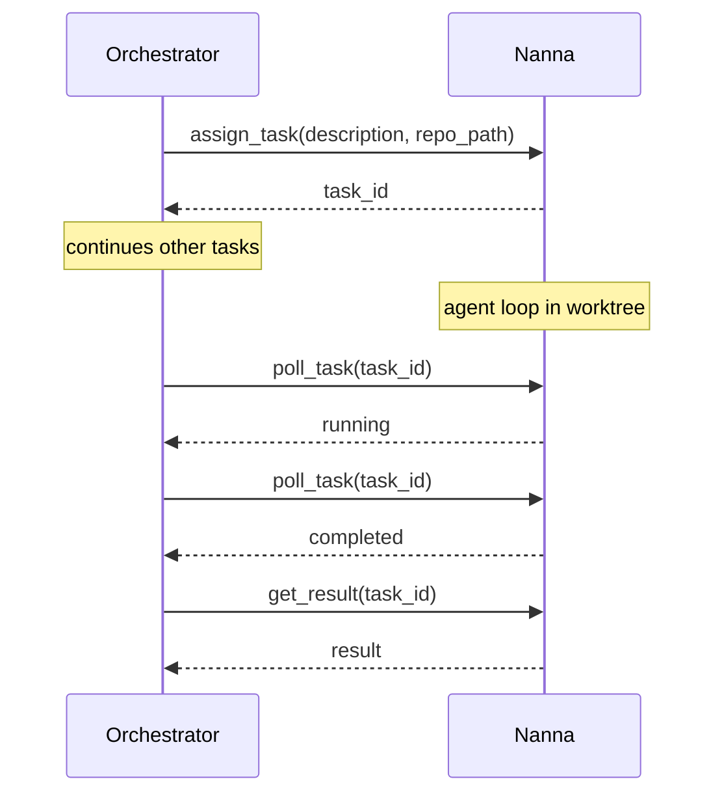

# Primary Use-Case (Background Agents Delegate Tasks to Nanna)

```mermaid
---
config:
  theme: redux-dark
  layout: elk
---
flowchart TD
    %% Provider side
    subgraph ProviderHosted["Provider-Hosted"]
        subgraph ProviderAgent["Primary Agent"]
            OrchestratorHarness["Orchestrator Harness"]
            OrchestratorModel["Provider's Frontier Model"]
            OrchestratorSecondaryModel["Provider's Specialized Secondary Models"]
            OrchestratorHarness --> OrchestratorModel
            OrchestratorHarness --> OrchestratorSecondaryModel
            ProviderDevEnv["Agent Dev Env"]
        end
        OrchestratorHarness --> ProviderDevEnv
    end

    %% Nanna side (Self-hosted or in Provider)
    subgraph Nanna["Nanna"]
        subgraph NannaDev["Containers (Self-hosted or in Provider)"]
            NannaHarness["Nanna Harness"]
            NannaDevEnv["Agent Dev Container(s)"]
            NannaHarness --> NannaDevEnv
        end
        subgraph GatewayHosted["Local or Secondary Provider"]
            NannaModel["Nanna Model"]
        end
    end

    %% Connections between orchestration layers
    OrchestratorHarness --> NannaHarness

    %% Optional external model provider for Nanna
    NannaHarness --> NannaModel

    %% Classes
    classDef area fill:#202020,stroke:#555,stroke-width:1px,color:#DDD
    classDef orchestrator stroke:#9D4EDD,fill:#E0AAFF,color:#5A189A
    classDef subagent stroke:#46EDC8,fill:#DEFFF8,color:#378E7A
    classDef nanna stroke:#FFB703,fill:#FFE8B6,color:#8B4513
    classDef model stroke:#B5179E,fill:#FFD6F0,color:#7209B7

    class ProviderHosted,NannaDev,GatewayHosted area
    class ProviderAgent orchestrator
    class Nanna nanna
    class NannaModel,OrchestratorModel,OrchestratorSecondaryModel model
```

# API

The harness exposes six CLI subcommands: `chat`, `agent`, `mcp-serve`, `models`, `tools`, and `health`. The `mcp-serve` subcommand starts a JSON-RPC 2.0 server over stdio that implements the Model Context Protocol, exposing six MCP tools for task orchestration. External orchestrators connect to Nanna exclusively through this MCP interface.

The six MCP tools form a complete task-delegation surface:

- **`assign_task`** — submit a new task (natural-language description plus target repo) and receive a `task_id`. Nanna spawns an agent loop in an isolated worktree on the designated repository.
- **`poll_task`** — query the current status of a task by `task_id` without blocking. Returns one of `running`, `completed`, `failed`, or `cancelled`, allowing orchestrators to interleave work on multiple tasks.
- **`get_result`** — fetch the final result for a completed task (conversation snapshot, tool calls made, result summary, and any written artefacts). Safe to call repeatedly.
- **`list_tasks`** — enumerate all tasks Nanna is currently tracking along with their states, giving orchestrators a view over in-flight work without needing to remember every `task_id` they dispatched.
- **`cancel_task`** — request termination of a running task by `task_id`. Nanna stops its agent loop at the next safe checkpoint and transitions the task to the `cancelled` state so subsequent `get_result` calls return a consistent terminal record.
- **`onboard_repo`** — register a new repository with Nanna (clone, index entities, and prepare a reusable worktree pool) so that later `assign_task` calls against that repo start immediately instead of paying cold-start cost.

```mermaid
---
config:
  theme: redux-dark
  layout: elk
---
flowchart LR
    subgraph CLI["CLI (harness)"]
        chat
        agent
        mcpserve["mcp-serve"]
        models
        tools
        health
    end
    subgraph MCP["MCP (stdio, via mcp-serve)"]
        assign_task
        poll_task
        get_result
        list_tasks
        cancel_task
        onboard_repo
    end
    mcpserve --> MCP
    classDef cli stroke:#46EDC8,fill:#DEFFF8,color:#378E7A
    classDef mcp stroke:#FFB703,fill:#FFE8B6,color:#8B4513
    class chat,agent,mcpserve,models,tools,health cli
    class assign_task,poll_task,get_result,list_tasks,cancel_task,onboard_repo mcp
```

# Delegation Sequence

```mermaid
sequenceDiagram
    participant O as Orchestrator
    participant N as Nanna
    O->>N: assign_task(description, repo_path)
    N-->>O: task_id
    Note over O: continues other tasks
    Note over N: agent loop in worktree
    O->>N: poll_task(task_id)
    N-->>O: running
    O->>N: poll_task(task_id)
    N-->>O: completed
    O->>N: get_result(task_id)
    N-->>O: result
```

# Harness Control Flow

```mermaid
---
config:
  theme: redux-dark
  layout: dagre
---
flowchart TD
    A(["Application State 1"]) --> n6["Entity Enrichment"]
    n10(["User Prompt"]) --> n4["Plan Entity Modification"]
    B{"Task Complete?"} --> C["Yes"] & D["No"]
    D --> n1["Entity Modification Decision"]
    n1 --> n3["Query Entities (RAG)"] & n4
    n4 --> n7["Perform Entity Modification"]
    C --> n9(["Application State 2"])
    n3 --> n1
    n7 --> n11["Update Entities"]
    n11 --> B
    n6 --> n4
    n6@{ shape: rect}
    n4@{ shape: rect}
    n1@{ shape: diam}
    n3@{ shape: rect}
    n7@{ shape: rect}
    n11@{ shape: rect}
     A:::Rose
     A:::Aqua
     n10:::Aqua
     n9:::Aqua
    classDef Rose stroke-width:1px, stroke-dasharray:none, stroke:#FF5978, fill:#FFDFE5, color:#8E2236
    classDef Aqua stroke-width:1px, stroke-dasharray:none, stroke:#46EDC8, fill:#DEFFF8, color:#378E7A
```

# Container Topology

See [TESTING.md](TESTING.md) for the test topology and how each layer is exercised.

```mermaid
---
config:
  theme: redux-dark
  layout: elk
---
flowchart TD
    B(["Harness Container"]) -- Modifies --> C(["Dev Container"])
    B -- Queries --> n1(["Model"])
    C -- Can compile binary for --> n2(["Sandbox"])
    n2 -- Can be promoted to --> n3(["Release"])
```

# Entity Classes

Entity management is where Nanna's domain complexity lives: what context it
surfaces to the model and how it lets the model reason about the relationships
between pieces of that context. The classes below partition that surface so
each one can be implemented and evolved as an independent module. Each class
has (or will have) its own sub-issue tracking deeper implementation work.

### Version Control

Repo, branch, staged/unstaged files, and the scope of what is and isn't
tracked (driven by `.gitignore` and bundled environment information). Nanna
manages feature branches per prompt and follows a **microcommit strategy**:
every modification to the dev environment produces a new commit, so the inner
dev loop has a granular, queryable history. The version-control entity is the
backbone other entities pivot around — most state is keyed by the current
`HEAD`.

### Dev Container State (at current HEAD)

Two complementary views of the working tree:

- **Queryable AST**: a structured, navigable view of the source. A
  limited-parameter model should be able to traverse it with only a few
  sentences of domain prompting, which implies free-text search plus graph
  relationships down to specific line segments. First-class languages: Rust,
  YAML, TOML, JSON, CSV, Python, JS/TS, Dockerfile, Nix, Makefile, CMake,
  shell (POSIX/bash/zsh), Java. Plain text falls back to a per-line view
  (with line + character counts) and binaries surface through a base64 layer.
- **Static analysis and tests**: complete results from every test, lint, and
  eval the harness runs after each modification. These results are bound to
  the git HEAD they were produced against, so the model can reason about
  cause/effect across commits.

### Sandbox Telemetry and Deployed State

**TODO** — per-project configuration gives this the largest scope of any
entity class, so its design is deferred. The goal is to surface runtime
behavior of sandboxed builds and any deployed artifacts back to the model.

### Environment / Deployment

The container graph above (Harness → Dev Container → Sandbox → Release) is
governed by **principle of least privilege**. Effects management for
sandbox/release candidates must be visible and modifiable by the model, but
**changes to system effects are a "big deal"** — they involve a human in the
loop rather than happening implicitly.

### Current Dev Project

User prompts, project scope changes, and progress markers. These are stored
in git commit descriptions so they share a single timeline with the
version-control entity and inherit its history semantics for free.

---

Architectural bias: implementation should be **autonomous, concurrent, and
modular**. Each entity class above should be replaceable in isolation.
