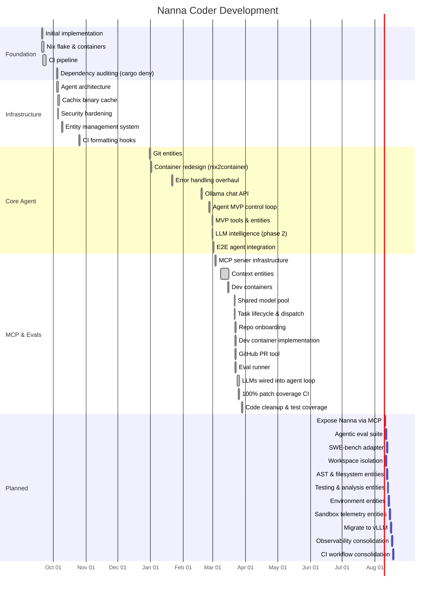

# Nanna Coder

A highly opinionated local coding assistant (WIP).

## Project Status



## Documentation

- [ARCHITECTURE.md](ARCHITECTURE.md) - System architecture and entity management
- [AGENTS.md](AGENTS.md) - Agent control loop and implementation details
- [TESTING.md](TESTING.md) - Testing strategy and guidelines

## Technologies
- [Ollama](https://ollama.ai/)
- [Nix](https://nixos.org/)
- [Podman](https://podman.io/)
- [Rust](https://rustlang.org)
- [Cachix](https://cachix.org/) - Binary cache for fast builds

## Quick Start

### Prerequisites
- Nix with flakes enabled
- (Optional) Cachix account for faster builds

### Setup

```bash
# Clone the repository
git clone https://github.com/DominicBurkart/nanna-coder.git
cd nanna-coder

# Enter development environment
nix develop

# Build the project
nix build
```

### LLM Setup (Ollama)

The agent requires a running [Ollama](https://ollama.ai/) instance with a model installed:

```bash
# Install Ollama (see https://ollama.ai/download)
curl -fsSL https://ollama.ai/install.sh | sh

# Pull the default model
ollama pull qwen3:0.6b

# Verify Ollama is running
nix develop --command cargo run --bin harness -- health
```

### Running the Agent

```bash
# Enter development environment
nix develop

# Run the agent with tools enabled (recommended)
cargo run --bin harness -- agent --prompt "Your task description" --tools

# Run with a specific model and verbose output
cargo run --bin harness -- agent --prompt "Your task" --model qwen3:0.6b --tools --verbose
```

### Using Cachix (Optional but Recommended)

Cachix provides a public binary cache for faster builds. No account needed to pull pre-built artifacts.

```bash
# Configure Cachix for faster builds (read-only access)
nix run .#setup-cache
```

See [CACHIX_SETUP.md](CACHIX_SETUP.md) for push access setup (maintainers only).
