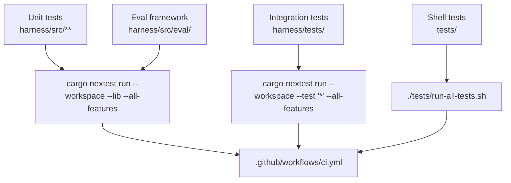

# Test Topology



## Running tests

All commands require the Nix devShell:

```bash
nix develop

# unit
cargo nextest run --workspace --lib --all-features

# integration (some need containers / Ollama)
cargo nextest run --workspace --test '*' --all-features

# shell-based security & integration
./tests/run-all-tests.sh

# lint + format
cargo clippy --workspace --all-targets --all-features -- -D warnings
cargo fmt --all -- --check

# supply-chain
cargo deny check
```

## Where tests live

| Category | Path | Runner |
|---|---|---|
| Unit (Rust `#[test]`) | [`harness/src/`](harness/src/) | nextest `--lib` |
| Entity test fixtures | [`harness/src/entities/test/`](harness/src/entities/test/) | nextest `--lib` |
| Eval cases | [`harness/src/eval/`](harness/src/eval/) | nextest `--lib` |
| Integration (Rust) | [`harness/tests/`](harness/tests/) | nextest `--test` |
| Model integration | [`model/tests/`](model/tests/) | nextest `--test` |
| Shell security | [`tests/security/`](tests/security/) | bash |
| Shell integration | [`tests/integration/`](tests/integration/) | bash |
| Shell helpers | [`tests/lib/test-helpers.sh`](tests/lib/test-helpers.sh) | sourced |
| CI matrix | [`.github/workflows/ci.yml`](.github/workflows/ci.yml) | GitHub Actions |

## Adding a new test

1. **Rust unit test** -- add `#[cfg(test)] mod tests` in the relevant `harness/src/` module.
2. **Rust integration test** -- add a file under [`harness/tests/`](harness/tests/).
3. **Shell test** -- create a script in `tests/security/` or `tests/integration/`, use helpers from [`tests/lib/test-helpers.sh`](tests/lib/test-helpers.sh), and register it in [`tests/run-all-tests.sh`](tests/run-all-tests.sh).
