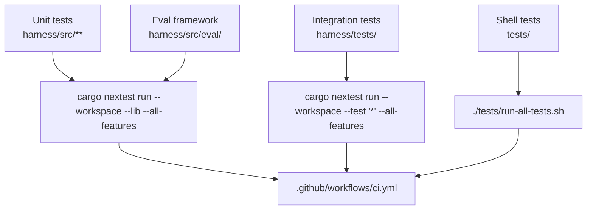

# Test Topology

**Scope:** evals measure agent performance (outcomes); tests verify harness correctness (deterministic components); benches optimize harness resources; QA is done manually in the dev env by an agent.


```mermaid
flowchart TD
    U["Unit tests\nharness/src/**"] --> NX["cargo nextest run --workspace --lib --all-features"]
    I["Integration tests\nharness/tests/"] --> NXI["cargo nextest run --workspace --test '*' --all-features"]
    S["Shell tests\ntests/"] --> SH["./tests/run-all-tests.sh"]
    E["Eval framework\nharness/src/eval/"] --> NX
    NX & NXI & SH --> CI[".github/workflows/ci.yml"]
```

## Principles

- Sorted preferred strategies (note: you'll need an ensemble, use complementary approaches): realistic happy-path integration tests, happy-path doctests on interfaces, aneas/kani invariant validation, proptests, unit tests (edge cases), unhappy-path integration tests (error legibility), edge-case doctests. 
- Design interfaces which can use the highest standards for validation (example: a de/serialization path needs to be compatible with both integration tests and formal methods validation, an external API surface needs to be expressible with both doctests and proptests). 
- Surface failures as early as possible: compile-time > CI > runtime. Make control flow boring and obvious by validating invariants statically first.
- Untested code is brittle. Harden it, don't bend it. Never merge `|| true`, silent failures, fallback parameters that shadow bad or dead code, or any other graceful-degradation pattern.

## CI gate

Codecov patch coverage must be **100%** on every PR. A PR that drops patch coverage below 100% is blocked. See [`.github/workflows/ci.yml`](.github/workflows/ci.yml).

## Running tests

All commands require the Nix devShell:

```bash
nix develop

# unit
cargo nextest run --workspace --lib --all-features

# integration (some need containers / Ollama)
cargo nextest run --workspace --test '*' --all-features

# shell-based security & integration
./tests/run-all-tests.sh

# lint + format
cargo clippy --workspace --all-targets --all-features -- -D warnings
cargo fmt --all -- --check

# supply-chain
cargo deny check
```

## Where tests live

| Category | Path | Runner |
|---|---|---|
| Unit (Rust `#[test]`) | [`harness/src/`](harness/src/) | nextest `--lib` |
| Entity test fixtures | [`harness/src/entities/test/`](harness/src/entities/test/) | nextest `--lib` |
| Eval cases | [`harness/src/eval/`](harness/src/eval/) | nextest `--lib` |
| Integration (Rust) | [`harness/tests/`](harness/tests/) | nextest `--test` |
| Full-stack fixture monorepo | [`tests/fixtures/fullstack/`](tests/fixtures/fullstack/) | own workspace; see below |
| Model integration | [`model/tests/`](model/tests/) | nextest `--test` |
| Shell security | [`tests/security/`](tests/security/) | bash |
| Shell integration | [`tests/integration/`](tests/integration/) | bash |
| Shell helpers | [`tests/lib/test-helpers.sh`](tests/lib/test-helpers.sh) | sourced |
| CI matrix | [`.github/workflows/ci.yml`](.github/workflows/ci.yml) | GitHub Actions |

## Full-stack fixture monorepo

[`tests/fixtures/fullstack/`](tests/fixtures/fullstack/) is a small, deterministic full-stack Rust monorepo (actix-web `api/`, dioxus `ui/` built with trunk, `shared/` wire types, one sqlx/Postgres migration, a `Containerfile`, a `CHECKS` endpoint manifest and a `.nanna/deploy.toml`). It is its own cargo workspace, listed under `exclude` in the root `Cargo.toml`, so the main workspace, clippy and coverage never see it. See its [README](tests/fixtures/fullstack/README.md) for the endpoint table and env hooks.

| Layer | How it uses the fixture |
|---|---|
| Harness integration (`harness/tests/fullstack_fixture.rs`) | Host-side, no container: runs `onboarding::detect::scan_project` and `capabilities::detect_capabilities` against the fixture and asserts its shape (workspace with `api`/`shared`/`ui`, stack dependencies, `CHECKS`, `.nanna/deploy.toml`, exactly one migration). Runs in ordinary CI. |
| Fixture unit tests (`cargo test --workspace` inside the fixture) | Cover the health handler, the greeting handler, the `FIXTURE_BREAK_ROUTE=1` hook (greeting `500`, health still `200`), the static-asset fallback and the `ui` render states. `FIXTURE_FAIL_TEST=1` makes exactly one test fail, giving inner-loop test tooling a deterministic red case. |
| Inner-loop QA (container, later issues) | Build the `Containerfile`, start the image, then hit each path in `CHECKS`; with `FIXTURE_BREAK_ROUTE=1` the `/api/v1/greeting` check must fail while `/health/v1` passes. Browser tests assert on the `#greeting` element rendered by `ui`. |
| Deployment executor and evals | Read `.nanna/deploy.toml` (a fake `container-registry+serverless` target on a reserved `.invalid` registry) to plan rollouts without touching a real registry. |

Build it locally with:

```bash
cd tests/fixtures/fullstack
cargo build --workspace && cargo test --workspace
(cd ui && trunk build)
```

## Adding a new test

1. **Rust unit test** -- add `#[cfg(test)] mod tests` in the relevant `harness/src/` module.
2. **Rust integration test** -- add a file under [`harness/tests/`](harness/tests/).
3. **Shell test** -- create a script in `tests/security/` or `tests/integration/`, use helpers from [`tests/lib/test-helpers.sh`](tests/lib/test-helpers.sh), and register it in [`tests/run-all-tests.sh`](tests/run-all-tests.sh).
