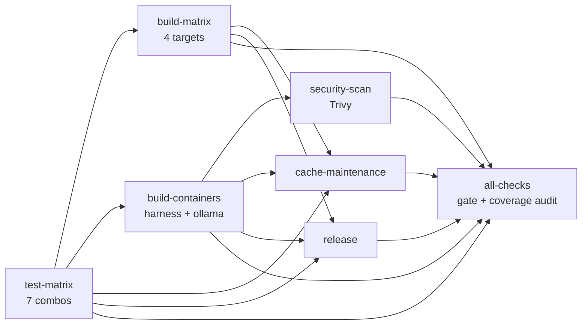

# CI Architecture

This document describes the CI/CD architecture for nanna-coder: the pipelines
that live under [`.github/workflows/`](../../.github/workflows/), why they are
structured the way they are, and how their outputs feed into downstream tooling
(codecov, container registry, releases).

Written to match the workflows as they exist in the repository — if you edit a
workflow, please keep this file in sync.

## Workflow inventory

| Workflow | Trigger | Purpose |
|----------|---------|---------|
| [`ci.yml`](../../.github/workflows/ci.yml) | `push` to `main`/`develop`, PRs to `main`, `release`s | Primary build/test/publish pipeline. Fan-out matrix + `all-checks` gate. |
| [`ci-integration.yml`](../../.github/workflows/ci-integration.yml) | PRs touching CI infra, weekly cron, manual | Smoke-tests the CI plumbing itself (nix builds, container loading, cold-cache path). |
| [`codecov-guard.yml`](../../.github/workflows/codecov-guard.yml) | PR/`main` touching `codecov.yml` | Rejects silent relaxations of coverage policy. See [`AGENTS.md`](../../AGENTS.md). |
| [`cache-warming.yml`](../../.github/workflows/cache-warming.yml) | Push to `main` touching lockfiles/manifests | Pre-populates Cachix so subsequent PRs start warm. |
| [`install-test.yml`](../../.github/workflows/install-test.yml) | PR / push | Validates the end-user install path across OSes. |
| [`install-nightly.yml`](../../.github/workflows/install-nightly.yml) | Cron 06:00 UTC + manual | Full nightly install-and-smoke including multi-GB Gemma pull. |
| [`eval.yml`](../../.github/workflows/eval.yml) | Manual (`workflow_dispatch`) | Runs the eval suite against a chosen model, optionally posts back to a PR. |
| [`badges.yaml`](../../.github/workflows/badges.yaml) | Push to `main` | Regenerates SVG badges (LOC, contributors) committed back to the repo. |
| [`ci-metrics.yml` (proposed)](proposed-ci-metrics-workflow.md) | `workflow_run` completion of CI/CD Pipeline + manual | Slice of #5. YAML is documented here pending install into `.github/workflows/` by a maintainer with `workflows` permission. |

## The primary pipeline (`ci.yml`)

`ci.yml` is a fan-out/fan-in DAG. Every non-gate job is required to be listed
under `jobs.all-checks.needs` — the last step of `all-checks` enforces this by
diffing `.jobs | keys` against its own `needs` array via `yq`. Adding a new job
without wiring it into the gate is a hard error at CI time, not a review-time
oversight.

### `test-matrix`

Seven-way matrix by `(os, test-type)`:

| OS | test-types |
|----|------------|
| `ubuntu-latest` | `unit`, `lint`, `security`, `integration`, `integration-container` |
| `macos-latest` | `unit` |
| `windows-latest` | `unit` |

Linux uses Nix (`nix develop --command ...`) as the toolchain source of truth.
macOS and Windows use `dtolnay/rust-toolchain@master` + `taiki-e/install-action`
for `cargo-nextest`, `cargo-audit`, `cargo-deny`, `cargo-tarpaulin` because Nix
adds cost on those platforms without corresponding cache reuse.

- `unit`: `cargo nextest run --workspace --lib --all-features`.
- `lint`: `cargo clippy --workspace --all-targets --all-features -- -D warnings`
  + `cargo fmt --all -- --check` + `cargo doc --no-deps --workspace`.
- `security` (Linux only): `cargo tarpaulin --workspace --all-features
  --skip-clean --out Lcov --output-dir . --timeout 1800`, uploaded via
  `codecov/codecov-action@v5`. `cargo audit` / `cargo deny` are currently
  disabled here pending CVSS 4.0 compatibility (see the workflow comment).
- `integration` and `integration-container`: `cargo nextest run --workspace
  --test '*' --all-features`. The container variant pre-builds
  `.#ollamaImage`, loads it into the Docker daemon via
  `nix run .#ollamaImage.copyToDockerDaemon`, and runs `--test-threads=1`
  because integration tests share the daemon and port bindings.

The `--workspace --all-features` scope on tarpaulin is deliberate: without it,
feature-gated modules (`model::anthropic`, `eval-runner`) drop out of coverage
and codecov reports them as 0%. Similarly `--ignore-tests` is not passed —
tarpaulin instruments `#[cfg(test)]` blocks and codecov's patch metric rewards
covered test bodies. `#[ignore]` tests correctly remain uncovered because
they're opt-in.

### `build-matrix`

Four-way `(target, runner, cross)`:

| Target | Runner | Cross | Build path |
|--------|--------|-------|------------|
| `x86_64-linux` | ubuntu | no | `nix build .#nanna-coder` |
| `aarch64-linux` | ubuntu | yes | `nix build .#packages.aarch64-linux.nanna-coder` (fallback to `.#nanna-coder`) |
| `x86_64-darwin` | macos | no | `cargo build --release` |
| `aarch64-darwin` | macos | yes | `cargo build --release --target aarch64-apple-darwin` |

The binary was renamed `harness` → `nanna` in `Cargo.toml`, but release
artifacts keep the historical `harness-<target>` filename so existing download
URLs continue to work.

### `build-containers`

Ubuntu-only. Currently builds `x86_64` for `harness` and `ollama` images.
Uses `nix run .#<image>.copyToDockerDaemon` (via nix2container + skopeo with
the `nix:` transport) to load images without re-serializing. Tags with both
`${{ github.sha }}` and `latest`, pushes to `ghcr.io/${OWNER,,}/{harness,ollama}`.
Fork-compatible via `${{ github.repository }}`; PRs from forks skip push
(`if: github.event_name != 'pull_request'`).

### `security-scan`

`aquasecurity/trivy-action` against the pushed `harness:latest` image, SARIF
uploaded to GitHub code-scanning. Skipped on PRs (image isn't published).

### `cache-maintenance`

Main-only. Runs `nix run .#cache-analytics` and appends the report to
`$GITHUB_STEP_SUMMARY`.

### `release`

Fires only on `release: types: [published]`. Rebuilds `nanna` for all four
targets and uploads `harness-<target>` artifacts.

### `all-checks`

The gate. Two responsibilities:

1. **Coverage audit** — `yq -r '.jobs | keys | .[]'` vs its own `needs`. Fails
   if any non-gate job is not covered.
2. **Aggregate result** — fails if any dependency is `failure` or `cancelled`.

Branch protection should require `All Checks Passed` (not individual jobs)
because it is the only status that guarantees every parallel branch reported
success.

## Codecov integration

- Runner: `codecov/codecov-action@v5` in the `security` matrix cell.
- Config: [`codecov.yml`](../../codecov.yml). `patch.default.target: 100%`,
  project status off, `ignore: harness/src/main.rs`.
- Guard: [`codecov-guard.yml`](../../.github/workflows/codecov-guard.yml).
  Rejects:
  - Lowering `target:` below the base ref's value.
  - Replacing a numeric target with `auto` or removing it.
  - Growth in `ignore:` entries.
  - Loss of `strict_yaml_branch`.
  Admin bypass is the only path to relax any of these. See
  [`AGENTS.md`](../../AGENTS.md) for the corresponding agent policy.

## Cache strategy

- **Cachix**: `nanna-coder` cache, populated on every Linux job that installs
  Nix. `pushFilter` skips `-source` and `nixpkgs.tar.gz` (large, low reuse).
  PRs from forks skip push (`skipPush: ${{ ... fork }}`) so upstream secrets
  don't need to be exposed.
- **Cache warming** ([`cache-warming.yml`](../../.github/workflows/cache-warming.yml)):
  On every `main` push touching `Cargo.lock`, `flake.lock`, or workspace
  `Cargo.toml`, rebuilds the Rust toolchain + core deps so subsequent PR
  builds get cache hits from the start.
- **`ci-cache-optimize`** (flake app, run via
  `nix run .#ci-cache-optimize`): applied at the start of every Linux job in
  the primary pipeline.
- Broader background: [`docs/CACHE_STRATEGY.md`](../CACHE_STRATEGY.md),
  [`docs/binary-cache-strategy.md`](../binary-cache-strategy.md),
  [`docs/cachix-migration.md`](../cachix-migration.md).

## Container topology

CI mirrors the runtime container topology described in
[`ARCHITECTURE.md`](../../ARCHITECTURE.md#container-topology):

- **Harness container** (`.#harnessImage`) — Rust binary + minimal userland.
- **Ollama container** (`.#ollamaImage`) — model runtime, exposed on `:11434`.
- Both built via `nix2container`, loaded into the Docker daemon via
  `copyToDockerDaemon` (skopeo `nix:` transport), then optionally re-tarballed
  and loaded into `podman` (see `install-nightly.yml` for the docker↔podman
  bridge).

Integration container tests use these same images. See
[`TESTING.md`](../../TESTING.md) for the test topology.

## Design decisions

- **Nix on Linux, native on macOS/Windows.** Nix cache reuse dominates Linux
  cost; on macOS/Windows the Nix install cost exceeds the toolchain install
  cost, so we use `dtolnay/rust-toolchain@master` there.
- **`fail-fast: false` on every matrix.** We want the full failure surface per
  PR, not the first-failure signal.
- **Fan-in via `all-checks` rather than protected-branch multi-select.**
  Selecting many statuses in GitHub branch protection is fragile against
  matrix additions; a single gate job with a coverage audit is fail-loud
  instead of fail-quiet.
- **Container tests run `--test-threads=1`.** Shared Docker daemon + fixed
  port bindings make parallelism unsafe.
- **Tarpaulin timeout 1800s.** Containerized E2E tests are slow under
  tarpaulin instrumentation.
- **Release asset name preserved.** `harness-<target>` naming survives the
  binary rename to `nanna` so external download URLs don't break.

## Related documents

- [`AGENTS.md`](../../AGENTS.md) — agent policy for CI/codecov.
- [`TESTING.md`](../../TESTING.md) — test topology.
- [`ARCHITECTURE.md`](../../ARCHITECTURE.md) — runtime architecture.
- [`docs/ci-cd-pipeline.md`](../ci-cd-pipeline.md) — older narrative overview.
- [`docs/ci/troubleshooting.md`](troubleshooting.md) — when things go wrong.
- [`docs/ci/maintenance.md`](maintenance.md) — routine care and feeding.
- [`docs/ci/onboarding.md`](onboarding.md) — first day on the pipeline.
- [`docs/ci/performance.md`](performance.md) — keeping wall time down.
- [`docs/ci/security.md`](security.md) — the trust boundary.
