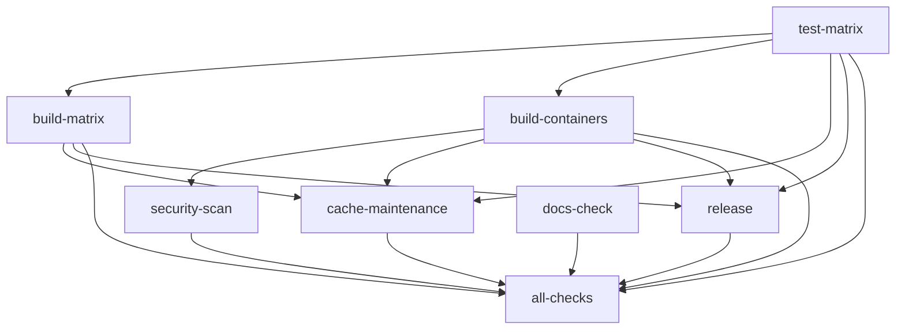

# CI Architecture

This document describes the CI surface that ships in `.github/workflows/`. It is the canonical, per-workflow reference for Nanna Coder's pipelines and enumerates every workflow file checked in to the repository.

The scripts in `scripts/check-ci-doc-coverage.sh` assert that every workflow filename appears as a dedicated `##` heading below (or is explicitly excluded via an `OMITTED:` marker). Any new workflow **must** be given a heading here before it can merge.

For a narrative, higher-level view of the pipeline that predates this tree, see [../ci-cd-pipeline.md](../ci-cd-pipeline.md). For binary-cache details, see [../CACHE_STRATEGY.md](../CACHE_STRATEGY.md), [../binary-cache-strategy.md](../binary-cache-strategy.md), [../cache-migration-guide.md](../cache-migration-guide.md), and [../cachix-migration.md](../cachix-migration.md).

## Workflow inventory

| File | Trigger(s) | Jobs | Matrix dimensions | Secrets |
|---|---|---|---|---|
| `ci.yml` | `push` (main, develop), `pull_request` (main), `release` | `test-matrix`, `build-matrix`, `build-containers`, `security-scan`, `cache-maintenance`, `release`, `docs-check`, `all-checks` | OS x test-type; target x runner; arch x image | `CACHIX_AUTH` (repo-level secret), `CODECOV_TOKEN` (codecov environment), `GITHUB_TOKEN` |
| `ci-integration.yml` | `pull_request` (paths-filtered on workflows/flake/nix/scripts), `schedule` (weekly Mon 06:00 UTC), `workflow_dispatch` | `container-loading`, `empty-cache`, `expected-failure` | none | `CACHIX_AUTH` (read-only via `skipPush: true`) |
| `cache-warming.yml` | `push` (main, path-filtered), `workflow_dispatch` | `warm-dependencies`, `warm-containers`, `warm-cross-platform` (currently disabled via `if: false`), `summary` | `image` (harness, ollama); `target` x `runner` (disabled) | `CACHIX_AUTH` |
| `codecov-guard.yml` | `pull_request` (paths-filtered on `codecov.yml`), `push` (main, same paths) | `guard` | none | `GITHUB_TOKEN` |
| `eval.yml` | `workflow_dispatch` | `eval` | none | `CACHIX_AUTH`, `GITHUB_TOKEN` |
| `install-nightly.yml` | `schedule` (daily 06:00 UTC), `workflow_dispatch` | `linux-full-e2e` | none | `CACHIX_AUTH` |
| `install-test.yml` | `pull_request`, `push` (main, develop), `workflow_dispatch` | `shellcheck`, `ps1-lint`, `ps1-parse`, `build-images`, `linux-bringup`, `macos-bringup`, `windows-bringup`, `install-test-gate` | OS-tier (linux/macos/windows) | `CACHIX_AUTH` (Linux jobs) |
| `badges.yaml` | `push` (main) | `update-badges` | none | `GITHUB_TOKEN` |

`CACHIX_AUTH` is a repo-level secret (not scoped to any GitHub environment); the five `ci.yml` jobs that consume it, plus every job in `cache-warming.yml` and the `eval` job in `eval.yml`, read it directly from repository secrets. `CODECOV_TOKEN` is the only environment-scoped secret: it lives in the `codecov` GitHub environment, which `test-matrix` opts into via `environment: codecov` solely to satisfy Codecov's OIDC requirements. `GITHUB_TOKEN` is provided automatically by GitHub Actions. `CACHIX_AUTH` is required for any job that pushes to Cachix; Cachix pulls are unauthenticated. See [../../CACHIX_SETUP.md](../../CACHIX_SETUP.md).

## ci.yml

The primary pipeline. Triggers on every push to `main`/`develop`, every PR targeting `main`, and every published release. See the live file at [.github/workflows/ci.yml](../../.github/workflows/ci.yml).

### Jobs

- **`test-matrix`** — runs on `ubuntu-latest`, `macos-latest`, `windows-latest` across test types `unit`, `lint`, `security`, `integration`, `integration-container`. Linux uses `nix develop --command ...`; macOS and Windows fall back to `dtolnay/rust-toolchain@master` with cargo-installed tools. The `security` variant runs `cargo tarpaulin` and uploads coverage to Codecov (see [../../codecov.yml](../../codecov.yml)). `cargo audit` and `cargo deny` are intentionally skipped with inline comments citing CVSS 4.0 incompatibility.
- **`build-matrix`** — runs on `needs: test-matrix`. Cross-builds `nanna-coder` for `x86_64-linux`, `aarch64-linux`, `x86_64-darwin`, `aarch64-darwin`. Linux uses `nix build`; macOS uses `cargo build --release`. Outputs are collected under `artifacts/` and uploaded via `actions/upload-artifact@v4`.
- **`build-containers`** — runs on `needs: test-matrix`. Builds `harnessImage` and `ollamaImage` for `x86_64` with `nix2container`'s `copyToDockerDaemon`, tags with the commit SHA and `latest`, and pushes to `ghcr.io/<repo lowercase>/<image>` on non-PR events. Requires `packages: write` permission and logs in with `GITHUB_TOKEN`.
- **`security-scan`** — runs on `needs: build-containers`, only on non-PR events. Runs `aquasecurity/trivy-action` against the pushed harness image and uploads SARIF via `github/codeql-action/upload-sarif@v3`. Requires `security-events: write`.
- **`cache-maintenance`** — runs on `needs: [test-matrix, build-matrix, build-containers]`, gated to `push` events on `refs/heads/main`. Invokes `nix run .#cache-analytics` (defined in [../../nix/cache.nix](../../nix/cache.nix)) and appends the report to `$GITHUB_STEP_SUMMARY`.
- **`release`** — runs on `needs: [test-matrix, build-matrix, build-containers]`, gated to `release` events. Rebuilds for each target and attaches `harness-<target>` to the GitHub release via `actions/upload-release-asset@v1`.
- **`docs-check`** — runs `scripts/check-docs-links.sh` and `scripts/check-ci-doc-coverage.sh` on `ubuntu-latest` so this doc tree cannot silently drift from the workflows it describes. Wired into `all-checks.needs` so a docs/CI mismatch blocks merge.
- **`all-checks`** — the gate job. `if: always()`, `needs:` every other job. Contains a `yq`-backed self-check that asserts every declared job appears in its own `needs:` list (see [maintenance.md](maintenance.md) for the exact logic), then fails on any dependency `failure`/`cancelled`.

### Job graph

## ci-integration.yml

Infrastructure smoke suite. Triggers on PRs that touch CI surface (`.github/workflows/**`, `.github/actions/**`, `flake.nix`, `flake.lock`, `nix/**`, `scripts/**`), on a weekly cron (Monday 06:00 UTC), and via `workflow_dispatch`. It is **not** wired into `ci.yml`'s `all-checks` gate — it exercises infrastructure, not product code, and runs in parallel rather than as a merge gate. See [.github/workflows/ci-integration.yml](../../.github/workflows/ci-integration.yml).

**The authoritative per-job design rationale, exit-criteria, and the source-of-truth YAML lives in [integration-tests.md](integration-tests.md).** This section is intentionally brief — it exists only to satisfy the doc-coverage invariant. Three jobs run on `ubuntu-latest` with `timeout-minutes: 10`:

- **`container-loading`** — harness-image build + Docker-daemon load smoke.
- **`empty-cache`** — `cache.nixos.org`-only cold-start fallback.
- **`expected-failure`** — negative test that a bogus flake attribute genuinely fails.

`concurrency.group` is `ci-integration-${{ github.ref }}` with `cancel-in-progress: true`, so a new push to the same branch supersedes any in-flight run.

## cache-warming.yml

Pre-populates the Cachix binary cache on every push to `main` that touches `flake.lock`, any `Cargo.toml`, or the workflow itself. Also available manually via `workflow_dispatch` with a `force_rebuild` boolean. See [.github/workflows/cache-warming.yml](../../.github/workflows/cache-warming.yml).

### Jobs

- **`warm-dependencies`** — builds the Rust toolchain and cargo dependencies (`nix develop --command cargo fetch --locked`, then `cargo build --workspace --all-features --release`). Emits a `deps-key` output of the form `cachix-v1-deps-<flake hash>-<cargo hash>`. The hash algorithm is the first 16 chars of a `sha256sum` of each lockfile.
- **`warm-containers`** — parallel matrix over `image: [harness, ollama]`. Runs `nix build .#harnessImage` / `nix build .#ollamaImage` with `--no-link` so the outputs land only in the Nix store (and from there, Cachix).
- **`warm-cross-platform`** — currently `if: false`. Preserved for when cross-compilation stabilizes. Would target `aarch64-linux`, `x86_64-darwin`, `aarch64-darwin`.
- **`summary`** — `if: always()`, depends on the first two jobs, writes a markdown table to `$GITHUB_STEP_SUMMARY`.

## codecov-guard.yml

Single-purpose guard against silent relaxations of `codecov.yml`. Triggers on PRs and pushes to `main` that modify `codecov.yml` or this workflow file itself. Independent of `ci.yml` — it does not feed into `all-checks`, but should be made a required check via branch protection. See [.github/workflows/codecov-guard.yml](../../.github/workflows/codecov-guard.yml).

### Jobs

- **`guard`** — runs on `ubuntu-latest` with `permissions: contents: read`. Verifies `yq` is available, resolves the base ref (`origin/<base_ref>` for PRs, `HEAD~1` for pushes), and compares the previous and current `codecov.yml`. If the file is unchanged, exits 0. Otherwise it parses three keys with `yq` (`coverage.status.patch.default.target`, `ignore`, `codecov.strict_yaml_branch`) and fails the run if any of:
  - the patch target moves from numeric to non-numeric (e.g. a value like `auto` replacing a numeric floor),
  - the patch target decreases numerically,
  - the `ignore` list grows in length,
  - `codecov.strict_yaml_branch` is changed away from a previously-set value.

  No commit trailer, env var, or script flag bypasses the check by design — the failure message documents that an admin merge is the only escape hatch.

## eval.yml

Manually triggered eval suite. `workflow_dispatch` only — it is never a PR gate. Inputs: `pr_number` (optional, posts a comment), `model` (choice: `qwen3:0.6b` or `llama3.1:8b`), `case_filter` (optional nextest filter appended to `test(eval)`). See [.github/workflows/eval.yml](../../.github/workflows/eval.yml).

### Jobs

- **`eval`** — single job. Installs Nix + Cachix, builds the workspace with `--release`, installs Ollama via upstream installer, launches `ollama serve` in the background, waits up to 30s for readiness, pulls the selected model, runs `cargo nextest run ... -E "test(eval) [& <filter>]"`, captures output to `eval-results.md`, uploads it as `eval-results` artifact, and optionally posts it via `peter-evans/create-or-update-comment@v4` when `pr_number` is set.

## install-nightly.yml

End-to-end installer validation including a multi-GB Gemma 4 model pull. Runs on a daily cron (06:00 UTC) and via `workflow_dispatch` with a `model` input (defaults to `gemma4:e4b`). Deliberately **not** part of PR gating to keep PR latency bounded. See [.github/workflows/install-nightly.yml](../../.github/workflows/install-nightly.yml).

### Jobs

- **`linux-full-e2e`** — runs on `ubuntu-latest` with a 90-minute timeout. Installs Nix + Cachix, builds `harnessImage` and `ollamaImage`, loads both into podman via the docker-archive bridge, invokes `scripts/install.sh --no-pull --yes --model <model>` with the locally-loaded images, verifies the model is reachable via `curl http://localhost:11434/api/tags`, and confirms `harness models` lists the requested model. Tears down the pod on `always()`.

## install-test.yml

Cross-platform installer smoke-tests for `scripts/install.sh` and `scripts/install.ps1`. Triggers on `pull_request`, on `push` to `main`/`develop`, and via `workflow_dispatch`. Independent of `ci.yml`'s `all-checks` gate; should be made a required check via branch protection alongside `install-test-gate`. See [.github/workflows/install-test.yml](../../.github/workflows/install-test.yml).

### Jobs

- **`shellcheck`** — `ubuntu-latest`; runs `shellcheck -x scripts/install.sh`.
- **`ps1-lint`** — `windows-latest`; runs `PSScriptAnalyzer` against `scripts/install.ps1`, failing on `Error` severity.
- **`ps1-parse`** — `windows-latest`; parses `install.ps1` via `[System.Management.Automation.Language.Parser]` and fails on any syntax errors.
- **`build-images`** — `ubuntu-latest`; builds `harnessImage` + `ollamaImage` and uploads them as artifacts for the OS bringup jobs.
- **`linux-bringup`** — `ubuntu-latest`; loads the built images into podman, then drives `scripts/install.sh` end-to-end without the model pull.
- **`macos-bringup`** — `macos-latest`; cargo-based bringup, validating the macOS installer path.
- **`windows-bringup`** — `windows-latest`; PowerShell-driven bringup against `install.ps1`.
- **`install-test-gate`** — aggregates the platform bringup jobs into a single gate suitable for branch protection.

## badges.yaml

Read-only badge refresh on every push to `main`. See [.github/workflows/badges.yaml](../../.github/workflows/badges.yaml).

### Jobs

- **`update-badges`** — computes two integers: lines of Rust code (via `git ls-files -z '*.rs' | xargs -0 cat | wc -l`) and distinct non-test contributors (via `git log --all --format="%ae"`). Fetches SVGs from `img.shields.io` into `development_metadata/badges/` and commits them as `github-actions[bot]`. `git push || true` is used deliberately so a failed push does not fail the workflow.

## Cross-references to existing docs

- Pipeline narrative predating this tree: [../ci-cd-pipeline.md](../ci-cd-pipeline.md)
- Cache strategy (operational): [../CACHE_STRATEGY.md](../CACHE_STRATEGY.md)
- Cache strategy (high-level): [../binary-cache-strategy.md](../binary-cache-strategy.md)
- Historical migration notes: [../cache-migration-guide.md](../cache-migration-guide.md), [../cachix-migration.md](../cachix-migration.md)
- Developer workflow and shortcuts: [../developer-experience.md](../developer-experience.md)
- Cachix credentials and push setup: [../../CACHIX_SETUP.md](../../CACHIX_SETUP.md)
- System architecture: [../../ARCHITECTURE.md](../../ARCHITECTURE.md)
- Testing philosophy and gates: [../../TESTING.md](../../TESTING.md)
- Contributor workflow: [../../CONTRIBUTING.md](../../CONTRIBUTING.md)
- Agent operating instructions: [../../AGENTS.md](../../AGENTS.md)

## Related documents

- [troubleshooting.md](troubleshooting.md) — failure triage for each job above
- [maintenance.md](maintenance.md) — upgrade, rotation, and gate-ownership procedures
- [onboarding.md](onboarding.md) — reading order for a new contributor
- [performance.md](performance.md) — where time is spent and why
- [security.md](security.md) — secrets, permissions, and supply-chain posture
- [integration-tests.md](integration-tests.md) — `ci-integration.yml` design rationale and source-of-truth YAML
