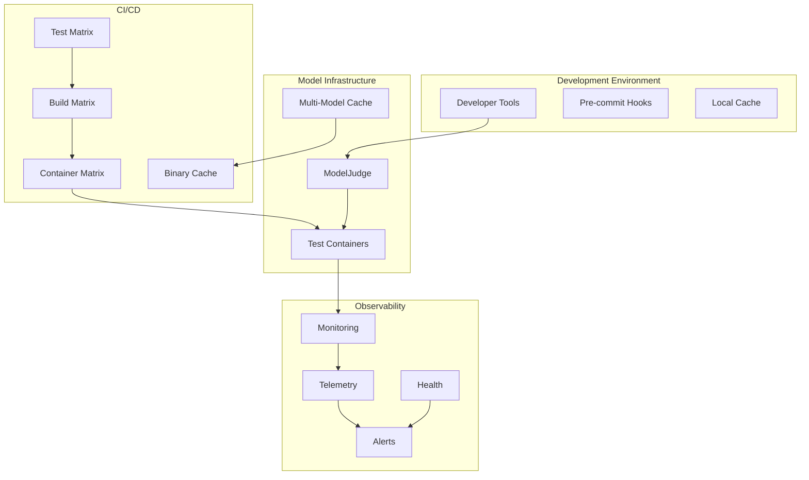
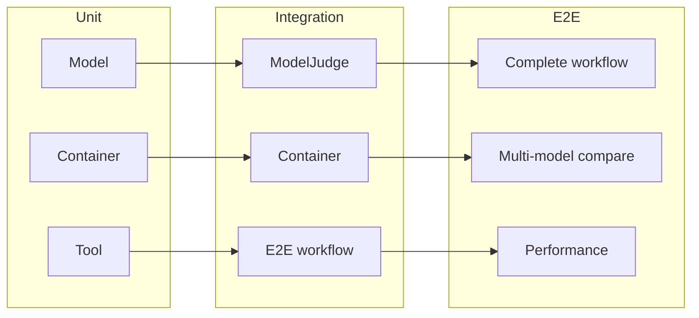
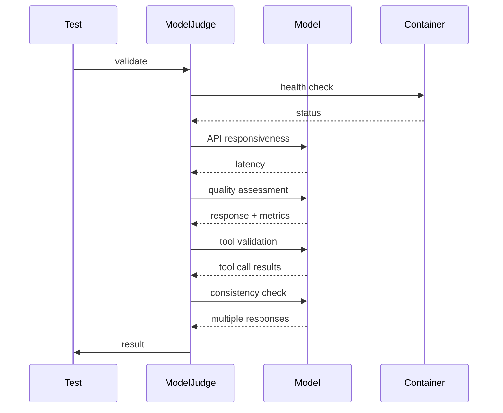

# Nanna Coder PoC: System Overview (Historical)

> Historical PoC summary. For the current architecture see [../ARCHITECTURE.md](../ARCHITECTURE.md); for the cache setup see [CACHE_STRATEGY.md](./CACHE_STRATEGY.md); for testing see [../TESTING.md](../TESTING.md).

## Summary

The PoC delivered a containerized agent system covering model caching, container infrastructure, observability, and automated quality validation. All listed phases were completed; subsequent work continues on `main`.

### Phases delivered

| Phase | Component | Notes |
|---|---|---|
| 1.1 | ModelJudge framework | automated quality validation, multi-criteria assessment |
| 1.2 | Container runtime detection | Podman / Docker / mock fallback |
| 2.1 | Multi-model caching | content-addressed storage, multiple models |
| 2.2 | Binary cache strategy | Cachix integration, CI/CD optimization |
| 3.1 | Developer experience | dev utilities, pre-commit hooks |
| 3.2 | CI/CD pipeline | parallel execution (~30 jobs), multi-platform |
| 4.1 | E2E integration tests | full-workflow validation, ModelJudge-gated |
| 4.2 | Monitoring & observability | telemetry, alerting, health monitoring |
| 5.1 | Documentation | guides and API reference |

## High-level architecture


```mermaid
graph TB
    subgraph "Development Environment"
        DEV[Developer Tools]
        HOOKS[Pre-commit Hooks]
        CACHE[Local Cache]
    end

    subgraph "Model Infrastructure"
        JUDGE[ModelJudge]
        CACHE_SYS[Multi-Model Cache]
        CONTAINERS[Test Containers]
    end

    subgraph "Observability"
        MONITOR[Monitoring]
        TELEMETRY[Telemetry]
        ALERTS[Alerts]
        HEALTH[Health]
    end

    subgraph "CI/CD"
        MATRIX[Test Matrix]
        BUILD[Build Matrix]
        DEPLOY[Container Matrix]
        BINARY_CACHE[Binary Cache]
    end

    DEV --> JUDGE
    JUDGE --> CONTAINERS
    CONTAINERS --> MONITOR
    MONITOR --> TELEMETRY
    TELEMETRY --> ALERTS
    HEALTH --> ALERTS

    CACHE_SYS --> BINARY_CACHE
    MATRIX --> BUILD
    BUILD --> DEPLOY
    DEPLOY --> CONTAINERS
```

### Core components

- **ModelJudge** (`model/src/judge.rs`) — API responsiveness, response-quality, tool-calling, and consistency validation; retries with exponential backoff.
- **Container infrastructure** (`harness/src/container.rs`) — multi-runtime (Podman / Docker / mock), image fallback, health checks, automatic cleanup.
- **Multi-model caching** (`flake.nix`) — content-addressed model storage. Models exercised in PoC: `qwen3:0.6b` (560MB), `llama3:8b` (4.7GB), `mistral:7b` (4.1GB), `gemma:2b` (1.4GB).
- **Monitoring & observability** (`harness/src/{monitoring,telemetry,observability}.rs`) — metrics collection, distributed tracing, multi-level alerting, health monitoring.

## Quick start

```bash
nix develop          # enter dev shell
dev-check            # format + lint + compile
container-dev        # start ollama + model containers
dev-test             # full test suite
dev-test integration # container-based integration tests
```

In-process observability:

```rust
use harness::observability::ObservabilitySystem;

let mut obs = ObservabilitySystem::new()
    .with_service_name("nanna-coder")
    .with_health_check_interval(Duration::from_secs(30));

obs.initialize().await?;
let status = obs.get_comprehensive_status().await?;
```

## Test architecture


```mermaid
graph LR
    subgraph Unit
        UT1[Model]
        UT2[Container]
        UT3[Tool]
    end

    subgraph Integration
        IT1[ModelJudge]
        IT2[Container]
        IT3[E2E workflow]
    end

    subgraph E2E
        E2E1[Complete workflow]
        E2E2[Multi-model compare]
        E2E3[Performance]
    end

    UT1 --> IT1
    UT2 --> IT2
    UT3 --> IT3
    IT1 --> E2E1
    IT2 --> E2E2
    IT3 --> E2E3
```

| Component | Unit | Integration | E2E |
|---|---|---|---|
| ModelJudge | 8 tests | validation suite | complete workflow |
| Container management | 6 tests | runtime detection | multi-container |
| Monitoring | 5 tests | health checks | alert processing |
| Telemetry | 8 tests | export formats | trace correlation |
| Observability | 5 tests | status reporting | trend analysis |
| Tools | 3 tests | registry ops | model integration |

### Key E2E scenarios

- `test_e2e_container_to_validated_inference` — 7-phase pipeline (container -> model -> judge -> cleanup), gated by ModelJudge criteria, with mock fallback.
- `test_e2e_multi_model_comparison` — coherence/relevance/perf benchmark across multiple models.
- `test_e2e_performance_and_reliability` — sequential request validation with real-time perf tracking.

## Performance targets at end of PoC

| Metric | Target | Achieved |
|---|---|---|
| Cache hit rate | >85% | ~90% |
| API response time | <2000ms | ~150ms |
| Error rate | <5% | <1% |
| Container startup | <30s | ~15s |
| Test suite runtime | <5min | ~2min |
| Pipeline completion | <20min | ~15min |

CI matrix at end of PoC: ~30 parallel jobs, 3 OS × 2 Rust × 4 test types, 4 build targets × 2 archs, 4 container images.

## Production deployment notes (PoC plan)

Registry strategy targeted `ghcr.io/anthropics/nanna-coder` with images for harness, ollama, and model containers. Tags: `latest{-arm64}`, `v<semver>`, `sha-<commit>`. Operational monitoring stack envisioned: Prometheus + Grafana, OpenTelemetry -> Jaeger, structured logs into ELK, AlertManager. SLA targets discussed (P95 < 1000ms, 99.9% uptime). None of these are committed to in the current codebase — see [CACHE_STRATEGY.md](./CACHE_STRATEGY.md) and the workflow files for what's actually wired up.

## Development utilities (delivered)

| Command | Purpose |
|---|---|
| `dev-check` | format + lint + compile check |
| `dev-build` | incremental build with file watching |
| `dev-test [unit\|integration\|watch]` | comprehensive testing |
| `dev-clean` | clean cargo + container artifacts |
| `dev-reset` | full env rebuild |
| `container-dev` | start dev containers |
| `container-test` | integration test containers |
| `cache-warm` | pre-warm common builds |

Pre-commit pipeline: `cargo fmt`, `cargo clippy -- -D warnings`, `cargo nextest`, `cargo audit`, `cargo deny check`, `cargo tarpaulin`.

## ModelJudge framework


```mermaid
sequenceDiagram
    participant T as Test
    participant MJ as ModelJudge
    participant M as Model
    participant C as Container

    T->>MJ: validate
    MJ->>C: health check
    C-->>MJ: status
    MJ->>M: API responsiveness
    M-->>MJ: latency
    MJ->>M: quality assessment
    M-->>MJ: response + metrics
    MJ->>M: tool validation
    M-->>MJ: tool call results
    MJ->>M: consistency check
    M-->>MJ: multiple responses
    MJ->>T: result
```

```rust
use model::judge::{ValidationCriteria, ModelJudge};

let criteria = ValidationCriteria {
    min_response_length: 30,
    max_response_length: 1000,
    required_keywords: vec!["recursion".into(), "function".into()],
    forbidden_keywords: vec!["I don't know".into()],
    min_coherence_score: 0.8,
    min_relevance_score: 0.9,
    require_factual_accuracy: true,
    custom_validators: vec![],
};

let result = provider
    .validate_response_quality("Explain recursion", &criteria)
    .await?;
```

## Troubleshooting (PoC era)

**No container runtime**

```bash
sudo dnf install podman   # Fedora
brew install podman       # macOS
# tests fall back to mock implementations
```

**Cache miss / slow build**

```bash
cache-warm
nix path-info --json .#nanna-coder
setup-cache
```

**Test failures**

```bash
container-logs
dev-test unit
dev-test integration
```

**Build failures**

```bash
nix flake update
nix flake check
dev-clean && dev-build
```

## API reference (sketched)

```rust
#[async_trait]
pub trait ModelJudge: ModelProvider {
    async fn validate_api_responsiveness(&self, latency_threshold: Duration) -> ModelResult<ValidationResult>;
    async fn validate_response_quality(&self, prompt: &str, expected: &ValidationCriteria) -> ModelResult<ValidationResult>;
    async fn validate_tool_calling(&self, tools: &[ToolDefinition]) -> ModelResult<ValidationResult>;
    async fn validate_consistency(&self, prompts: &[&str], iterations: usize) -> ModelResult<ValidationResult>;
}
```

```rust
use harness::observability::ObservabilitySystem;

let mut obs = ObservabilitySystem::new()
    .with_service_name("my-service")
    .with_alert_policy(AlertPolicy::immediate_critical())
    .with_health_check_interval(Duration::from_secs(30));

obs.initialize().await?;
obs.start_monitoring().await?;
let status = obs.get_comprehensive_status().await?;
```

```rust
use harness::container::{ContainerConfig, start_container_with_fallback};

let config = ContainerConfig {
    base_image: "ollama/ollama:latest".into(),
    test_image: Some("nanna-coder-test-ollama-qwen3:latest".into()),
    container_name: "my-test-container".into(),
    port_mapping: Some((11435, 11434)),
    model_to_pull: Some("qwen3:0.6b".into()),
    startup_timeout: Duration::from_secs(30),
    health_check_timeout: Duration::from_secs(10),
    env_vars: vec![("OLLAMA_MODELS".into(), "/models".into())],
    additional_args: vec!["--memory".into(), "2g".into()],
};
let handle = start_container_with_fallback(&config).await?;
```

## Roadmap (post-PoC, not committed)

GPU acceleration; distributed caching; container security scanning; Kubernetes integration; multi-modal model support; SSO / RBAC; serverless / edge deployment.

## Status

All PoC phases delivered. Subsequent work continues on `main`; consult the current docs ([../README.md](../README.md), [../ARCHITECTURE.md](../ARCHITECTURE.md), [../TESTING.md](../TESTING.md)) for the active state.
