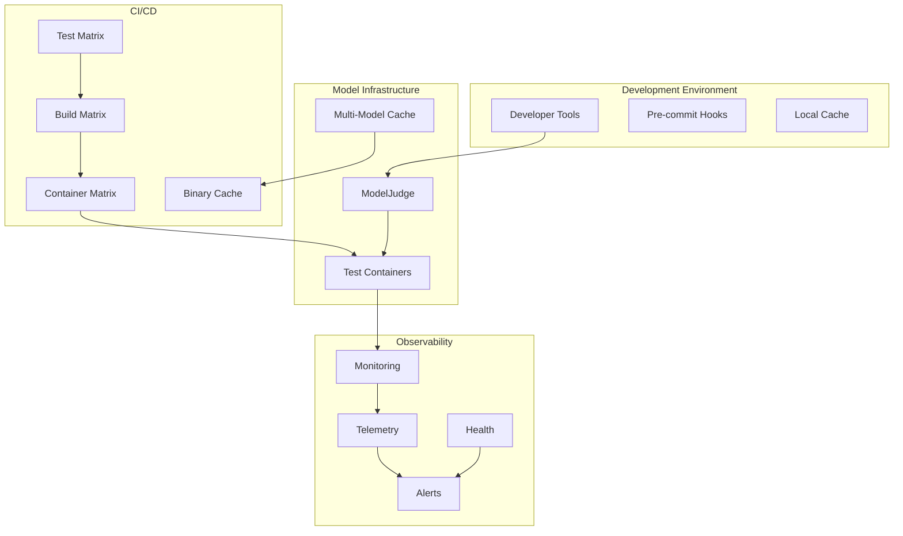

# Nanna Coder PoC: System Overview (Historical)

> Historical PoC summary. For current architecture see [ARCHITECTURE.md](../ARCHITECTURE.md); for cache specifics see [CACHE_STRATEGY.md](./CACHE_STRATEGY.md); for current dev workflow see [developer-experience.md](./developer-experience.md).

## Summary

The PoC delivered a containerized AI assistant system covering model caching, container infrastructure, monitoring, and automated quality validation.

### Delivered phases

| Phase | Component | Notes |
|-------|-----------|-------|
| 1.1 | ModelJudge framework | Automated quality validation, multi-criteria assessment |
| 1.2 | Container runtime detection | Podman/Docker/mock fallback |
| 2.1 | Multi-model caching | Content-addressed model storage |
| 2.2 | Binary cache strategy | Cachix integration for CI/CD |
| 3.1 | Developer experience | `dev-*` and `container-*` utilities, pre-commit hooks |
| 3.2 | CI/CD pipeline | ~30 parallel jobs, multi-platform |
| 4.1 | E2E integration tests | Workflow validation, ModelJudge integration |
| 4.2 | Monitoring & observability | Telemetry, alerting, health monitoring |
| 5.1 | Documentation | Per-component guides |

## High-level architecture


```mermaid
graph TB
    subgraph Dev["Development Environment"]
        DEV[Developer Tools]
        HOOKS[Pre-commit Hooks]
        CACHE[Local Cache]
    end
    subgraph Model["Model Infrastructure"]
        JUDGE[ModelJudge]
        CACHE_SYS[Multi-Model Cache]
        CONTAINERS[Test Containers]
    end
    subgraph Obs["Observability"]
        MONITOR[Monitoring]
        TELEMETRY[Telemetry]
        ALERTS[Alerts]
        HEALTH[Health]
    end
    subgraph CI["CI/CD"]
        MATRIX[Test Matrix]
        BUILD[Build Matrix]
        DEPLOY[Container Matrix]
        BINARY_CACHE[Binary Cache]
    end
    DEV --> JUDGE
    JUDGE --> CONTAINERS
    CONTAINERS --> MONITOR
    MONITOR --> TELEMETRY
    TELEMETRY --> ALERTS
    HEALTH --> ALERTS
    CACHE_SYS --> BINARY_CACHE
    MATRIX --> BUILD
    BUILD --> DEPLOY
    DEPLOY --> CONTAINERS
```

## Core components

- **ModelJudge** (`model/src/judge.rs`): API responsiveness, response-quality, tool-calling, and consistency validation with retry/backoff.
- **Container infrastructure** (`harness/src/container.rs`): Podman/Docker/mock runtime with image-fallback chain (pre-built → base → mock) and automatic cleanup.
- **Multi-model caching** (`flake.nix`): Content-addressed storage for `qwen3:0.6b`, `llama3:8b`, `mistral:7b`, `gemma:2b`.
- **Monitoring & observability** (`harness/src/monitoring.rs`, `harness/src/telemetry.rs`, `harness/src/observability.rs`): Metrics, distributed tracing, Prometheus export, multi-level alerting.

## API surface examples

ModelJudge trait:

```rust
#[async_trait]
pub trait ModelJudge: ModelProvider {
    async fn validate_api_responsiveness(&self, latency_threshold: Duration) -> ModelResult<ValidationResult>;
    async fn validate_response_quality(&self, prompt: &str, criteria: &ValidationCriteria) -> ModelResult<ValidationResult>;
    async fn validate_tool_calling(&self, tools: &[ToolDefinition]) -> ModelResult<ValidationResult>;
    async fn validate_consistency(&self, prompts: &[&str], iterations: usize) -> ModelResult<ValidationResult>;
}
```

Container orchestration:

```rust
use harness::container::{ContainerConfig, start_container_with_fallback};

let handle = start_container_with_fallback(&config).await?;
// Container automatically cleaned up when handle is dropped.
```

## Status

All PoC phases delivered. Subsequent work has continued on the `main` branch; consult current docs (README, ARCHITECTURE, TESTING) for the active state of the project.
