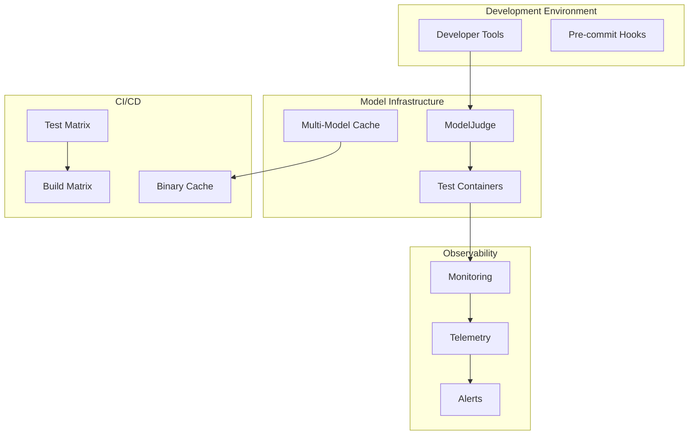

# Nanna Coder PoC: System Overview

This document summarises the PoC implementation: its components, architecture, and current status.

## Implemented Components

| Component | Module | Description |
|-----------|--------|-------------|
| ModelJudge Framework | `model/src/judge.rs` | Automated model quality validation (coherence, relevance, tool-calling, consistency) with retry/backoff |
| Container Infrastructure | `harness/src/container.rs` | Multi-runtime support (Podman, Docker, mock fallback), health-checking, automatic cleanup |
| Multi-Model Cache | `flake.nix` | Content-addressed model storage for qwen3:0.6b, llama3:8b, mistral:7b, gemma:2b |
| Monitoring | `harness/src/monitoring.rs` | Metrics collection, health checks, multi-level alerting |
| Telemetry | `harness/src/telemetry.rs` | Distributed tracing, Prometheus export |
| Observability | `harness/src/observability.rs` | Comprehensive status reporting, trend analysis |

## Architecture


```mermaid
graph TB
    subgraph "Development Environment"
        DEV[Developer Tools]
        HOOKS[Pre-commit Hooks]
    end

    subgraph "Model Infrastructure"
        JUDGE[ModelJudge]
        CACHE_SYS[Multi-Model Cache]
        CONTAINERS[Test Containers]
    end

    subgraph "Observability"
        MONITOR[Monitoring]
        TELEMETRY[Telemetry]
        ALERTS[Alerts]
    end

    subgraph "CI/CD"
        MATRIX[Test Matrix]
        BUILD[Build Matrix]
        BINARY_CACHE[Binary Cache]
    end

    DEV --> JUDGE
    JUDGE --> CONTAINERS
    CONTAINERS --> MONITOR
    MONITOR --> TELEMETRY --> ALERTS
    CACHE_SYS --> BINARY_CACHE
    MATRIX --> BUILD
```

## Quick Start

```bash
# Enter dev environment
nix develop

# Health check
dev-check

# Start containers
nix run .#container-dev

# Run tests
cargo nextest run --workspace
```

## Testing Architecture

Three evaluation levels:

1. **Unit** – individual components in isolation (state transitions, RAG query quality, entity logic).
2. **Integration** – subsystem interactions (agent control loop, LLM-agent patterns, multi-entity workflows).
3. **System** – full containerised stack with real models (Ollama/vLLM, telemetry, end-to-end task completion).

For detailed evaluation patterns and metrics, see [agent-evaluation-patterns.md](agent-evaluation-patterns.md).

## Performance Targets

| Metric | Target |
|--------|--------|
| Cache hit rate | >85% |
| API response time | <2000 ms |
| Error rate | <5% |
| Container startup | <30 s |
| Test suite runtime | <5 min |
| Full pipeline | <20 min |

## Development Utilities

| Command | Purpose |
|---------|--------|
| `dev-check` | Format, lint, compile |
| `dev-build` | Incremental file-watching build |
| `dev-test [unit\|integration\|watch]` | Run tests |
| `dev-clean` | Clear artifacts and old containers |
| `dev-reset` | Full environment rebuild |
| `nix run .#container-dev` | Start dev containers |
| `nix run .#container-test` | Run integration tests in containers |
| `nix run .#cache-warm` | Pre-warm caches |

## Troubleshooting

```bash
# No container runtime
sudo dnf install podman   # Fedora
brew install podman        # macOS
# Tests fall back to mock implementations automatically

# Cache issues
nix run .#cache-warm
nix run .#setup-cache

# Build failures
nix flake update && nix flake check
nix run .#dev-clean && nix develop --command cargo build
```

## References

- [ARCHITECTURE.md](../ARCHITECTURE.md) – system architecture
- [AGENTS.md](../AGENTS.md) – agent control flow
- [TESTING.md](../TESTING.md) – testing strategy
- [developer-experience.md](developer-experience.md) – dev utilities
- [ci-cd-pipeline.md](ci-cd-pipeline.md) – CI/CD pipeline
