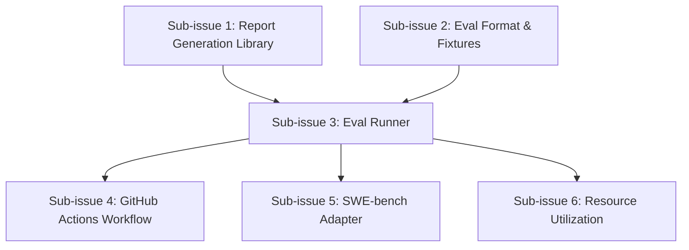

# Eval Suite Decomposition — Issue #84

Parent issue: [#84 — Agentic Eval Suite](https://github.com/DominicBurkart/nanna-coder/issues/84)

## Dependency Graph



Sub-issues 1 and 2 can be worked in parallel. Sub-issue 3 depends on both. Sub-issues 4, 5, and 6 depend on 3 but are independent of each other.

---

## Sub-issue 1: Eval Report Generation Library

**Labels:** `eval`, `library`, `good-first-issue`

### Summary

Create a Rust module that takes structured eval results and produces a markdown report with Mermaid visualizations (histograms, pass-rate bar charts, quantile tables).

### Context

The existing `harness/src/agent/eval.rs` already defines `AgentEvaluationResult`, `EvaluationMetrics`, and `BatchEvaluationResult`. The report module consumes these types (or a superset of them) and renders markdown.

### Scope

- New module at `harness/src/eval/report.rs` (or a standalone `evals` crate in the workspace if preferred)
- Define an `EvalReport` struct containing:
  - `Vec<TaskOutcome>` — each with: task ID, pass/fail, duration, iteration count, token counts (optional), error messages
  - Aggregate stats: total, passed, failed, pass rate, p50/p90/p95 duration
- `fn render_markdown(report: &EvalReport) -> String` that produces:
  - Summary table (total/pass/fail/rate)
  - Mermaid bar chart of pass rates by category
  - Mermaid histogram of execution durations
  - Quantile table (p50, p90, p95, p99) for duration and iterations
  - Per-task detail table with expandable failure messages (`<details>` tags)
- The markdown must be valid for GitHub PR comments (no raw HTML beyond `<details>`)

### Acceptance Criteria

- [ ] Unit tests verify markdown output for: all-pass, all-fail, mixed, empty result sets, single task
- [ ] Mermaid chart syntax is valid (test with a Mermaid linter or snapshot tests)
- [ ] Output renders correctly when pasted into a GitHub comment
- [ ] No external dependencies beyond `serde` and `chrono` (already in workspace)
- [ ] `cargo clippy` and `cargo fmt` pass

### Existing Code References

- `harness/src/agent/eval.rs` — `EvaluationMetrics` struct
- `harness/src/agent/eval.rs` — `AgentEvaluationResult` struct
- `harness/src/agent/eval.rs` — `BatchEvaluationResult` struct

---

## Sub-issue 2: Eval Case Format & Dummy Repo Fixtures

**Labels:** `eval`, `design`, `infrastructure`

### Summary

Define the eval case format for happy-path test scenarios and create 2–3 trivial fixture cases that exercise nanna's core entity-modification loop.

### Context

The agent control loop (see `ARCHITECTURE.md`) follows: Entity Enrichment → Plan Entity Modification → Decision → Query (RAG) → Perform → Update → Check Completion. Eval cases need to provide enough context for nanna to complete this loop on a small, self-contained repo.

### Scope

- Define a `task.toml` schema for eval cases:
  ```toml
  [task]
  id = "happy-path-001"
  description = "Add a greet function to lib.rs that passes the included test"
  category = "entity-creation"  # maps to EvaluationCategory
  max_iterations = 10
  timeout_secs = 120

  [repo]
  # Path to the fixture repo directory, relative to this file
  source = "./repo"

  [expected]
  # Command to verify success
  test_command = "cargo test"
  # Minimum expected entities created
  min_entities = 1
  # Expected pass (true = test_command exits 0)
  should_pass = true
  ```
- Directory structure:
  ```
  evals/cases/happy-path-001/
  ├── task.toml
  └── repo/
      ├── Cargo.toml
      ├── src/
      │   └── lib.rs       # Minimal starting state
      └── tests/
          └── test.rs       # Test that should pass after nanna modifies lib.rs
  ```
- Create 3 fixtures:
  1. **happy-path-001**: "Add a `greet(name: &str) -> String` function to `lib.rs`" — test calls `greet("world")` and asserts `"Hello, world!"`
  2. **happy-path-002**: "Fix the compile error in `lib.rs`" — `lib.rs` has a typo, test verifies the fix
  3. **happy-path-003**: "Add a new module `math.rs` with an `add` function" — tests import and call it
- Implement `EvalCase` deserialization in Rust (`evals/src/case.rs` or `harness/src/eval/case.rs`):
  ```rust
  #[derive(Debug, Deserialize)]
  pub struct EvalCase {
      pub task: TaskConfig,
      pub repo: RepoConfig,
      pub expected: ExpectedConfig,
  }
  ```

### Acceptance Criteria

- [ ] `task.toml` schema is documented in a `evals/README.md`
- [ ] 3 fixture repos exist and are valid Rust projects (`cargo check` passes in each)
- [ ] A Rust integration test loads all fixtures, parses `task.toml`, and validates the structure
- [ ] Fixture repos are minimal (< 20 lines of Rust each)
- [ ] `cargo clippy` and `cargo fmt` pass

### Architecture References

- `ARCHITECTURE.md` — Entity Enrichment → Plan Entity Modification flow
- `harness/src/agent/eval.rs` — `EvaluationScenario` and `EvaluationCategory`

---

## Sub-issue 3: Eval Runner — Execute Nanna Against a Single Eval Case

**Labels:** `eval`, `integration`, `core`

> **Implementation Status (as of 2026-03-29):** Partially addressed by open PRs:
> - **#96** — introduces `run_eval()`, `EvalRunnerConfig`, `EvalRunResult`/`VerificationResult`/`TokenUsage`, temp-dir isolation, timeout via `tokio::time::timeout`, unit and integration tests
> - **#103** — wires the Ollama LLM provider in `run_eval()` and adds token-usage tracking via `AgentRunResult.token_usage`
> - **#109** — removes dead code (`work_dir` field, `set_tool_registry`), adds `EvalRunnerError::ProviderUnavailable` when Ollama is unreachable
>
> The acceptance criteria below remain the definition of done for this sub-issue.

### Summary

Build the eval runner that takes an `EvalCase` (from sub-issue 2), executes nanna's agent loop against the fixture repo, and returns a structured `TaskOutcome` (from sub-issue 1).

### Context

This is the integration point between the eval infrastructure and nanna's existing agent loop. The runner must:
1. Copy the fixture repo to a temporary directory (to avoid mutating checked-in fixtures)
2. Configure and invoke the agent loop (`AgentLoop`) with the task prompt
3. After completion, run the `test_command` to verify success
4. Capture metrics: pass/fail, wall-clock duration, iterations, agent state transitions

### Scope

- New module: `harness/src/eval/runner.rs`
- `async fn run_eval(case: &EvalCase, config: &EvalRunnerConfig) -> Result<TaskOutcome>`
  - Creates a temp dir, copies `case.repo.source` into it
  - Sets up `AgentConfig` from `case.task` fields
  - Creates `AgentContext` with `case.task.description` as the user prompt
  - Runs `AgentLoop::run(context)` with a timeout
  - After agent completion, runs `case.expected.test_command` via `std::process::Command`
  - Returns `TaskOutcome` with all metrics
- `EvalRunnerConfig`:
  ```rust
  pub struct EvalRunnerConfig {
      pub model: String,
      pub model_base_url: Option<String>,
      pub verbose: bool,
  }
  ```
- The runner does NOT need container/nix setup for this sub-issue — it runs against the local filesystem. Container support is a follow-up.

### Acceptance Criteria

- [ ] A `#[tokio::test] #[ignore]` integration test runs `happy-path-001` end-to-end
- [ ] The test is `#[ignore]` because it requires a running Ollama instance
- [ ] `TaskOutcome` captures: task ID, pass/fail, duration, iterations, error message (if any)
- [ ] Fixture repos are not mutated (temp dir isolation)
- [ ] Timeout is enforced via `tokio::time::timeout`
- [ ] `cargo clippy` and `cargo fmt` pass

### Code References

- `harness/src/agent/mod.rs` — `AgentLoop`, `AgentConfig`, `AgentContext`, `AgentRunResult`
- `harness/src/agent/eval.rs` — `AgentEvaluator::evaluate()` pattern to follow
- `harness/src/agent/eval.rs` — agent config and context setup pattern

---

## Sub-issue 4: GitHub Actions Workflow for Manual Eval Trigger

**Labels:** `eval`, `ci`, `github-actions`

### Summary

Create a `workflow_dispatch` GitHub Actions workflow that runs the eval suite against all happy-path cases and posts results as a PR comment.

### Context

The repo already has `.github/workflows/ci.yml` with nix/cachix setup and container builds. The eval workflow should reuse as much of this setup as possible.

### Scope

- New workflow: `.github/workflows/eval.yml`
- Trigger: `workflow_dispatch` with inputs:
  - `pr_number` (optional): PR to comment results on
  - `model` (optional, default: `qwen3:0.6b`): model to use
  - `cases` (optional, default: `all`): comma-separated case IDs or `all`
- Steps:
  1. Checkout code
  2. Install nix (use `cachix/install-nix-action` as in existing CI)
  3. Setup cachix (use existing cachix config)
  4. Build the eval runner: `nix develop -c cargo build --release`
  5. Start Ollama (pull from nix or container)
  6. Run eval: `./target/release/harness eval --cases <cases> --model <model> --output eval-report.md`
  7. If `pr_number` provided, post report as PR comment using `peter-evans/create-or-update-comment`
  8. Upload report as workflow artifact regardless
- The `harness eval` subcommand is the CLI entry point for the eval runner (may need to be added to `harness/src/main.rs`)

### Acceptance Criteria

- [ ] Workflow YAML is valid (`actionlint` passes if available)
- [ ] Reuses existing nix/cachix setup from `ci.yml`
- [ ] PR comment includes the full markdown report with Mermaid charts
- [ ] Comment is created-or-updated (not duplicated on re-runs)
- [ ] Report is also uploaded as a workflow artifact
- [ ] Workflow can be triggered manually from the Actions tab

### CI References

- `.github/workflows/ci.yml` — existing nix/cachix/container setup
- `.github/workflows/cache-warming.yml` — existing `workflow_dispatch` pattern
- `harness/src/main.rs` — CLI subcommand structure (uses `clap`)

---

## Sub-issue 5: SWE-bench Adapter

**Labels:** `eval`, `swe-bench`, `adapter`

### Summary

Write an adapter that translates SWE-bench task definitions into nanna's eval case format, runs them through the eval runner, and feeds results into the report generator.

### Context

SWE-bench tasks are typically Python-repo GitHub issues. Since nanna currently operates on Rust projects, the adapter should target either:
- **Option A**: [SWE-PolyBench](https://github.com/nicktrue/SWE-PolyBench) if it includes Rust tasks
- **Option B**: A curated subset of SWE-bench Verified with Python repos (requires nanna to support Python projects)
- **Option C**: A custom Rust-language SWE-bench-style dataset

**Decision needed**: Which variant to target. This should be decided before implementation begins.

### Scope

- New module: `harness/src/eval/swebench.rs`
- `SWEBenchTask` struct:
  ```rust
  pub struct SWEBenchTask {
      pub instance_id: String,
      pub repo: String,
      pub base_commit: String,
      pub problem_statement: String,
      pub hints_text: Option<String>,
      pub test_patch: String,
  }
  ```
- `fn adapt_to_eval_case(task: &SWEBenchTask, workdir: &Path) -> Result<EvalCase>`:
  - Clones the repo at `base_commit`
  - Applies `test_patch` to set up the test
  - Creates an `EvalCase` with `problem_statement` as the task description
  - Sets `test_command` based on the repo's test framework
- `fn load_swebench_dataset(path: &Path) -> Result<Vec<SWEBenchTask>>`:
  - Parses the SWE-bench JSONL format
- Integration with the eval runner and report generator from sub-issues 1 and 3

### Acceptance Criteria

- [ ] Can load at least one SWE-bench dataset file (JSONL)
- [ ] Successfully adapts at least 5 tasks to `EvalCase` format
- [ ] Runs adapted tasks through the eval runner (may fail — that's fine, the pipeline should work)
- [ ] Produces a valid report with pass/fail statistics
- [ ] Unit tests for JSONL parsing and case adaptation

### Open Questions

- Which SWE-bench variant to target (needs maintainer input)
- Whether to support non-Rust repos (significant scope increase)

---

## Sub-issue 6: Resource Utilization Tracking

**Labels:** `eval`, `metrics`, `observability`

### Summary

Extend the eval runner to capture computational resource metrics: CPU time, peak memory, model inference time, and optionally estimated cost.

### Context

The existing `EvaluationMetrics` in `harness/src/agent/eval.rs` tracks execution time, iterations, and quality scores but does not capture resource utilization. The `SystemMetrics` type (from `harness/src/monitoring.rs`) may already capture some of this.

### Scope

- Extend `TaskOutcome` (from sub-issue 1) with resource fields:
  ```rust
  pub struct ResourceMetrics {
      /// Total CPU time in milliseconds
      pub cpu_time_ms: Option<u64>,
      /// Peak resident set size in bytes
      pub peak_memory_bytes: Option<u64>,
      /// Model inference time (sum of all model calls) in milliseconds
      pub model_inference_ms: Option<u64>,
      /// Number of model API calls
      pub model_call_count: Option<u32>,
      /// Total input tokens (if available from model provider)
      pub total_input_tokens: Option<u64>,
      /// Total output tokens (if available from model provider)
      pub total_output_tokens: Option<u64>,
  }
  ```
- Capture CPU and memory:
  - On Linux: read from `/proc/self/stat` and `/proc/self/status` (or use `procfs` crate)
  - Sample peak RSS before and after eval, take the delta
  - For container runs (future): use `podman stats --no-stream --format json`
- Capture model metrics:
  - Extend the model provider interface to return token counts and inference duration per call
  - Aggregate across all calls during an eval run
- Extend the report generator (sub-issue 1) to include:
  - Resource summary table (CPU, memory, model time)
  - Cost estimation based on configurable pricing (tokens × $/token)
  - Mermaid chart comparing resource usage across tasks

### Acceptance Criteria

- [ ] `ResourceMetrics` is populated for local (non-container) eval runs
- [ ] CPU time and peak memory are captured on Linux
- [ ] Model call count and inference time are captured when using Ollama
- [ ] Report includes resource metrics table
- [ ] Unit tests for resource metric aggregation and cost estimation
- [ ] Graceful degradation: missing metrics show "N/A" in the report

### Code References

- `harness/src/monitoring.rs` — `SystemMetrics` struct
- `harness/src/agent/eval.rs` — `EvaluationMetrics` struct
- `model/src/ollama.rs` — Ollama provider (extend for token tracking)
- `model/src/types.rs` — `ChatResponse` (may already include usage info)

---

## Items Deferred from MVP

The following items from the original issue are **not decomposed** here because they require design decisions or are architecturally distinct:

1. **Comparative harness evaluation** (nanna vs. SWE-bench default harness) — Requires defining what "same model" means when nanna uses local models and the comparison harness uses frontier models. Defer until the MVP pipeline is running and a manual comparison has been done once.

2. **Climate impact estimation** — Requires researching: Paris residential electricity carbon intensity, Framework 13 Ryzen power draw profiles, frontier model inference energy estimates. Better suited to a focused research session than a background agent task.

3. **Claude Code background agent integration** — Running nanna remotely via Claude Code is a meta-eval (evaluating an agent that uses your tool). This is architecturally distinct from the eval suite and should be its own issue.
